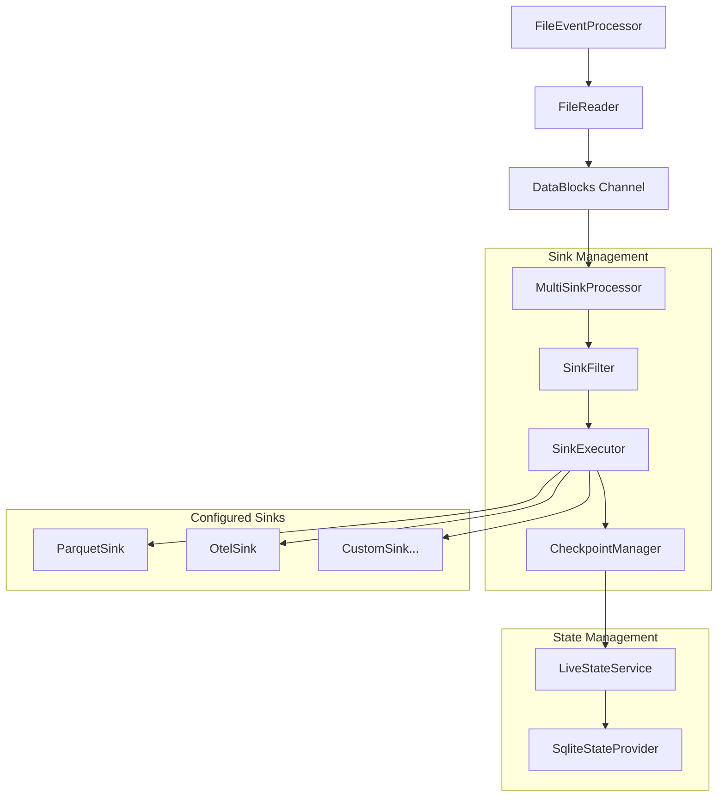
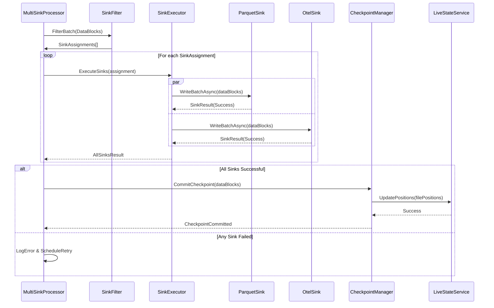

# Multi-Sink Ingester Architecture Design

## Overview

This design extends the LogTapestry ingester to support multiple configurable data sinks while preserving the critical checkpointing guarantees that ensure reliable file position tracking and data consistency. The current system uses a tightly coupled `CheckpointDataSink` that combines Parquet data persistence with state checkpointing. This design decouples these concerns while maintaining atomicity guarantees.

## Architecture

### Current Architecture Analysis

The existing ingestion pipeline follows this flow:
```
FileEventProcessor → FileReader → DataBlocks → CheckpointDataSink → [Parquet + State Updates]
```

The `CheckpointDataSink` currently:
1. Writes DataBlocks to Parquet files
2. Only after successful write, updates file positions via `LiveStateService`
3. Ensures atomic data-state consistency

### Proposed Multi-Sink Architecture



### Core Components

#### 1. MultiSinkProcessor
Central coordinator that replaces `CheckpointDataSink`:
- Receives DataBlock batches from the ingestion pipeline
- Applies sink filtering logic
- Coordinates parallel sink execution
- Manages checkpoint operations

#### 2. SinkFilter
Implements filtering logic to route entries to appropriate sinks:
- **Default behavior**: All entries go to all sinks
- **Optional filtering**: Configurable rules based on entry properties
- **Filter expressions**: Support for field-based, level-based, or source-based filtering

#### 3. SinkExecutor
Manages parallel execution of multiple sinks:
- Executes all applicable sinks for each DataBlock batch
- Implements error handling and retry logic
- Ensures all sinks complete before checkpointing

#### 4. CheckpointManager
Maintains checkpointing guarantees:
- Only updates file positions after ALL sinks successfully process data
- Implements atomic checkpoint operations
- Handles partial failure scenarios

## Data Sink Interface

### Enhanced IDataSink Interface
```csharp
public interface IDataSink
{
    string Name { get; }
    Task<SinkResult> WriteBatchAsync(
        IList<DataBlock> batch, 
        SinkContext context,
        CancellationToken cancellationToken = default);
    Task<bool> HealthCheckAsync(CancellationToken cancellationToken = default);
}

public class SinkResult
{
    public bool Success { get; init; }
    public string? ErrorMessage { get; init; }
    public Dictionary<string, object>? Metrics { get; init; }
}

public class SinkContext
{
    public string PartitionPath { get; init; }
    public Dictionary<string, object> Properties { get; init; }
}
```

### Sink Implementations

#### 1. ParquetSink
Replaces the current Parquet writing logic:
- Maintains existing partitioning strategy
- Preserves schema management
- Handles file operations atomically

#### 2. OtelSink
New sink for OpenTelemetry integration:
- Converts LogEntry to OTEL log format
- Supports configurable OTEL collector endpoints
- Implements batching for performance
- Handles OTEL-specific metadata

#### 3. CustomSink (Extensible)
Framework for additional sink types:
- HTTP webhook sinks
- Database sinks
- Message queue sinks

## Configuration Schema

### Sink Configuration Structure
```json
{
  "Ingester": {
    // ... existing settings ...
    "Sinks": {
      "Default": {
        "FilterExpression": "*",
        "Sinks": ["parquet", "otel"]
      },
      "Configurations": {
        "parquet": {
          "Type": "Parquet",
          "Settings": {
            "DataRoot": "data",
            "PartitionStrategy": "timestamp",
            "CompressionLevel": "Snappy"
          }
        },
        "otel": {
          "Type": "OpenTelemetry",
          "Settings": {
            "Endpoint": "http://localhost:4317",
            "Protocol": "grpc",
            "BatchSize": 1000,
            "ExportTimeout": "30s",
            "Headers": {
              "Authorization": "Bearer ${OTEL_TOKEN}"
            }
          }
        }
      },
      "Filters": [
        {
          "Name": "ErrorsOnly",
          "Expression": "Level == 'ERROR'",
          "Sinks": ["otel", "alerts"]
        },
        {
          "Name": "HighVolumeApp",
          "Expression": "Source.Contains('HighVolumeApp')",
          "Sinks": ["parquet"]
        }
      ]
    }
  }
}
```

### Configuration Classes
```csharp
public class SinkConfiguration
{
    public DefaultSinkConfig Default { get; set; } = new();
    public Dictionary<string, SinkDefinition> Configurations { get; set; } = new();
    public List<SinkFilter> Filters { get; set; } = new();
}

public class SinkDefinition
{
    public string Type { get; set; } = "";
    public Dictionary<string, object> Settings { get; set; } = new();
    public bool Enabled { get; set; } = true;
    public int Priority { get; set; } = 0;
}

public class SinkFilter
{
    public string Name { get; set; } = "";
    public string Expression { get; set; } = "";
    public List<string> Sinks { get; set; } = new();
}
```

## Checkpointing Strategy

### Atomic Multi-Sink Checkpointing

The critical challenge is maintaining checkpointing guarantees across multiple sinks:

1. **All-or-Nothing Principle**: File positions are only updated after ALL applicable sinks successfully process the data
2. **Failure Handling**: If any sink fails, the entire batch fails and no checkpoint is made
3. **Retry Strategy**: Failed batches are retried with exponential backoff
4. **Partial Sink Failure**: Individual sink failures don't affect other sinks but prevent checkpointing

### Implementation Flow


## Sink-Specific Implementations

### OpenTelemetry Sink Design

#### OTEL Log Data Model Mapping
```csharp
// LogEntry -> OTEL LogRecord conversion
public class OtelLogRecord
{
    public ulong TimeUnixNano { get; set; }
    public int SeverityNumber { get; set; }
    public string SeverityText { get; set; }
    public string Body { get; set; }
    public Dictionary<string, AnyValue> Attributes { get; set; }
    public byte[] TraceId { get; set; }
    public byte[] SpanId { get; set; }
}
```

#### OTEL Sink Configuration
- **Endpoint Configuration**: Support for GRPC and HTTP protocols
- **Batch Processing**: Configurable batch sizes and timeouts
- **Resource Attributes**: Service metadata and environment information
- **Retry Logic**: Exponential backoff for failed exports
- **Health Monitoring**: Connection health checks

### Parquet Sink Migration

The existing Parquet logic is extracted into a dedicated sink:
- **Schema Management**: Maintains existing Parquet schema
- **Partitioning**: Preserves timestamp-based partitioning
- **File Operations**: Atomic write-then-move operations
- **Indexing**: SQLite file indexing remains unchanged

## Error Handling and Resilience

### Failure Scenarios

1. **Individual Sink Failure**
   - Log error with sink details
   - Mark batch as failed
   - Trigger retry mechanism
   - Maintain checkpoint consistency

2. **Partial Sink Success**
   - No checkpoint update
   - Retry entire batch
   - Implement idempotency where possible

3. **Configuration Errors**
   - Validate sink configurations at startup
   - Graceful degradation for disabled sinks
   - Runtime configuration validation

### Retry Strategy
- **Exponential Backoff**: 1s, 2s, 4s, 8s, 16s, max 60s
- **Max Retries**: Configurable (default: 5)
- **Dead Letter Queue**: Failed batches after max retries
- **Circuit Breaker**: Disable failing sinks temporarily

## Performance Considerations

### Parallelization Strategy
- **Sink-Level Parallelism**: Multiple sinks execute concurrently
- **Batch-Level Parallelism**: Large batches split across sinks
- **Resource Management**: Configurable thread pools per sink type

### Memory Management
- **Shared DataBlocks**: Sinks share read-only references
- **Streaming**: Large batches processed in chunks
- **Buffer Management**: Configurable memory limits per sink

### Monitoring and Metrics
```csharp
public class MultiSinkMetrics
{
    public long TotalBatchesProcessed { get; set; }
    public long TotalSinkExecutions { get; set; }
    public long SuccessfulCheckpoints { get; set; }
    public long FailedBatches { get; set; }
    public Dictionary<string, SinkMetrics> SinkStats { get; set; }
}

public class SinkMetrics
{
    public long BatchesProcessed { get; set; }
    public long EntriesProcessed { get; set; }
    public long BytesProcessed { get; set; }
    public TimeSpan AverageProcessingTime { get; set; }
    public long ErrorCount { get; set; }
    public DateTime LastSuccess { get; set; }
}
```

## Testing Strategy

### Unit Testing
- **Sink Interface Testing**: Mock implementations for each sink type
- **Filter Logic Testing**: Expression evaluation and routing
- **Checkpoint Logic Testing**: Atomic operation verification
- **Configuration Testing**: Validation and parsing

### Integration Testing
- **Multi-Sink Scenarios**: End-to-end data flow verification
- **Failure Recovery**: Retry and checkpoint consistency
- **Performance Testing**: Load testing with multiple sinks
- **OTEL Integration**: Real OTEL collector integration tests

## Migration Strategy

### Phase 1: Infrastructure
1. Implement `IDataSink` interface and base classes
2. Extract Parquet logic into `ParquetSink`
3. Implement `MultiSinkProcessor` framework
4. Add configuration schema

### Phase 2: OTEL Integration
1. Implement `OtelSink` with GRPC support
2. Add OTEL-specific configuration
3. Implement log record conversion
4. Add OTEL health monitoring

### Phase 3: Advanced Features
1. Implement filtering expressions
2. Add custom sink framework
3. Implement advanced retry strategies
4. Add comprehensive monitoring

### Backward Compatibility
- Existing configurations continue to work
- Default behavior routes to Parquet sink only
- Gradual migration path for existing deployments