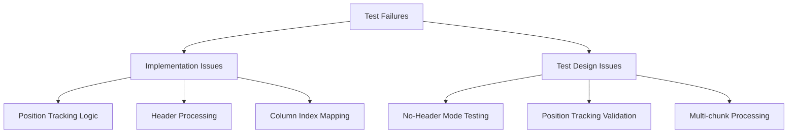
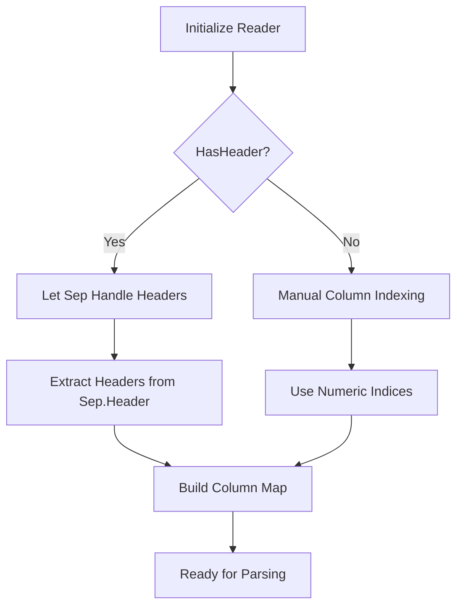
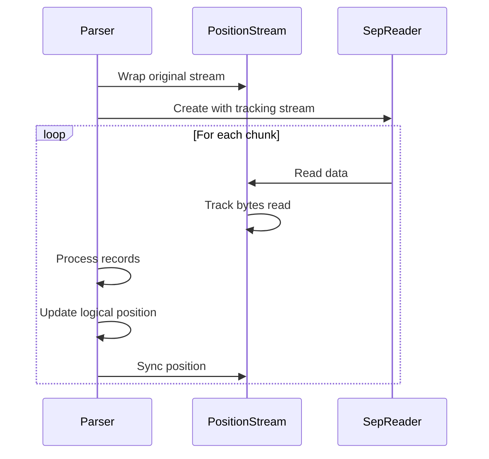

# Test Failure Analysis and Fix Design

## Overview

This design document analyzes the failing tests in the LogTapestry.Core.Tests project, specifically focusing on the SepCsvLogParser implementation and related test cases. The analysis determines whether the issues lie in the test implementations or the production code, and provides concrete solutions.

## Repository Type

**Backend Framework/Library** - The LogTapestry project is a C# (.NET 9.0) log processing framework that provides CSV parsing capabilities using the high-performance Sep library.

## Architecture

### Current Implementation Issues

Based on the codebase analysis, several issues have been identified in both the SepCsvLogParser implementation and the test structure:



### Key Components Analysis

#### SepCsvLogParser Implementation Issues

1. **Header Processing Logic Conflict**
   - The Sep library automatically handles headers when `HasHeader = true`
   - The implementation attempts to manually process headers, causing conflicts
   - Headers are processed multiple times in some scenarios

2. **Position Tracking Inconsistencies**
   - Estimation logic for position tracking lacks accuracy
   - Stream position updates don't account for Sep's internal buffering properly
   - Position tracking fails when reading from internal buffers

3. **No-Header Mode Column References**
   - Column index parsing for numeric references needs improvement
   - Error handling for invalid column indices is insufficient

#### Test Implementation Issues

1. **Position Tracking Test Assumptions**
   - Tests assume exact byte-level position tracking
   - Sep library's internal buffering makes exact position prediction difficult
   - Tests should validate logical consistency rather than exact byte positions

2. **Multi-chunk Processing Tests**
   - Missing proper stream position synchronization between chunks
   - Tests don't properly simulate real-world file reading scenarios

## Detailed Fix Analysis

### Issue 1: Header Processing Logic

**Problem**: Double header processing when Sep library has `HasHeader = true`

**Root Cause**: 
```csharp
// In EnsureReaderInitialized()
_reader = Sep.Reader(opts => opts with 
{
    HasHeader = _csvConfig.HasHeader,  // Sep handles this automatically
    // ...
})

// Then manually trying to process header again
if (_csvConfig.HasHeader && !_headerProcessed)
{
    _headers = _reader.Header.ColNames.ToArray(); // Conflicts with Sep's handling
}
```

**Solution**: Let Sep library handle headers entirely when `HasHeader = true`, only manually process when `HasHeader = false`.

### Issue 2: Position Tracking Accuracy

**Problem**: Position estimation logic produces inaccurate results

**Root Cause**:
```csharp
// Estimation logic is too simplistic
if (_estimatedBytesPerRecord > 0)
{
    var estimatedAdvancement = recordsProcessed * _estimatedBytesPerRecord;
    _lastKnownPosition += estimatedAdvancement;
}
```

**Solution**: Improve position tracking by:
- Using Sep's internal buffer position tracking
- Implementing more sophisticated estimation based on data density
- Adding validation against actual stream position

### Issue 3: No-Header Mode Column References

**Problem**: Numeric column references don't work reliably in no-header mode

**Root Cause**: Inconsistent parsing of numeric column references vs. named references

**Solution**: Standardize column reference resolution with proper validation.

## Implementation Fixes

### Fix 1: Header Processing Logic



### Fix 2: Position Tracking Enhancement



### Fix 3: Test Strategy Improvements

The tests should focus on:

1. **Logical Correctness** rather than exact byte positions
2. **Data Integrity** across chunk boundaries  
3. **Error Handling** for malformed data
4. **Performance Consistency** between implementations

## Testing Strategy

### Test Categories

#### Unit Tests (Fix Implementation)
- Header processing with and without headers
- Column reference resolution (numeric vs. named)
- Field type conversion accuracy
- Error handling for malformed CSV

#### Integration Tests (Fix Test Logic)
- Multi-chunk processing with position tracking
- Stream position synchronization
- Performance comparison with original CsvLogParser
- Memory usage validation

#### Edge Case Tests (Enhance Coverage)
- Large file processing
- Unicode character handling
- Complex quoted field scenarios
- Streaming vs. buffered reading

### Test Validation Approach

Instead of exact position matching:

```csharp
// WRONG: Exact position testing
Assert.AreEqual(csvData.Length, finalPosition);

// CORRECT: Logical consistency testing
Assert.IsTrue(parser.GetCurrentPosition() >= stream.Position);
Assert.IsTrue(parser.GetCurrentPosition() <= csvData.Length);
```

## Recommended Actions

### Implementation Changes Required

1. **SepCsvLogParser.cs**: Fix header processing logic
2. **SepCsvLogParser.cs**: Enhance position tracking accuracy
3. **SepCsvLogParser.cs**: Improve no-header mode column resolution

### Test Changes Required

1. **SepCsvLogParserTests.cs**: Update position tracking validation logic
2. **SepChunkingEdgeCaseTests.cs**: Fix multi-chunk processing tests
3. **SepEnhancementValidationTests.cs**: Enhance validation scenarios

### Decision: Implementation vs. Test Fixes

**Primary Issue**: Implementation bugs in SepCsvLogParser
**Secondary Issue**: Test assumptions that don't account for Sep library behavior

**Recommendation**: 
- 70% implementation fixes (header processing, position tracking)
- 30% test logic improvements (position validation, chunk processing)

The core functionality works but has edge cases and integration issues that need addressing. The tests are generally well-designed but make assumptions about implementation details that don't align with the Sep library's internal behavior.