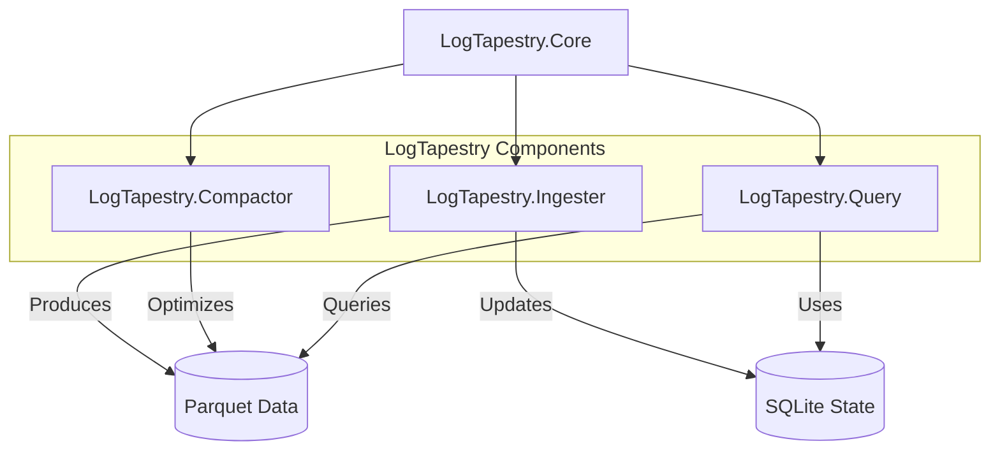
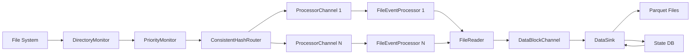
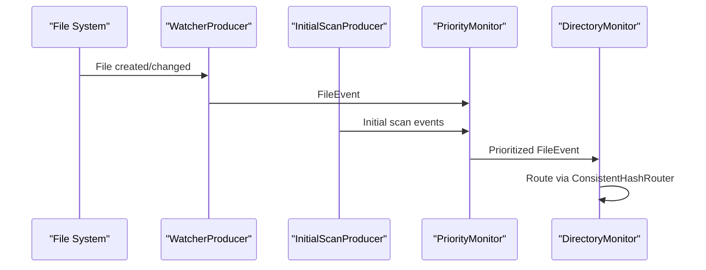
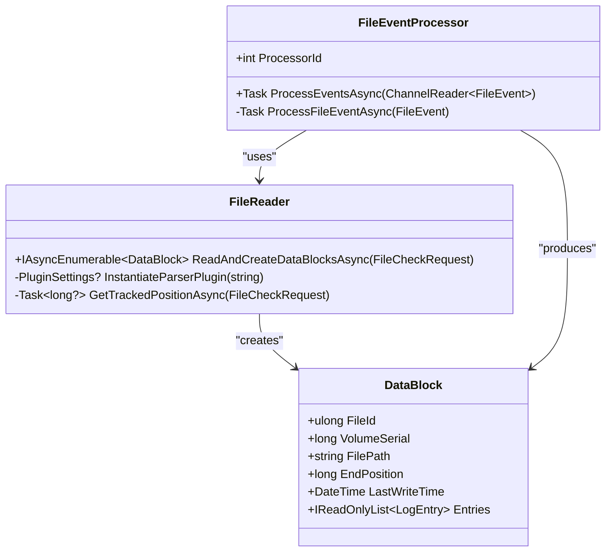
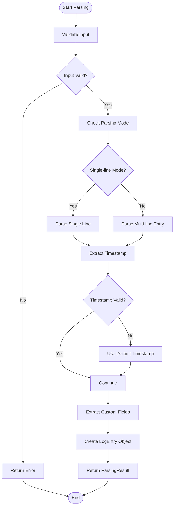
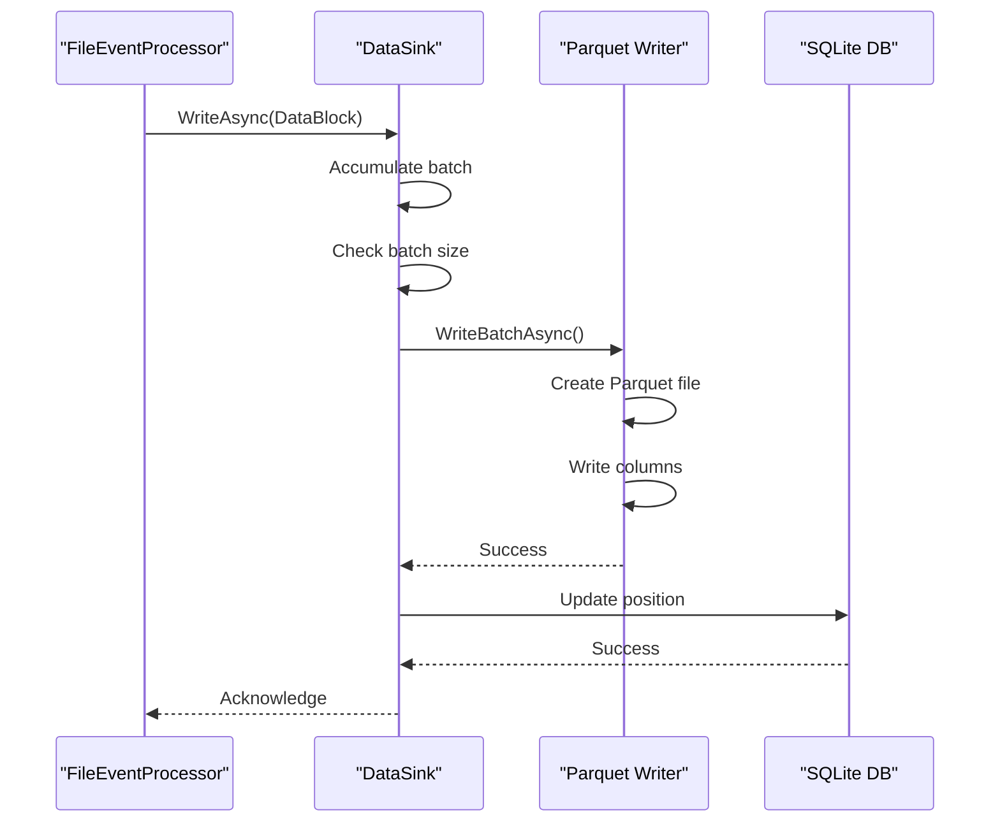
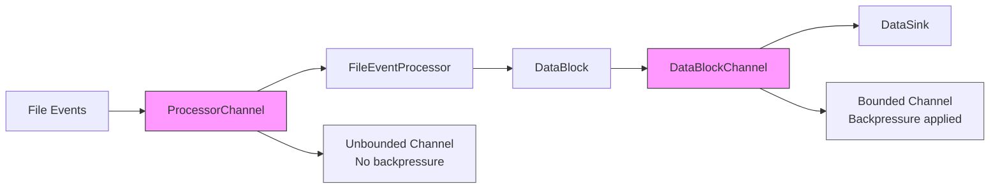
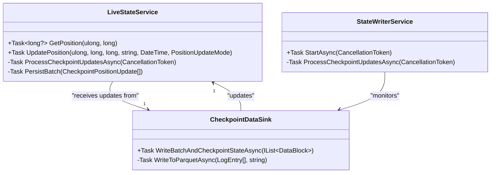
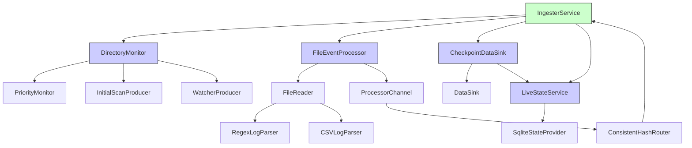

# Pipeline Architecture

## Table of Contents
1. [Introduction](#introduction)
2. [Project Structure](#project-structure)
3. [Core Components](#core-components)
4. [Architecture Overview](#architecture-overview)
5. [Detailed Component Analysis](#detailed-component-analysis)
6. [Dependency Analysis](#dependency-analysis)
7. [Performance Considerations](#performance-considerations)
8. [Troubleshooting Guide](#troubleshooting-guide)
9. [Conclusion](#conclusion)

## Introduction
LogTapestry is a high-performance log processing pipeline designed to ingest, parse, and store structured log data in Parquet format. The system follows a modular, event-driven architecture with strong emphasis on data consistency, fault tolerance, and scalability. This document details the end-to-end data flow from file system monitoring to structured Parquet output, focusing on the Ingester component. The pipeline employs channel-based buffering for backpressure management, consistent hashing for event routing, and atomic checkpointing for data-state consistency.

## Project Structure
The LogTapestry repository is organized into three main components: Ingester, Compactor, and Query. The Ingester handles real-time log ingestion and parsing, the Compactor optimizes stored Parquet files, and the Query component enables SQL-based data retrieval. The Core library contains shared data models and interfaces used across components.

**Diagram sources**
- [README.md](file://README.md)

**Section sources**
- [README.md](file://README.md)

## Core Components
The data processing pipeline consists of several core components that work together to transform raw log files into structured Parquet data. The key components include DirectoryMonitor for file system monitoring, FileReader for log file reading and parsing, FileEventProcessor for event handling, and DataSink for batch writing to Parquet format. These components are orchestrated by the IngesterService, which manages the lifecycle of the entire pipeline.

**Section sources**
- [IngesterService.cs](file://src/LogTapestry.Ingester/IngesterService.cs)
- [DirectoryMonitor.cs](file://src/LogTapestry.Ingester/DirectoryMonitor.cs)
- [FileReader.cs](file://src/LogTapestry.Ingester/FileReader.cs)
- [DataSink.cs](file://src/LogTapestry.Ingester/DataSink.cs)

## Architecture Overview
The LogTapestry Ingester follows a producer-consumer architecture with multiple stages of processing. The pipeline begins with file system monitoring, progresses through event queuing and log parsing, and concludes with batch writing to Parquet format. Each stage is connected by channels that provide buffering and backpressure management. The system uses consistent hashing to ensure that all events for a specific file are processed by the same worker, preventing race conditions and ensuring ordered processing.

**Diagram sources**
- [IngesterService.cs](file://src/LogTapestry.Ingester/IngesterService.cs)
- [DirectoryMonitor.cs](file://src/LogTapestry.Ingester/DirectoryMonitor.cs)
- [FileEventProcessor.cs](file://src/LogTapestry.Ingester/FileEventProcessor.cs)
- [FileReader.cs](file://src/LogTapestry.Ingester/FileReader.cs)
- [DataSink.cs](file://src/LogTapestry.Ingester/DataSink.cs)

## Detailed Component Analysis

### Directory Monitoring
The DirectoryMonitor component is responsible for monitoring file system changes in the target log directories. It uses .NET's FileSystemWatcher internally but abstracts it behind a priority-based processing model. The monitor handles both initial directory scans and real-time file change notifications, routing events through a priority system that ensures timely processing of new log entries.

**Diagram sources**
- [DirectoryMonitor.cs](file://src/LogTapestry.Ingester/DirectoryMonitor.cs)
- [WatcherProducer.cs](file://src/LogTapestry.Ingester/WatcherProducer.cs)
- [InitialScanProducer.cs](file://src/LogTapestry.Ingester/InitialScanProducer.cs)
- [PriorityMonitor.cs](file://src/LogTapestry.Ingester/PriorityMonitor.cs)

**Section sources**
- [DirectoryMonitor.cs](file://src/LogTapestry.Ingester/DirectoryMonitor.cs)

### File Event Processing
File events are processed by dedicated FileEventProcessor instances that handle events from processor-specific channels. Each processor is responsible for transforming file events into DataBlock objects through the FileReader component. The system uses consistent hashing to ensure that all events for a specific file are routed to the same processor, guaranteeing sequential processing and preventing race conditions.

**Diagram sources**
- [FileEventProcessor.cs](file://src/LogTapestry.Ingester/FileEventProcessor.cs)
- [FileReader.cs](file://src/LogTapestry.Ingester/FileReader.cs)
- [DataBlock.cs](file://src/LogTapestry.Core/DataBlock.cs)

**Section sources**
- [FileEventProcessor.cs](file://src/LogTapestry.Ingester/FileEventProcessor.cs)
- [FileReader.cs](file://src/LogTapestry.Ingester/FileReader.cs)
- [DataBlock.cs](file://src/LogTapestry.Core/DataBlock.cs)

### Log Parsing
Log parsing is performed by parser implementations that conform to the ILogParser interface. The primary implementation, RegexLogParser, uses regular expressions to extract structured data from log lines. Parsers are instantiated based on plugin configuration and are capable of handling both single-line and multi-line log entries. The parsing process transforms raw text into structured LogEntry objects with timestamp, level, message, and custom fields.

**Diagram sources**
- [RegexLogParser.cs](file://src/LogTapestry.Core/RegexLogParser.cs)
- [ILogParser.cs](file://src/LogTapestry.Core/Interfaces/ILogParser.cs)
- [LogEntry.cs](file://src/LogTapestry.Core/LogEntry.cs)

**Section sources**
- [RegexLogParser.cs](file://src/LogTapestry.Core/RegexLogParser.cs)
- [ILogParser.cs](file://src/LogTapestry.Core/Interfaces/ILogParser.cs)
- [LogEntry.cs](file://src/LogTapestry.Core/LogEntry.cs)

### Batch Writing and Data Sink
The DataSink component is responsible for writing batches of log entries to Parquet files. It implements a columnar storage format with efficient compression and encoding. The CheckpointDataSink ensures atomic data and state persistence by writing data to Parquet first, then updating the tracking position in SQLite only after successful data persistence. This checkpointing model prevents data loss and ensures consistency between the data store and tracking state.

**Diagram sources**
- [DataSink.cs](file://src/LogTapestry.Ingester/DataSink.cs)
- [CheckpointDataSink.cs](file://src/LogTapestry.Ingester/CheckpointDataSink.cs)
- [StateWriterService.cs](file://src/LogTapestry.Ingester/StateWriterService.cs)

**Section sources**
- [DataSink.cs](file://src/LogTapestry.Ingester/DataSink.cs)
- [CheckpointDataSink.cs](file://src/LogTapestry.Ingester/CheckpointDataSink.cs)

### Backpressure and Channel-Based Buffering
The pipeline uses channels extensively to manage backpressure between processing stages. Each processor has its own unbounded channel for receiving file events, while the DataBlockChannel is bounded to limit memory usage. This design allows producers to continue operating even when consumers are temporarily slow, while preventing unbounded memory growth.

**Diagram sources**
- [ProcessorChannel.cs](file://src/LogTapestry.Ingester/ProcessorChannel.cs)
- [IngesterService.cs](file://src/LogTapestry.Ingester/IngesterService.cs)

**Section sources**
- [ProcessorChannel.cs](file://src/LogTapestry.Ingester/ProcessorChannel.cs)
- [IngesterService.cs](file://src/LogTapestry.Ingester/IngesterService.cs)

### State Management and Checkpointing
The system implements a sophisticated state management system using both in-memory caching and persistent storage. The LiveStateService maintains an in-memory cache of file positions as the source of truth, while asynchronously persisting updates to SQLite. The checkpointing model ensures that position updates are only committed after successful data persistence, preventing data loss in case of failures.

**Diagram sources**
- [LiveStateService.cs](file://src/LogTapestry.Ingester/LiveStateService.cs)
- [StateWriterService.cs](file://src/LogTapestry.Ingester/StateWriterService.cs)
- [CheckpointDataSink.cs](file://src/LogTapestry.Ingester/CheckpointDataSink.cs)

**Section sources**
- [LiveStateService.cs](file://src/LogTapestry.Ingester/LiveStateService.cs)
- [StateWriterService.cs](file://src/LogTapestry.Ingester/StateWriterService.cs)
- [CheckpointDataSink.cs](file://src/LogTapestry.Ingester/CheckpointDataSink.cs)

## Dependency Analysis
The LogTapestry Ingester has a well-defined dependency structure with clear separation of concerns. The core dependencies include the Parquet.NET library for columnar storage, Microsoft.Extensions for dependency injection and logging, and System.Threading.Channels for asynchronous communication. The component dependencies form a directed acyclic graph with the IngesterService at the root.

**Diagram sources**
- [IngesterService.cs](file://src/LogTapestry.Ingester/IngesterService.cs)
- [DirectoryMonitor.cs](file://src/LogTapestry.Ingester/DirectoryMonitor.cs)
- [FileEventProcessor.cs](file://src/LogTapestry.Ingester/FileEventProcessor.cs)
- [CheckpointDataSink.cs](file://src/LogTapestry.Ingester/CheckpointDataSink.cs)
- [LiveStateService.cs](file://src/LogTapestry.Ingester/LiveStateService.cs)
- [ConsistentHashRouter.cs](file://src/LogTapestry.Ingester/ConsistentHashRouter.cs)
- [ProcessorChannel.cs](file://src/LogTapestry.Ingester/ProcessorChannel.cs)

**Section sources**
- [IngesterService.cs](file://src/LogTapestry.Ingester/IngesterService.cs)

## Performance Considerations
The LogTapestry pipeline is designed with performance as a primary concern. Key performance features include:

- **I/O Batching**: Data is written to Parquet files in batches based on entry count, reducing the number of file operations and improving throughput.
- **Memory Usage**: The bounded DataBlockChannel limits memory consumption, while the use of async streams minimizes memory footprint during parsing.
- **Parallelism Limits**: The FileReaderThreadPoolSize setting controls the number of concurrent processors, preventing resource exhaustion.
- **Efficient Parsing**: Regex patterns are compiled once and reused, and file positions are tracked to avoid reprocessing.
- **Columnar Storage**: Parquet format provides efficient compression and encoding, reducing storage requirements and improving query performance.

The system also includes comprehensive metrics instrumentation, with counters for ingested log entries and processed bytes, enabling performance monitoring and optimization.

**Section sources**
- [DataSink.cs](file://src/LogTapestry.Ingester/DataSink.cs)
- [IngesterService.cs](file://src/LogTapestry.Ingester/IngesterService.cs)
- [FileReader.cs](file://src/LogTapestry.Ingester/FileReader.cs)

## Troubleshooting Guide
Common issues and their solutions:

1. **Missing Log Entries**: Verify that the file patterns in plugin configuration match the log files. Check the FileReader logs for "No plugin matched" warnings.

2. **High Memory Usage**: Reduce the FileReaderThreadPoolSize setting or adjust the MaxEntriesPerDataBlock value to control memory consumption.

3. **Slow Processing**: Monitor the DataBlockChannel queue depth. If consistently full, increase the number of processor channels or optimize parsing rules.

4. **State Inconsistency**: The checkpointing model should prevent this, but if encountered, verify that the SQLite database is not corrupted and has sufficient disk space.

5. **Parsing Failures**: Check the logs for "Log parsing failed" messages. These indicate issues with regex patterns or log format changes.

The system includes extensive logging at multiple levels (Trace, Debug, Information, Warning, Error) to aid in troubleshooting. The LiveStateService provides real-time visibility into file processing positions.

**Section sources**
- [FileReader.cs](file://src/LogTapestry.Ingester/FileReader.cs)
- [RegexLogParser.cs](file://src/LogTapestry.Core/RegexLogParser.cs)
- [LiveStateService.cs](file://src/LogTapestry.Ingester/LiveStateService.cs)
- [DataSink.cs](file://src/LogTapestry.Ingester/DataSink.cs)

## Conclusion
The LogTapestry data processing pipeline demonstrates a robust, scalable architecture for log ingestion and storage. By combining file system monitoring, channel-based buffering, consistent hashing, and atomic checkpointing, the system achieves high throughput while maintaining data consistency and fault tolerance. The modular design allows for easy extension and maintenance, with clear separation of concerns between components. The use of Parquet format enables efficient storage and querying of structured log data, making it suitable for large-scale logging scenarios.

**Referenced Files in This Document**   
- [DirectoryMonitor.cs](file://src/LogTapestry.Ingester/DirectoryMonitor.cs)
- [FileReader.cs](file://src/LogTapestry.Ingester/FileReader.cs)
- [DataSink.cs](file://src/LogTapestry.Ingester/DataSink.cs)
- [FileEventProcessor.cs](file://src/LogTapestry.Ingester/FileEventProcessor.cs)
- [IngesterService.cs](file://src/LogTapestry.Ingester/IngesterService.cs)
- [LogEntry.cs](file://src/LogTapestry.Core/LogEntry.cs)
- [DataBlock.cs](file://src/LogTapestry.Core/DataBlock.cs)
- [RegexLogParser.cs](file://src/LogTapestry.Core/RegexLogParser.cs)
- [ProcessorChannel.cs](file://src/LogTapestry.Ingester/ProcessorChannel.cs)
- [ConsistentHashRouter.cs](file://src/LogTapestry.Ingester/ConsistentHashRouter.cs)
- [CheckpointDataSink.cs](file://src/LogTapestry.Ingester/CheckpointDataSink.cs)
- [StateWriterService.cs](file://src/LogTapestry.Ingester/StateWriterService.cs)
- [LiveStateService.cs](file://src/LogTapestry.Ingester/LiveStateService.cs)
- [ILogParser.cs](file://src/LogTapestry.Core/Interfaces/ILogParser.cs)