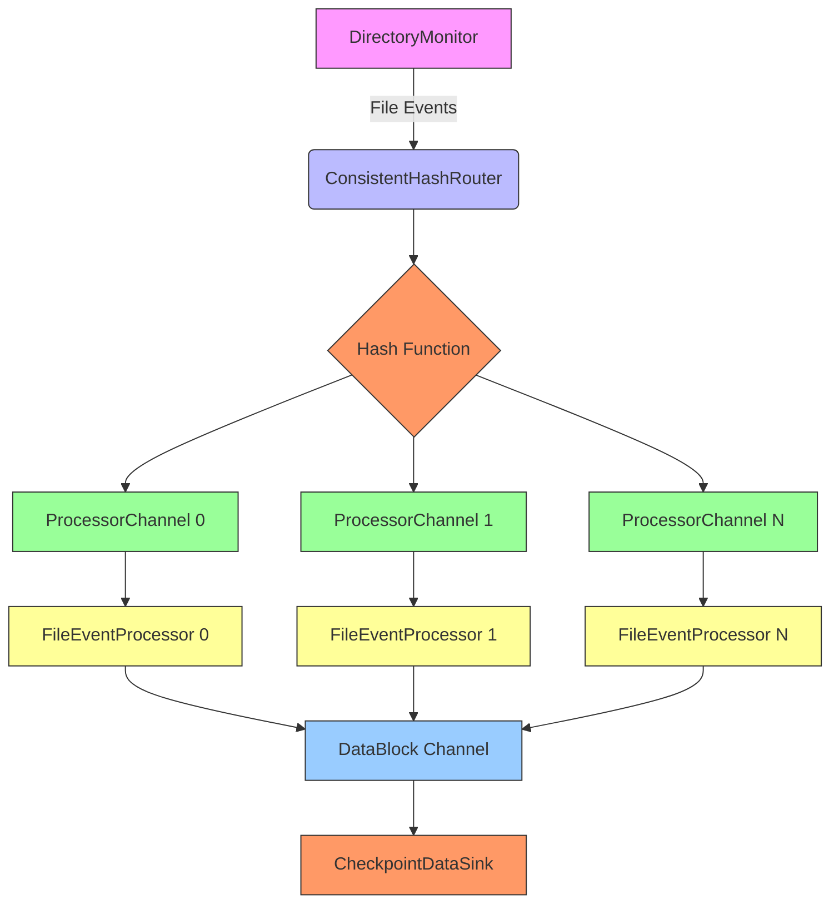
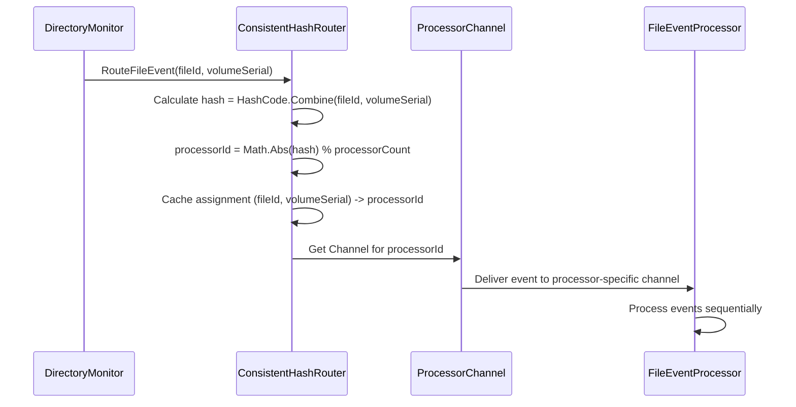
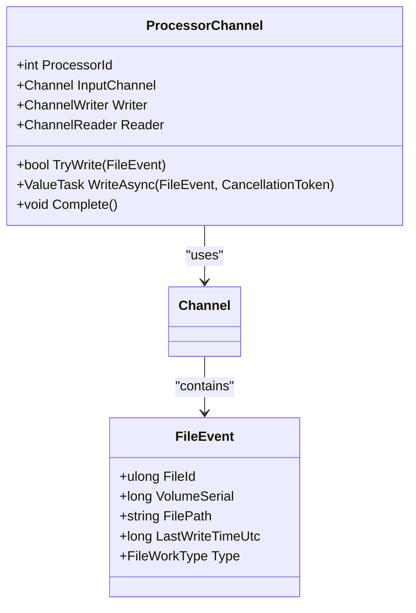
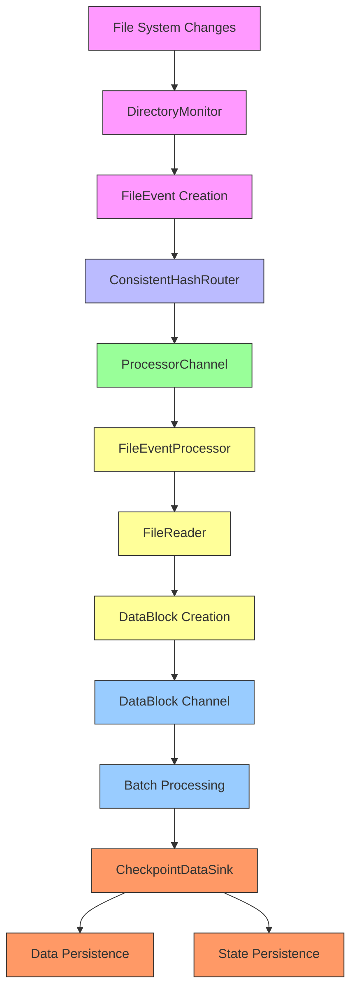
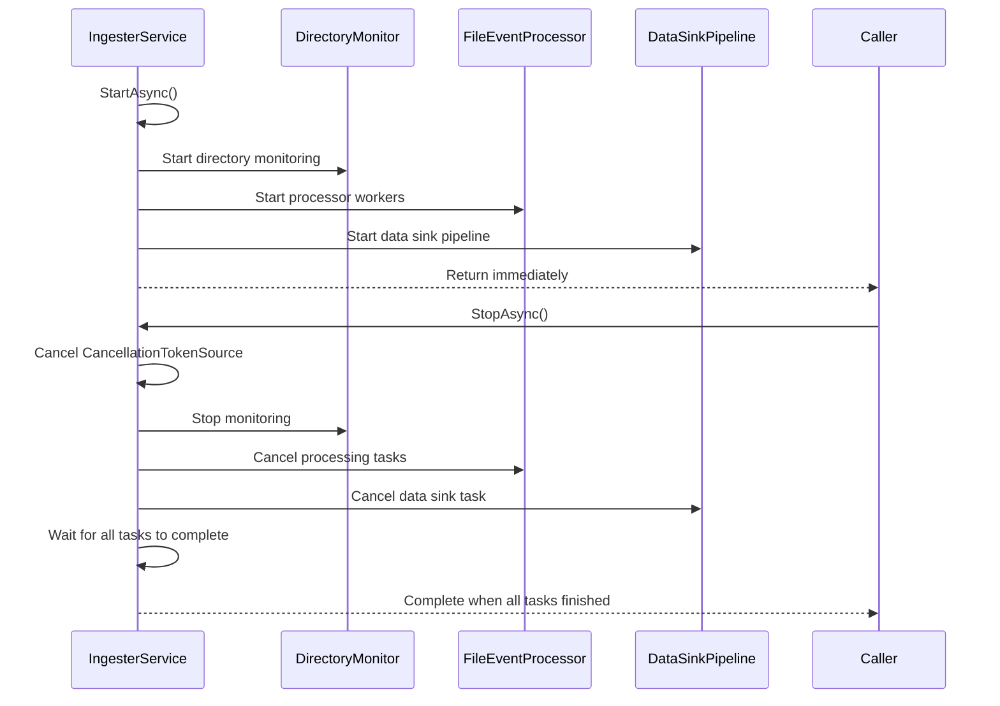

# Worker Pool and Task Distribution


## Table of Contents
1. [Introduction](#introduction)
2. [Worker Pool Architecture Overview](#worker-pool-architecture-overview)
3. [Consistent Hashing for Task Distribution](#consistent-hashing-for-task-distribution)
4. [ProcessorChannel: Independent Processing Units](#processorchannel-independent-processing-units)
5. [Processing Pipeline and Data Flow](#processing-pipeline-and-data-flow)
6. [Thread Safety and Concurrency Control](#thread-safety-and-concurrency-control)
7. [Startup and Shutdown Coordination](#startup-and-shutdown-coordination)
8. [Configuration and Tuning](#configuration-and-tuning)
9. [Metrics and Monitoring](#metrics-and-monitoring)
10. [Performance Analysis and Scalability](#performance-analysis-and-scalability)

## Introduction
This document provides comprehensive documentation for the worker pool architecture and consistent hashing-based task distribution mechanism in the LogTapestry ingestion system. The architecture is designed to efficiently process log files from multiple sources while ensuring that events from the same file are processed in order and routed consistently to the same processing thread. The system achieves load balancing across worker threads while maintaining processing guarantees through a combination of consistent hashing, channel-based communication, and coordinated state management.

The core components include the ConsistentHashRouter for deterministic task routing, ProcessorChannel for thread-isolated event processing, and FileEventProcessor for executing the actual parsing and data transformation logic. This documentation details the design, implementation, and operational characteristics of these components, providing insights into their interactions and performance implications.

## Worker Pool Architecture Overview





**Diagram sources**
- [ConsistentHashRouter.cs](file://src/LogTapestry.Ingester/ConsistentHashRouter.cs#L8-L85)
- [ProcessorChannel.cs](file://src/LogTapestry.Ingester/ProcessorChannel.cs#L13-L66)
- [FileEventProcessor.cs](file://src/LogTapestry.Ingester/FileEventProcessor.cs#L13-L120)
- [IngesterService.cs](file://src/LogTapestry.Ingester/IngesterService.cs#L14-L197)

**Section sources**
- [ConsistentHashRouter.cs](file://src/LogTapestry.Ingester/ConsistentHashRouter.cs#L8-L85)
- [ProcessorChannel.cs](file://src/LogTapestry.Ingester/ProcessorChannel.cs#L13-L66)
- [FileEventProcessor.cs](file://src/LogTapestry.Ingester/FileEventProcessor.cs#L13-L120)
- [IngesterService.cs](file://src/LogTapestry.Ingester/IngesterService.cs#L14-L197)

## Consistent Hashing for Task Distribution

The ConsistentHashRouter class implements a consistent hashing algorithm to ensure that all events from the same log file are routed to the same ProcessorChannel, thereby maintaining processing order and preventing race conditions. The router uses a combination of file identifier (FileId) and volume serial number (VolumeSerial) to create a stable hash key that deterministically maps to a specific processor.

When a file event is received, the router calculates a hash using the HashCode.Combine method on the file's unique identifiers. This hash is then used to determine the target processor through modulo arithmetic based on the configured worker count. The assignment is cached in a thread-safe dictionary to ensure that subsequent events from the same file are routed to the same processor.





**Diagram sources**
- [ConsistentHashRouter.cs](file://src/LogTapestry.Ingester/ConsistentHashRouter.cs#L8-L85)
- [ProcessorChannel.cs](file://src/LogTapestry.Ingester/ProcessorChannel.cs#L13-L66)

**Section sources**
- [ConsistentHashRouter.cs](file://src/LogTapestry.Ingester/ConsistentHashRouter.cs#L8-L85)

### Hash Distribution and Collision Handling
The consistent hashing implementation uses the built-in HashCode.Combine method to generate a stable hash from the file's unique identifiers. This approach ensures that the same file will always produce the same hash value across application restarts, maintaining consistent routing behavior.

The system handles hash collisions implicitly through the modulo operation. Since the hash space is much larger than the number of processors, collisions at the processor level are rare and evenly distributed. The router maintains an internal dictionary of file-to-processor assignments, which serves as a cache to avoid recalculating hashes for files that have been processed before.

The current implementation does not use virtual nodes or other advanced consistent hashing techniques, as the number of processors is relatively small and stable. This simplifies the implementation while still providing good load distribution across workers.

### Load Balancing Characteristics
The consistent hashing mechanism provides effective load balancing across worker threads by distributing files evenly based on their hash values. Since file identifiers are typically randomly distributed, the modulo operation results in a uniform distribution of files across processors.

The load balancing effectiveness depends on the number of active files being processed. With a large number of files, the distribution approaches perfect uniformity. In cases with fewer files, some processors may be underutilized while others handle multiple files. This is an inherent characteristic of consistent hashing with a fixed number of buckets (processors).

## ProcessorChannel: Independent Processing Units

The ProcessorChannel class represents an independent processing unit within the worker pool architecture. Each channel is associated with a specific processor ID and provides a dedicated communication pathway for file events. This design ensures that events for any given file are processed by the same worker thread, maintaining processing order and preventing race conditions.





**Diagram sources**
- [ProcessorChannel.cs](file://src/LogTapestry.Ingester/ProcessorChannel.cs#L13-L66)
- [NewWorkerTypes.cs](file://src/LogTapestry.Core/NewWorkerTypes.cs#L29-L36)

**Section sources**
- [ProcessorChannel.cs](file://src/LogTapestry.Ingester/ProcessorChannel.cs#L13-L66)

### Channel Design and Capacity
Each ProcessorChannel uses an unbounded System.Threading.Channels.Channel to buffer incoming file events. The unbounded nature of the channel prevents blocking during high event throughput periods, allowing the system to absorb bursts of file activity. However, this also means that memory usage can grow without bound under sustained high load.

The channel provides both synchronous (TryWrite) and asynchronous (WriteAsync) write methods, allowing flexibility in how events are submitted. The TryWrite method is non-blocking and returns false if the channel is closed, while WriteAsync supports cancellation through CancellationToken.

Currently, the system does not expose a mechanism to monitor queue depth, as the GetPendingEventCount method is implemented as a placeholder returning zero. This could be enhanced in the future by maintaining a counter that tracks the number of pending events.

### Thread Safety and Isolation
The ProcessorChannel implementation is thread-safe for concurrent operations. Multiple producers can write to the channel simultaneously, while each channel is consumed by a single FileEventProcessor running on its own task. This one-writer-to-many-readers pattern is efficiently handled by the underlying Channel implementation.

The channel abstraction provides natural isolation between processors, preventing cross-thread interference and eliminating the need for explicit locking in the processing logic. Each processor operates independently, reading from its dedicated channel and processing events sequentially.

## Processing Pipeline and Data Flow

The processing pipeline begins with file system monitoring and ends with data persistence through checkpointing. The pipeline is designed to maintain data integrity while maximizing throughput and responsiveness.





**Diagram sources**
- [FileEventProcessor.cs](file://src/LogTapestry.Ingester/FileEventProcessor.cs#L13-L120)
- [IngesterService.cs](file://src/LogTapestry.Ingester/IngesterService.cs#L14-L197)

**Section sources**
- [FileEventProcessor.cs](file://src/LogTapestry.Ingester/FileEventProcessor.cs#L13-L120)
- [IngesterService.cs](file://src/LogTapestry.Ingester/IngesterService.cs#L14-L197)

### Event Processing Workflow
When a file event is received, it is transformed into a FileCheckRequest and passed to the FileReader component. The FileReader reads the file content from the last known position, parses the new entries, and creates DataBlock objects containing the parsed log entries.

The DataBlock objects are then written to a shared bounded channel with a capacity of 10. This bounded channel acts as a buffer between the file processing stage and the data sinking stage, preventing the system from overwhelming downstream components with too much data at once.

A separate task processes the DataBlock channel in batches, either when a certain number of entries have accumulated or when a periodic timer fires. This batching improves I/O efficiency by reducing the number of write operations to persistent storage.

### Data Integrity and Checkpointing
The system uses a checkpointing model to ensure atomic data and state persistence. The CheckpointDataSink component writes both the data blocks and the corresponding processing state in a single transaction, preventing race conditions and ensuring consistency.

If a batch write fails, the entire operation is aborted and the batch is not acknowledged, allowing for retry or investigation. This all-or-nothing approach guarantees that the system state remains consistent, even in the face of failures.

## Thread Safety and Concurrency Control

The worker pool architecture employs several concurrency control mechanisms to ensure thread safety and data integrity across multiple processing threads.

### ConsistentHashRouter Synchronization
The ConsistentHashRouter uses a dedicated Lock object to protect access to the _fileAssignments dictionary. This lock ensures that file-to-processor assignments are created atomically and prevents race conditions when multiple threads attempt to assign the same file simultaneously.


```csharp
private readonly Lock _lock = new();
// All dictionary operations are wrapped in lock (_lock) { ... }
```


This fine-grained locking approach allows multiple threads to query existing assignments concurrently while serializing modifications to the assignment map. The lock is only held for the duration of dictionary operations, minimizing contention.

### Channel-Based Communication
The system relies heavily on System.Threading.Channels for thread-safe communication between components. Channels provide built-in thread safety for concurrent producers and consumers, eliminating the need for explicit locking in most cases.

The unbounded channels used for ProcessorChannels allow unlimited buffering of file events, preventing producers from blocking. The bounded channel used for DataBlock transmission limits memory usage while still providing sufficient buffering to handle throughput variations.

### Immutable Data Structures
Where possible, the system uses immutable data structures to avoid shared mutable state. FileEvent objects are created once and not modified during processing, preventing race conditions that could occur if multiple threads accessed the same mutable object.

## Startup and Shutdown Coordination

The IngesterService class manages the lifecycle of the entire worker pool, coordinating startup and shutdown of all components through the IHostedService interface.





**Diagram sources**
- [IngesterService.cs](file://src/LogTapestry.Ingester/IngesterService.cs#L14-L197)

**Section sources**
- [IngesterService.cs](file://src/LogTapestry.Ingester/IngesterService.cs#L14-L197)

### Startup Sequence
During startup, the IngesterService initializes all components in the following order:
1. Create FileEventProcessor instances for each processor
2. Start the directory monitor to begin receiving file events
3. Start the state writer service for periodic state persistence
4. Start processor worker tasks to begin processing events
5. Start the data sink pipeline for batch processing

The service uses a linked CancellationTokenSource to coordinate cancellation across all components, ensuring that when shutdown is initiated, all tasks receive the cancellation signal simultaneously.

### Shutdown Sequence
During shutdown, the service follows a graceful termination process:
1. Cancel the CancellationTokenSource to signal all tasks to stop
2. Stop the directory monitor gracefully
3. Wait for all processing tasks to complete
4. Ensure all data is flushed and persisted

This coordinated shutdown ensures that no data is lost during termination and that all components have the opportunity to clean up resources properly.

## Configuration and Tuning

The worker pool behavior is controlled through configuration settings defined in the LogTapestrySettings class, particularly the IngesterSettings section.


```json
{
  "Ingester": {
    "FileReaderThreadPoolSize": 8,
    "BatchSize": 50000,
    "MaxEntriesPerDataBlock": 10000,
    "PollingIntervalMs": 1000,
    "StateWriterBatchSize": 1000,
    "StateWriterIntervalSeconds": 2,
    "FileSystemWatcherBufferSize": 65536,
    "BatchSizeInBlocks": 100,
    "BatchTimeout": "00:00:30",
    "EnableCheckpointing": true
  }
}
```


**Section sources**
- [Configuration.cs](file://src/LogTapestry.Core/Configuration.cs#L2-L84)

### Key Configuration Options
**FileReaderThreadPoolSize**: Determines the number of worker threads in the pool. Default is Environment.ProcessorCount * 2, providing good utilization of multi-core systems.

**BatchSize**: Controls the number of log entries processed in a single batch before checkpointing. Larger values improve throughput but increase memory usage and recovery time after failures.

**MaxEntriesPerDataBlock**: Limits the size of individual data blocks created during file reading. This prevents any single block from consuming excessive memory.

**StateWriterIntervalSeconds**: Controls how frequently processing state is written to persistent storage. More frequent writes reduce potential data loss but increase I/O overhead.

### Worker Count Tuning
The optimal worker count depends on the workload characteristics:
- For CPU-intensive parsing tasks, match the worker count to the number of CPU cores
- For I/O-bound workloads with many small files, higher worker counts can improve throughput
- For workloads with few large files, fewer workers may be sufficient

The system automatically configures the ConsistentHashRouter and creates the appropriate number of ProcessorChannels based on the FileReaderThreadPoolSize setting.

## Metrics and Monitoring

The system provides several metrics for monitoring worker utilization and queue depth, primarily through logging and internal counters.

### Available Metrics
**Processor Assignment Count**: The ConsistentHashRouter provides a GetAssignmentCount method that returns the number of unique files currently assigned to processors. This metric indicates the diversity of the workload.

**Processor-Specific Logging**: Each ProcessorChannel and FileEventProcessor includes the processor ID in log messages, enabling analysis of per-processor activity and load distribution.

**Batch Processing Metrics**: The data sink pipeline logs the size of each batch processed, providing insight into throughput and batching efficiency.

### Monitoring Recommendations
To effectively monitor the worker pool:
1. Track the number of file assignments to detect imbalanced workloads
2. Monitor batch sizes to ensure efficient processing
3. Analyze processor-specific logs to identify underutilized or overloaded workers
4. Watch for warnings from ProcessorChannel.TryWrite failures, which indicate channel backpressure

The current implementation could be enhanced with more comprehensive metrics collection, such as queue depth monitoring and processor utilization rates.

## Performance Analysis and Scalability

### Scalability Limits
The current architecture has several scalability characteristics and potential limits:

**Processor Count**: The maximum number of workers is limited only by system resources, but diminishing returns occur when the number of workers exceeds the number of CPU cores for CPU-bound workloads.

**File Count**: The system can handle a large number of files, as file assignments are stored in a dictionary with O(1) lookup time. Memory usage scales linearly with the number of unique files being processed.

**Throughput**: Maximum throughput is constrained by the slowest component in the pipeline, typically disk I/O for reading log files or database I/O for checkpointing.

### Performance Optimization Opportunities
**Queue Depth Monitoring**: Implement actual queue depth tracking in ProcessorChannel to provide better visibility into processing backpressure.

**Dynamic Worker Scaling**: Consider implementing dynamic adjustment of worker count based on system load and file activity patterns.

**Advanced Hashing**: For more even distribution, consider implementing virtual nodes in the consistent hashing algorithm, especially when the number of processors is small.

**Channel Capacity Tuning**: Evaluate the trade-offs between bounded and unbounded channels, potentially using bounded channels with appropriate backpressure signaling.

The current design provides a robust foundation for log processing with good scalability characteristics. By maintaining per-file processing order through consistent hashing while achieving load balancing across workers, the system effectively balances the competing requirements of data integrity and performance.

**Referenced Files in This Document**   
- [ConsistentHashRouter.cs](file://src/LogTapestry.Ingester/ConsistentHashRouter.cs)
- [ProcessorChannel.cs](file://src/LogTapestry.Ingester/ProcessorChannel.cs)
- [FileEventProcessor.cs](file://src/LogTapestry.Ingester/FileEventProcessor.cs)
- [IngesterService.cs](file://src/LogTapestry.Ingester/IngesterService.cs)
- [Configuration.cs](file://src/LogTapestry.Core/Configuration.cs)
- [Program.cs](file://src/LogTapestry.Ingester/Program.cs)
- [NewWorkerTypes.cs](file://src/LogTapestry.Core/NewWorkerTypes.cs)