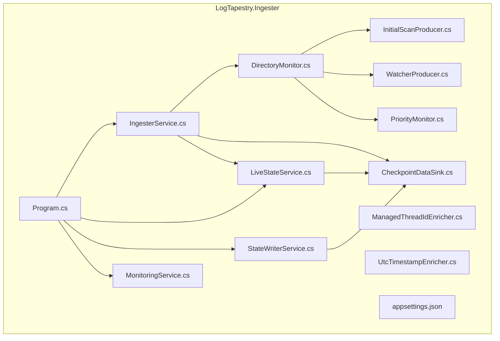
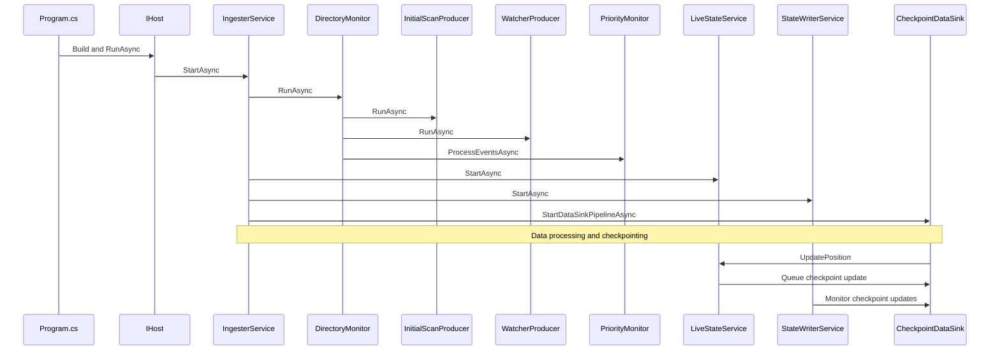
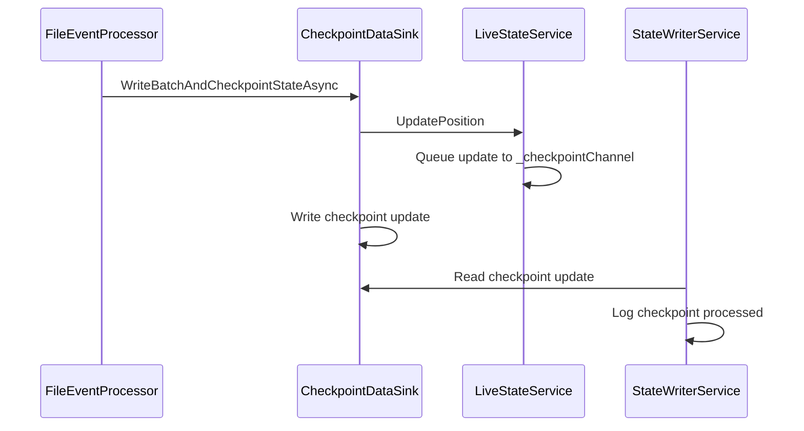
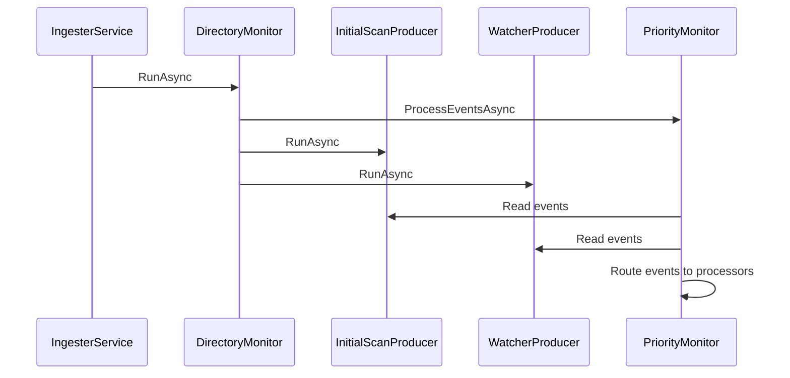
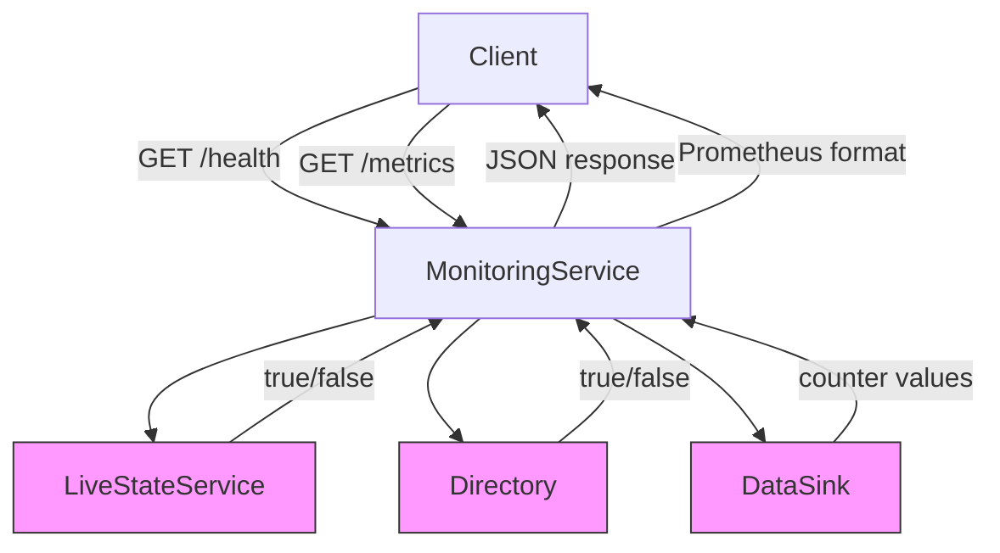
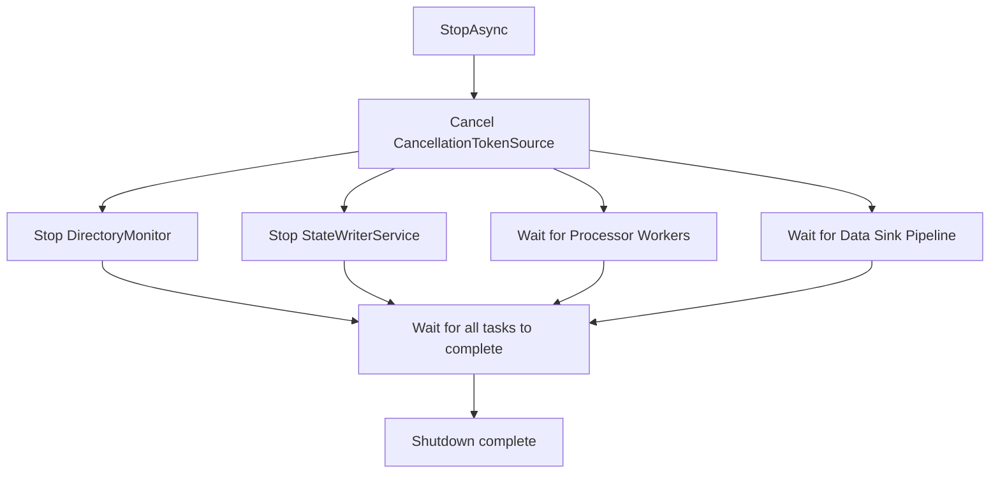

# Component Interaction and Lifecycle Management


## Table of Contents
1. [Introduction](#introduction)
2. [Project Structure](#project-structure)
3. [Core Components](#core-components)
4. [Architecture Overview](#architecture-overview)
5. [Detailed Component Analysis](#detailed-component-analysis)
6. [Dependency Analysis](#dependency-analysis)
7. [Performance Considerations](#performance-considerations)
8. [Troubleshooting Guide](#troubleshooting-guide)
9. [Conclusion](#conclusion)

## Introduction
This document details the lifecycle and interaction patterns of core components within the LogTapestry Ingester service. It explains the service registration and startup sequence using Microsoft.Extensions.Hosting, including dependency injection setup and configuration binding. The orchestration of DirectoryMonitor, InitialScanProducer, and WatcherProducer by IngesterService during initialization is described. The coordination between LiveStateService for runtime state and StateWriterService for persistence is illustrated. Health monitoring integration via MonitoringService and PriorityMonitor is covered, along with graceful shutdown procedures and resource cleanup. Diagnostic logging practices using Serilog enrichers are explained, and guidance is provided for extending the service lifecycle.

## Project Structure
The LogTapestry repository is organized into multiple modules, with the Ingester service located in `src/LogTapestry.Ingester`. This module contains the core logic for monitoring log files, processing events, and persisting data and state. Key components include hosted services for lifecycle management, producers for file events, state management services, and diagnostic utilities. Configuration is managed through `appsettings.json`, and logging is implemented using Serilog with custom enrichers.





**Diagram sources**
- [Program.cs](file://src/LogTapestry.Ingester/Program.cs)
- [IngesterService.cs](file://src/LogTapestry.Ingester/IngesterService.cs)
- [DirectoryMonitor.cs](file://src/LogTapestry.Ingester/DirectoryMonitor.cs)
- [InitialScanProducer.cs](file://src/LogTapestry.Ingester/InitialScanProducer.cs)
- [WatcherProducer.cs](file://src/LogTapestry.Ingester/WatcherProducer.cs)
- [LiveStateService.cs](file://src/LogTapestry.Ingester/LiveStateService.cs)
- [StateWriterService.cs](file://src/LogTapestry.Ingester/StateWriterService.cs)
- [CheckpointDataSink.cs](file://src/LogTapestry.Ingester/CheckpointDataSink.cs)
- [PriorityMonitor.cs](file://src/LogTapestry.Ingester/PriorityMonitor.cs)
- [MonitoringService.cs](file://src/LogTapestry.Ingester/MonitoringService.cs)

**Section sources**
- [Program.cs](file://src/LogTapestry.Ingester/Program.cs)
- [IngesterService.cs](file://src/LogTapestry.Ingester/IngesterService.cs)

## Core Components
The core components of the LogTapestry Ingester are designed around a hosted service architecture using Microsoft.Extensions.Hosting. The `IngesterService` orchestrates the initialization and coordination of file monitoring, event processing, and state persistence. `LiveStateService` maintains the in-memory source of truth for file positions, while `StateWriterService` monitors checkpoint updates. `MonitoringService` provides health and metrics endpoints, and `PriorityMonitor` ensures event processing priority. The `CheckpointDataSink` implements atomic data and state persistence through a coordinated checkpointing mechanism.

**Section sources**
- [IngesterService.cs](file://src/LogTapestry.Ingester/IngesterService.cs)
- [LiveStateService.cs](file://src/LogTapestry.Ingester/LiveStateService.cs)
- [StateWriterService.cs](file://src/LogTapestry.Ingester/StateWriterService.cs)
- [MonitoringService.cs](file://src/LogTapestry.Ingester/MonitoringService.cs)
- [PriorityMonitor.cs](file://src/LogTapestry.Ingester/PriorityMonitor.cs)
- [CheckpointDataSink.cs](file://src/LogTapestry.Ingester/CheckpointDataSink.cs)

## Architecture Overview
The LogTapestry Ingester follows a microservices-inspired architecture built on .NET's hosted service model. The system is initialized through `Program.cs`, which configures dependency injection, binds configuration, and registers hosted services. The `IngesterService` acts as the central orchestrator, starting the `DirectoryMonitor`, `StateWriterService`, processor workers, and data sink pipeline. The `DirectoryMonitor` coordinates `InitialScanProducer` and `WatcherProducer` through `PriorityMonitor`, which routes events to processor-specific channels using consistent hashing. State management is handled by `LiveStateService`, which maintains an in-memory cache and queues updates to SQLite via a channel. The `CheckpointDataSink` ensures atomic data and state persistence by writing data first and then emitting checkpoint updates.





**Diagram sources**
- [Program.cs](file://src/LogTapestry.Ingester/Program.cs#L1-L190)
- [IngesterService.cs](file://src/LogTapestry.Ingester/IngesterService.cs#L1-L200)
- [DirectoryMonitor.cs](file://src/LogTapestry.Ingester/DirectoryMonitor.cs#L1-L98)
- [InitialScanProducer.cs](file://src/LogTapestry.Ingester/InitialScanProducer.cs#L1-L142)
- [WatcherProducer.cs](file://src/LogTapestry.Ingester/WatcherProducer.cs#L1-L154)
- [PriorityMonitor.cs](file://src/LogTapestry.Ingester/PriorityMonitor.cs#L1-L100)
- [LiveStateService.cs](file://src/LogTapestry.Ingester/LiveStateService.cs#L1-L270)
- [StateWriterService.cs](file://src/LogTapestry.Ingester/StateWriterService.cs#L1-L72)
- [CheckpointDataSink.cs](file://src/LogTapestry.Ingester/CheckpointDataSink.cs#L1-L361)

## Detailed Component Analysis

### IngesterService Analysis
The `IngesterService` is the central orchestrator of the LogTapestry Ingester. It is registered as a hosted service and is responsible for starting and stopping all core components. During startup, it initializes processor channels, starts the directory monitor, state writer service, processor workers, and the data sink pipeline. It uses a `CancellationTokenSource` to coordinate graceful shutdown across all tasks.


```mermaid
classDiagram
class IngesterService {
+StartAsync(CancellationToken) Task
+StopAsync(CancellationToken) Task
-InitializeProcessorChannels() void
-StartProcessorWorkers(CancellationToken) Task[]
-StartDataSinkPipelineAsync(CancellationToken) Task
-ProcessDataBlockBatch(DataBlock[]) Task
}
class DirectoryMonitor {
+RunAsync(CancellationToken) Task
+StopAsync() Task
}
class StateWriterService {
+StartAsync(CancellationToken) Task
+StopAsync(CancellationToken) Task
}
class CheckpointDataSink {
+WriteBatchAndCheckpointStateAsync(IList~DataBlock~) Task
}
IngesterService --> DirectoryMonitor : "uses"
IngesterService --> StateWriterService : "uses"
IngesterService --> CheckpointDataSink : "uses"
IngesterService --> FileReader : "uses"
IngesterService --> ConsistentHashRouter : "uses"
IngesterService --> ProcessorChannel[] : "uses"
```


**Diagram sources**
- [IngesterService.cs](file://src/LogTapestry.Ingester/IngesterService.cs#L1-L200)

**Section sources**
- [IngesterService.cs](file://src/LogTapestry.Ingester/IngesterService.cs#L1-L200)

### LiveStateService and StateWriterService Coordination
The `LiveStateService` and `StateWriterService` work together to manage runtime state and ensure its persistence. `LiveStateService` acts as the in-memory source of truth for file positions, using a `ConcurrentDictionary` for thread-safe access. It queues position updates to a channel for asynchronous persistence to SQLite. `StateWriterService` monitors the `CheckpointDataSink` for successful checkpoint updates, serving as a logging and monitoring component.





**Diagram sources**
- [LiveStateService.cs](file://src/LogTapestry.Ingester/LiveStateService.cs#L1-L270)
- [StateWriterService.cs](file://src/LogTapestry.Ingester/StateWriterService.cs#L1-L72)
- [CheckpointDataSink.cs](file://src/LogTapestry.Ingester/CheckpointDataSink.cs#L1-L361)

**Section sources**
- [LiveStateService.cs](file://src/LogTapestry.Ingester/LiveStateService.cs#L1-L270)
- [StateWriterService.cs](file://src/LogTapestry.Ingester/StateWriterService.cs#L1-L72)

### DirectoryMonitor, InitialScanProducer, and WatcherProducer Initialization
The `DirectoryMonitor` coordinates the `InitialScanProducer` and `WatcherProducer` to provide a unified stream of file events. It uses `PriorityMonitor` to merge events from both producers, giving priority to real-time events from the watcher. The `InitialScanProducer` performs a parallel scan of the directory at startup, while the `WatcherProducer` uses `FileSystemWatcher` to detect real-time changes.





**Diagram sources**
- [DirectoryMonitor.cs](file://src/LogTapestry.Ingester/DirectoryMonitor.cs#L1-L98)
- [InitialScanProducer.cs](file://src/LogTapestry.Ingester/InitialScanProducer.cs#L1-L142)
- [WatcherProducer.cs](file://src/LogTapestry.Ingester/WatcherProducer.cs#L1-L154)
- [PriorityMonitor.cs](file://src/LogTapestry.Ingester/PriorityMonitor.cs#L1-L100)

**Section sources**
- [DirectoryMonitor.cs](file://src/LogTapestry.Ingester/DirectoryMonitor.cs#L1-L98)
- [InitialScanProducer.cs](file://src/LogTapestry.Ingester/InitialScanProducer.cs#L1-L142)
- [WatcherProducer.cs](file://src/LogTapestry.Ingester/WatcherProducer.cs#L1-L154)

### Health Monitoring Integration
The `MonitoringService` provides health and metrics endpoints using ASP.NET Core. It exposes a `/health` endpoint that checks the database and directory health, and a `/metrics` endpoint that exposes ingestion metrics in Prometheus format. This allows external systems to monitor the service's health and performance.





**Diagram sources**
- [MonitoringService.cs](file://src/LogTapestry.Ingester/MonitoringService.cs#L1-L74)

**Section sources**
- [MonitoringService.cs](file://src/LogTapestry.Ingester/MonitoringService.cs#L1-L74)

### Graceful Shutdown Procedures
The LogTapestry Ingester implements graceful shutdown through the `IHostedService.StopAsync` method. The `IngesterService` cancels its `CancellationTokenSource`, which propagates cancellation to all child tasks. It then waits for the directory monitor, state writer service, processor workers, and data sink pipeline to complete. This ensures that all resources are properly cleaned up and no data is lost during shutdown.





**Section sources**
- [IngesterService.cs](file://src/LogTapestry.Ingester/IngesterService.cs#L163-L198)

## Dependency Analysis
The LogTapestry Ingester uses Microsoft.Extensions.DependencyInjection for dependency injection. Services are registered as singletons, ensuring a single instance throughout the application lifetime. The `Program.cs` file configures the service container, binding configuration to strongly-typed options and registering hosted services. The dependency graph shows a clear hierarchy with `IngesterService` at the top, depending on lower-level components like `DirectoryMonitor`, `LiveStateService`, and `CheckpointDataSink`.


```mermaid
graph TD
Program --> Host
Host --> IngesterService
IngesterService --> DirectoryMonitor
IngesterService --> StateWriterService
IngesterService --> CheckpointDataSink
IngesterService --> LiveStateService
IngesterService --> FileReader
IngesterService --> ConsistentHashRouter
IngesterService --> List~ProcessorChannel~
DirectoryMonitor --> InitialScanProducer
DirectoryMonitor --> WatcherProducer
DirectoryMonitor --> PriorityMonitor
PriorityMonitor --> ConsistentHashRouter
PriorityMonitor --> List~ProcessorChannel~
LiveStateService --> SqliteStateProvider
CheckpointDataSink --> LiveStateService
StateWriterService --> CheckpointDataSink
MonitoringService --> LiveStateService
MonitoringService --> IngesterSettings
```


**Diagram sources**
- [Program.cs](file://src/LogTapestry.Ingester/Program.cs#L1-L190)
- [IngesterService.cs](file://src/LogTapestry.Ingester/IngesterService.cs#L1-L200)
- [DirectoryMonitor.cs](file://src/LogTapestry.Ingester/DirectoryMonitor.cs#L1-L98)
- [PriorityMonitor.cs](file://src/LogTapestry.Ingester/PriorityMonitor.cs#L1-L100)
- [LiveStateService.cs](file://src/LogTapestry.Ingester/LiveStateService.cs#L1-L270)
- [CheckpointDataSink.cs](file://src/LogTapestry.Ingester/CheckpointDataSink.cs#L1-L361)
- [StateWriterService.cs](file://src/LogTapestry.Ingester/StateWriterService.cs#L1-L72)
- [MonitoringService.cs](file://src/LogTapestry.Ingester/MonitoringService.cs#L1-L74)

**Section sources**
- [Program.cs](file://src/LogTapestry.Ingester/Program.cs#L1-L190)

## Performance Considerations
The LogTapestry Ingester is designed for high performance and scalability. The use of `Channel<T>` enables efficient, thread-safe communication between components. The `InitialScanProducer` uses `Parallel.ForEachAsync` for parallel directory scanning, maximizing CPU utilization. Consistent hashing ensures that file events are routed to the same processor, enabling sequential processing per file and reducing contention. The checkpointing architecture ensures atomic data and state persistence, preventing data loss and corruption. The use of in-memory state in `LiveStateService` provides fast access to file positions, while asynchronous persistence to SQLite ensures durability without blocking.

## Troubleshooting Guide
When troubleshooting the LogTapestry Ingester, start by checking the logs in the `logs/` directory. The `ingester-.log` file contains structured text logs, while `ingester-errors-.json` contains machine-parseable error logs. Use the `--validate` command-line argument to validate configuration before startup. The `/health` endpoint can be used to check the service's health, and the `/metrics` endpoint provides ingestion metrics. Common issues include incorrect directory paths, file permission errors, and database corruption. The `--zap-db` argument can be used to clear the state database if corruption is suspected.

**Section sources**
- [Program.cs](file://src/LogTapestry.Ingester/Program.cs#L1-L190)
- [MonitoringService.cs](file://src/LogTapestry.Ingester/MonitoringService.cs#L1-L74)
- [ManagedThreadIdEnricher.cs](file://src/LogTapestry.Ingester/ManagedThreadIdEnricher.cs#L1-L15)
- [UtcTimestampEnricher.cs](file://src/LogTapestry.Ingester/UtcTimestampEnricher.cs#L1-L15)

## Conclusion
The LogTapestry Ingester demonstrates a robust and scalable architecture for log file ingestion. Its use of Microsoft.Extensions.Hosting, dependency injection, and hosted services provides a clean and maintainable structure. The coordinated state update model with checkpointing ensures data consistency and durability. The component interactions are well-defined, with clear responsibilities and minimal coupling. The service lifecycle is managed gracefully, with proper startup and shutdown procedures. The diagnostic logging and monitoring capabilities make it easy to operate and troubleshoot in production environments.

**Referenced Files in This Document**   
- [Program.cs](file://src/LogTapestry.Ingester/Program.cs)
- [IngesterService.cs](file://src/LogTapestry.Ingester/IngesterService.cs)
- [LiveStateService.cs](file://src/LogTapestry.Ingester/LiveStateService.cs)
- [StateWriterService.cs](file://src/LogTapestry.Ingester/StateWriterService.cs)
- [MonitoringService.cs](file://src/LogTapestry.Ingester/MonitoringService.cs)
- [PriorityMonitor.cs](file://src/LogTapestry.Ingester/PriorityMonitor.cs)
- [DirectoryMonitor.cs](file://src/LogTapestry.Ingester/DirectoryMonitor.cs)
- [InitialScanProducer.cs](file://src/LogTapestry.Ingester/InitialScanProducer.cs)
- [WatcherProducer.cs](file://src/LogTapestry.Ingester/WatcherProducer.cs)
- [CheckpointDataSink.cs](file://src/LogTapestry.Ingester/CheckpointDataSink.cs)
- [ManagedThreadIdEnricher.cs](file://src/LogTapestry.Ingester/ManagedThreadIdEnricher.cs)
- [UtcTimestampEnricher.cs](file://src/LogTapestry.Ingester/UtcTimestampEnricher.cs)
- [appsettings.json](file://src/LogTapestry.Ingester/appsettings.json)