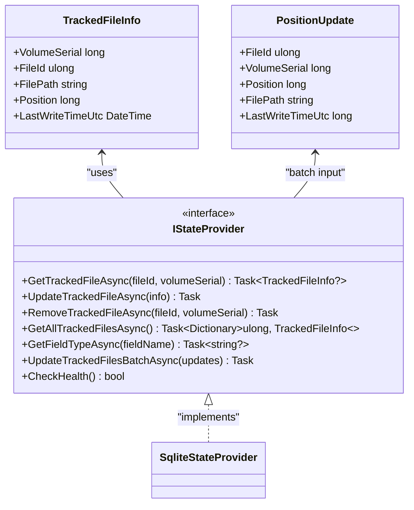
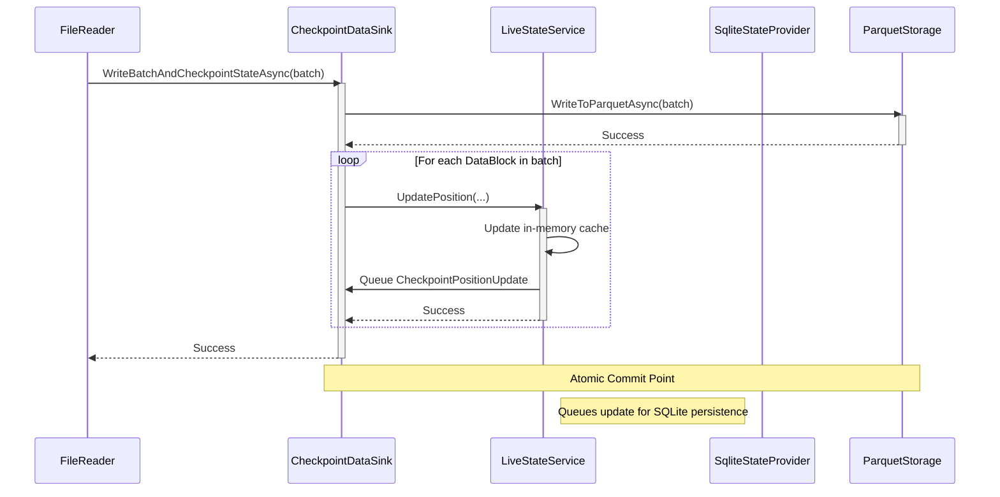
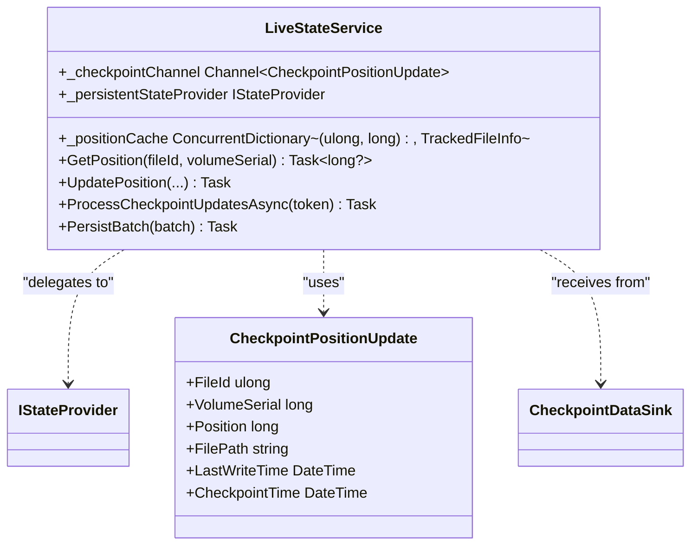

# IStateProvider Interface


## Table of Contents
1. [Introduction](#introduction)
2. [Core Interface Contract](#core-interface-contract)
3. [Method Specifications](#method-specifications)
4. [Exactly-Once Processing Semantics](#exactly-once-processing-semantics)
5. **SqliteStateProvider Implementation**
6. **Performance and Concurrency Considerations**
7. **Alternative Backend Implementation Guidance**
8. **Architecture Overview**
9. **Detailed Component Analysis**

## Introduction
The **IStateProvider** interface serves as the abstraction layer for state persistence in the LogTapestry system, specifically designed to track file processing progress across restarts and failures. It enables reliable ingestion of log files by maintaining the last processed byte position for each file, identified by its unique (VolumeSerial, FileId) tuple. This documentation provides a comprehensive analysis of the interface contract, its primary **SqliteStateProvider** implementation, integration with the checkpointing mechanism via **CheckpointDataSink**, and the architectural patterns that ensure exactly-once processing semantics. The design emphasizes atomicity, durability, and high-throughput state updates, making it suitable for high-volume log processing scenarios.

## Core Interface Contract
The **IStateProvider** defines a contract for persistent storage of file processing state. It abstracts the underlying storage mechanism, allowing for different backends (e.g., SQLite, Redis, a cloud database) while providing a consistent API for the ingestion pipeline. The core responsibility is to store and retrieve **TrackedFileInfo** objects, which contain the file's identifier, path, and the byte offset (**Position**) up to which data has been successfully processed.





**Diagram sources**
- [IStateProvider.cs](file://src/LogTapestry.Core/Interfaces/IStateProvider.cs#L5-L11)
- [NewWorkerTypes.cs](file://src/LogTapestry.Core/NewWorkerTypes.cs#L20-L27)

**Section sources**
- [IStateProvider.cs](file://src/LogTapestry.Core/Interfaces/IStateProvider.cs#L3-L25)

## Method Specifications
This section details the parameters, return values, and error conditions for each method in the **IStateProvider** interface.

### Read Operations
#### **GetTrackedFileAsync**
Retrieves the tracking information for a specific file.

- **Parameters**:
  - `fileId`: The unique identifier of the file within its volume.
  - `volumeSerial`: The unique identifier of the volume containing the file.
- **Return Value**: A `Task<TrackedFileInfo?>` which is the tracking information if the file is found, or `null` if no record exists.
- **Error Conditions**: Throws an exception if the underlying storage is unavailable or if a database query fails. The caller must handle these exceptions appropriately.

#### **GetAllTrackedFilesAsync**
Retrieves tracking information for all files currently being tracked.

- **Parameters**: None.
- **Return Value**: A `Task<Dictionary<ulong, TrackedFileInfo>>` containing all tracked files, keyed by their `FileId`.
- **Error Conditions**: Throws an exception on storage failure. This method can be resource-intensive for large datasets and should be used judiciously.

#### **GetFieldTypeAsync**
Retrieves the inferred data type for a specific log field (e.g., "string", "long").

- **Parameters**:
  - `fieldName`: The name of the field to query.
- **Return Value**: A `Task<string?>` with the field type if known, or `null` if the field has not been encountered.
- **Error Conditions**: Throws an exception on storage failure. This is part of a schema registry feature for Parquet file indexing.

### Write Operations
#### **UpdateTrackedFileAsync**
Persists or updates the tracking information for a single file.

- **Parameters**:
  - `info`: A `TrackedFileInfo` object containing the file's state.
- **Return Value**: A `Task` representing the asynchronous operation.
- **Error Conditions**: Throws an exception on storage failure. The operation is atomic; either the entire record is updated, or the operation fails.
- **Contract**: Must use the (VolumeSerial, FileId) as a primary key. An `INSERT` should be performed if the file is new, or an `UPDATE` if it already exists.

#### **RemoveTrackedFileAsync**
Removes the tracking record for a specific file.

- **Parameters**:
  - `fileId`: The file identifier.
  - `volumeSerial`: The volume identifier.
- **Return Value**: A `Task` representing the asynchronous operation.
- **Error Conditions**: Throws an exception on storage failure. It is not an error if the file does not exist.

#### **UpdateTrackedFilesBatchAsync**
Efficiently persists updates for multiple files in a single atomic operation.

- **Parameters**:
  - `updates`: An array of `PositionUpdate` objects, each containing the new state for a file.
- **Return Value**: A `Task` representing the asynchronous operation.
- **Error Conditions**: Throws an exception on storage failure. If the operation fails, the entire batch update is rolled back, ensuring no partial updates.
- **Contract**: This method is critical for performance. Implementations must use database transactions to ensure atomicity and consistency. The method should be optimized for high-frequency calls from the ingestion pipeline.

### Health Check
#### **CheckHealth**
Performs a simple health check on the state provider.

- **Parameters**: None.
- **Return Value**: A `bool` indicating if the provider is healthy (e.g., the database connection is active).
- **Error Conditions**: Returns `false` if the provider is unhealthy. This method should not throw exceptions.

**Section sources**
- [IStateProvider.cs](file://src/LogTapestry.Core/Interfaces/IStateProvider.cs#L5-L13)

## Exactly-Once Processing Semantics
The **IStateProvider** is a cornerstone of the system's exactly-once processing guarantee, which ensures that no log entry is ingested more than once, even in the event of failures or restarts. This is achieved through a **checkpointing** mechanism orchestrated by the **CheckpointDataSink** and **LiveStateService**.





**Diagram sources**
- [CheckpointDataSink.cs](file://src/LogTapestry.Ingester/CheckpointDataSink.cs#L66-L100)
- [LiveStateService.cs](file://src/LogTapestry.Ingester/LiveStateService.cs#L108-L138)

**Section sources**
- [CheckpointDataSink.cs](file://src/LogTapestry.Ingester/CheckpointDataSink.cs#L66-L100)
- [LiveStateService.cs](file://src/LogTapestry.Ingester/LiveStateService.cs#L108-L138)

The process works as follows:
1.  **Data Persistence First**: The **CheckpointDataSink** writes the log data batch to durable storage (Parquet files) *before* updating any state.
2.  **State Update After Success**: Only after the data is successfully written and committed does the **CheckpointDataSink** trigger state updates via the **LiveStateService**.
3.  **In-Memory Source of Truth**: The **LiveStateService** maintains an in-memory cache of file positions. It updates this cache immediately upon receiving a checkpoint request, making it the definitive source of the current processing state.
4.  **Asynchronous Persistence**: The **LiveStateService** then asynchronously queues the state update to the **IStateProvider** (e.g., **SqliteStateProvider**) for durable storage. This decouples the fast, in-memory update from the slower disk I/O.
5.  **Atomic Batch Update**: The queued updates are processed in batches by the **LiveStateService**, which calls `UpdateTrackedFilesBatchAsync`. This method uses a database transaction to ensure that a group of state updates is applied atomically.

This design ensures that if the system crashes *after* data is written but *before* state is persisted, upon restart, the **LiveStateService** will re-read the durable state from the **IStateProvider** into its cache. Since the state update was not committed, the system will reprocess the last batch of data. However, because the data was already written, the ingestion system must be idempotent (e.g., using unique identifiers for log entries) to prevent duplication. The key point is that the state is only advanced *after* the data is safe, preventing data loss.

## SqliteStateProvider Implementation
The **SqliteStateProvider** is the primary implementation of **IStateProvider**, using an SQLite database for durable state storage. It provides a concrete example of how the interface contract is fulfilled.

### Schema Structure
The provider manages three tables:
- **TrackedFiles**: Stores the core file processing state with a composite primary key (VolumeSerial, FileId).
- **FieldSchema**: Acts as a schema registry for dynamic log fields.
- **ParquetFiles**: Indexes generated Parquet files for metadata and cataloging.


```sql
CREATE TABLE TrackedFiles (
    VolumeSerial INTEGER NOT NULL,
    FileId INTEGER NOT NULL,
    FilePath TEXT NOT NULL,
    Position INTEGER NOT NULL,
    LastWriteTimeUtc INTEGER NOT NULL,
    PRIMARY KEY (VolumeSerial, FileId)
);
```


### Atomic Updates and Consistency
The implementation guarantees atomic updates through the use of SQLite transactions:
- **Single Updates**: The `UpdateTrackedFileAsync` method uses SQLite's `INSERT ... ON CONFLICT DO UPDATE` (upsert) syntax, which is atomic.
- **Batch Updates**: The `UpdateTrackedFilesBatchAsync` method explicitly begins a transaction, executes all upserts within that transaction, and commits only if all succeed. If any operation fails, the transaction is rolled back, ensuring no partial state updates.

### Key Implementation Details
- **DateTime Handling**: `DateTime` values are converted to Unix timestamps (seconds since epoch) for efficient integer storage in SQLite.
- **Parameterized Queries**: All database operations use parameterized queries to prevent SQL injection.
- **Connection Management**: The provider owns a single, long-lived `SqliteConnection` that is opened in the constructor and disposed of in `Dispose()`.

**Section sources**
- [SqliteStateProvider.cs](file://src/LogTapestry.Core/SqliteStateProvider.cs#L15-L45)

## Performance and Concurrency Considerations
The **IStateProvider** and its **SqliteStateProvider** implementation are designed with performance and concurrency in mind for high-frequency state updates.

### High-Frequency State Updates
- **Batching**: The `UpdateTrackedFilesBatchAsync` method is essential for performance. Writing state for every single log entry would be prohibitively slow. The system batches updates, significantly reducing the number of I/O operations.
- **In-Memory Cache**: The **LiveStateService** acts as a write-through cache. The immediate in-memory update ensures that subsequent reads are fast, while the durable persistence happens asynchronously in the background.
- **Transaction Size**: The **SqliteStateProvider** processes batch updates in a single transaction. While this ensures atomicity, very large transactions can lock the database for extended periods. The **LiveStateService** limits its internal batch size to 100 updates to mitigate this.

### Concurrency Handling
- **Thread Safety**: The **SqliteStateProvider** relies on SQLite's built-in support for multiple readers and a single writer. The use of a single connection means that write operations are serialized, preventing race conditions.
- **Idempotency**: The upsert operations (`INSERT ... ON CONFLICT`) are idempotent. If the same update is applied multiple times, the final state is the same, which is crucial for fault tolerance.
- **LiveStateService Coordination**: The **LiveStateService** uses `ConcurrentDictionary` and thread-safe `AddOrUpdate` operations to prevent duplicate processing of the same file position update from multiple worker threads.

### Durability vs. Throughput Trade-offs
- **Durability**: Using a transaction for every batch update ensures that state changes are durable and survive system crashes. The `PRAGMA synchronous = FULL` setting (if used) would further enhance durability at the cost of speed.
- **Throughput**: The asynchronous, batched persistence model maximizes throughput by minimizing the time the ingestion pipeline waits for state updates. The trade-off is a small window of potential data reprocessing in the event of a crash between data write and state persistence.

**Section sources**
- [SqliteStateProvider.cs](file://src/LogTapestry.Core/SqliteStateProvider.cs#L155-L187)
- [LiveStateService.cs](file://src/LogTapestry.Ingester/LiveStateService.cs#L108-L154)

## Alternative Backend Implementation Guidance
When implementing an alternative backend for **IStateProvider**, the following guidelines must be followed to maintain compatibility with the checkpointing mechanism:

1.  **Honor the Contract**: Implement all methods as specified, ensuring correct parameter handling and return types.
2.  **Ensure Atomicity**: The `UpdateTrackedFilesBatchAsync` method must be atomic. If the backend does not support multi-record transactions, it must provide an alternative mechanism (e.g., versioning, conditional writes) to achieve the same consistency guarantee.
3.  **Support Upsert Semantics**: The `UpdateTrackedFileAsync` method must perform an upsert. The backend should have a native upsert operation or a way to emulate it efficiently.
4.  **Handle Concurrency**: The implementation must be thread-safe and handle concurrent reads and writes correctly. For distributed backends, consider the consistency model (e.g., strong vs. eventual).
5.  **Optimize for Batch Writes**: Design the backend to handle frequent, small batch writes efficiently. Avoid operations that require full table scans or expensive indexing on every update.
6.  **Implement Health Checks**: The `CheckHealth` method should perform a lightweight check (e.g., a ping or a simple query) to verify the backend's availability.
7.  **Data Type Consistency**: Ensure that `DateTime` values are stored and retrieved accurately. The `PositionUpdate` class uses `long` for `LastWriteTimeUtc`, which represents ticks, so conversion logic must be consistent.

**Section sources**
- [IStateProvider.cs](file://src/LogTapestry.Core/Interfaces/IStateProvider.cs#L3-L13)

## Architecture Overview
The state management system is a multi-layered architecture designed for reliability and performance. The **IStateProvider** sits at the center, providing a stable interface for durable storage.


```mermaid
graph TD
subgraph "Ingestion Pipeline"
FileReader[FileReader]
CheckpointDataSink[CheckpointDataSink]
LiveStateService[LiveStateService]
end
subgraph "State Management"
IStateProvider[IStateProvider<br/>Interface]
SqliteStateProvider[SqliteStateProvider<br/>(Implementation)]
end
FileReader --> CheckpointDataSink : "DataBlocks"
CheckpointDataSink --> LiveStateService : "Checkpoint Updates"
LiveStateService --> IStateProvider : "Batch Updates"
IStateProvider --> SqliteStateProvider : "Concrete Implementation"
SqliteStateProvider -.-> SQLite[(SQLite Database)]
style IStateProvider fill:#f9f,stroke:#333
style SqliteStateProvider fill:#bbf,stroke:#333
```


**Diagram sources**
- [CheckpointDataSink.cs](file://src/LogTapestry.Ingester/CheckpointDataSink.cs#L66-L100)
- [LiveStateService.cs](file://src/LogTapestry.Ingester/LiveStateService.cs#L108-L138)
- [SqliteStateProvider.cs](file://src/LogTapestry.Core/SqliteStateProvider.cs#L15-L45)

**Section sources**
- [CheckpointDataSink.cs](file://src/LogTapestry.Ingester/CheckpointDataSink.cs#L66-L100)
- [LiveStateService.cs](file://src/LogTapestry.Ingester/LiveStateService.cs#L108-L138)

## Detailed Component Analysis

### LiveStateService Analysis
The **LiveStateService** is a critical component that implements the **IStateProvider** interface but uses an in-memory cache as the primary source of truth, delegating durable persistence to another **IStateProvider**.





**Diagram sources**
- [LiveStateService.cs](file://src/LogTapestry.Ingester/LiveStateService.cs#L28-L32)
- [DataBlock.cs](file://src/LogTapestry.Core/DataBlock.cs#L19-L26)

**Section sources**
- [LiveStateService.cs](file://src/LogTapestry.Ingester/LiveStateService.cs#L20-L269)

#### Key Responsibilities
- **Source of Truth**: The `_positionCache` is the definitive record of the current processing state. All reads go here first.
- **Deduplication**: The `AddOrUpdate` pattern ensures that only position updates that represent forward progress are applied, preventing duplicate processing.
- **Asynchronous Persistence**: It decouples the ingestion pipeline from durable storage I/O by queuing updates and processing them in the background.
- **Health Delegation**: Its `CheckHealth` method simply delegates to the underlying persistent provider.

**Referenced Files in This Document**   
- [IStateProvider.cs](file://src/LogTapestry.Core/Interfaces/IStateProvider.cs)
- [SqliteStateProvider.cs](file://src/LogTapestry.Core/SqliteStateProvider.cs)
- [CheckpointDataSink.cs](file://src/LogTapestry.Ingester/CheckpointDataSink.cs)
- [LiveStateService.cs](file://src/LogTapestry.Ingester/LiveStateService.cs)
- [NewWorkerTypes.cs](file://src/LogTapestry.Core/NewWorkerTypes.cs)
- [DataBlock.cs](file://src/LogTapestry.Core/DataBlock.cs)
- [StateWriterService.cs](file://src/LogTapestry.Ingester/StateWriterService.cs)