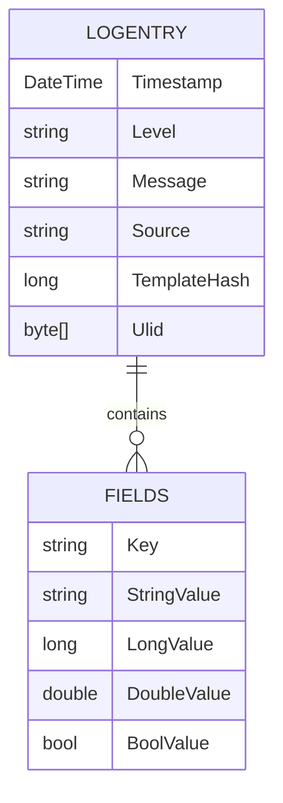
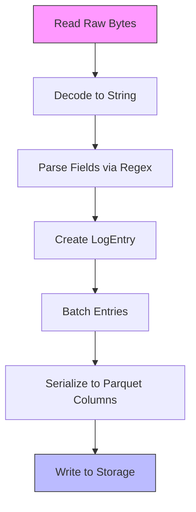

# LogEntry Data Model


## Table of Contents
1. [LogEntry Data Model](#logentry-data-model)
2. [Property Details](#property-details)
3. [Instance Creation and Parsing](#instance-creation-and-parsing)
4. [Immutability and Thread-Safe Access](#immutability-and-thread-safe-access)
5. [Serialization for Parquet Output](#serialization-for-parquet-output)
6. [Handling Schema Variability](#handling-schema-variability)
7. [Performance Considerations](#performance-considerations)

## Property Details

The **LogEntry** record represents a single structured log event after successful parsing and serves as the canonical object that flows through the ingestion pipeline to the data sink. It is defined as an immutable record with the following properties:

- **Timestamp**: `DateTime` - The timestamp of the log event, parsed from the original log line. This value is typically set during parsing and may be adjusted to UTC based on configuration.
- **Level**: `string` - The severity level of the log entry (e.g., "INFO", "ERROR"). Initially set to "UNKNOWN" during entry creation and updated during finalization if a level pattern is defined.
- **Message**: `string` - The full text of the log message, which may be multi-line and assembled from multiple input lines during parsing.
- **Source**: `string` - The file path or identifier of the source log file from which this entry was parsed.
- **TemplateHash**: `long` - A hash value representing the message template pattern. Currently initialized to 0 and not yet implemented for dynamic computation.
- **Fields**: `IReadOnlyDictionary<string, object>` - A dictionary of dynamic key-value fields extracted from the log message using configured regex patterns or CSV mappings. Supports values of type string, long, double, or bool.
- **Ulid**: `byte[]` - A 16-byte Universally Unique Lexicographically Sortable Identifier generated automatically if not provided. Used for unique identification and sorting of log entries.


```csharp
public record LogEntry(DateTime Timestamp,
    string Level, string Message, string Source,
    long TemplateHash,
    IReadOnlyDictionary<string, object> Fields,
    byte[]? Ulid = null)
{
    public byte[] Ulid { get; init; } = Ulid ?? System.Ulid.NewUlid().ToByteArray();
}
```


**Section sources**
- [LogEntry.cs](file://d:/devel/LogTapestry/src/LogTapestry.Core/LogEntry.cs#L1-L13)

## Instance Creation and Parsing

LogEntry instances are created during the parsing phase by log parsers such as **RegexLogParser** and **CsvLogParser**. The creation process begins with minimal information and is finalized after full message assembly and field extraction.

During initial entry detection, a partial LogEntry is created with default values:


```csharp
return (new LogEntry(timestamp, level, message, _sourceFile, 0, fields, []), false);
```


The entry is then finalized in the **FinalizeEntry** method, where dynamic fields are extracted using configured regex patterns:


```csharp
foreach (var fieldRegex in _settings.Config.FieldsRegexes) {
    var valueStr = match.Groups[1].Value;
    object value = valueStr;
    if (fieldRegex.Type == "long") {
        if (long.TryParse(valueStr, out var longValue)) {
            value = longValue;
        }
    } else if (fieldRegex.Type == "double") {
        if (double.TryParse(valueStr, out var doubleValue)) {
            value = doubleValue;
        }
    }
    fields[fieldRegex.FieldName] = value;
}
```


The final LogEntry is constructed using C#’s `with` keyword to update immutable properties:


```csharp
var entry = inProgressEntry with { Message = finalMessage, Fields = fields, Level = level, Ulid = inProgressEntry.Ulid };
```


This approach enables incremental construction while maintaining immutability.

**Section sources**
- [RegexLogParser.cs](file://d:/devel/LogTapestry/src/LogTapestry.Core/RegexLogParser.cs#L65-L95)
- [RegexLogParser.cs](file://d:/devel/LogTapestry/src/LogTapestry.Core/RegexLogParser.cs#L93-L124)
- [BaseLogParser.cs](file://d:/devel/LogTapestry/src/LogTapestry.Core/BaseLogParser.cs#L200-L245)

## Immutability and Thread-Safe Access

The **LogEntry** record is inherently immutable due to its implementation as a C# record with `init`-only properties. Once created, its state cannot be modified, ensuring thread-safe access across concurrent processing stages.

All properties are set during construction, and any modification results in a new instance via the `with` expression. This design eliminates race conditions and allows safe sharing of LogEntry instances across threads without synchronization.

The **Fields** dictionary is exposed as `IReadOnlyDictionary<string, object>`, preventing external mutation. Parsers construct the dictionary internally before LogEntry creation, ensuring encapsulation.

This immutability aligns with functional programming principles and supports efficient, lock-free data flow through the ingestion pipeline.

**Section sources**
- [LogEntry.cs](file://d:/devel/LogTapestry/src/LogTapestry.Core/LogEntry.cs#L1-L13)
- [RegexLogParser.cs](file://d:/devel/LogTapestry/src/LogTapestry.Core/RegexLogParser.cs#L127-L127)

## Serialization for Parquet Output

LogEntry instances are serialized into Parquet format for efficient storage and querying. The **DataSink** class defines a Parquet schema that maps LogEntry properties to structured columns:





**Diagram sources**
- [DataSink.cs](file://d:/devel/LogTapestry/src/LogTapestry.Ingester/DataSink.cs#L20-L35)

The schema includes:
- Top-level scalar columns for Timestamp, Level, Message, Source, TemplateHash, and Ulid
- A nested **Fields** list field containing struct elements with typed value columns (StringValue, LongValue, DoubleValue, BoolValue)

During serialization, the **NestedListShredder** transforms the dictionary of dynamic fields into a normalized columnar format suitable for Parquet’s nested data model. Each field becomes a **FieldElement** with a key and a **FieldValue** containing one non-null typed value.

This design enables efficient columnar storage, predicate pushdown, and DuckDB querying while preserving schema flexibility.

**Section sources**
- [DataSink.cs](file://d:/devel/LogTapestry/src/LogTapestry.Ingester/DataSink.cs#L20-L35)
- [DataSink.cs](file://d:/devel/LogTapestry/src/LogTapestry.Ingester/DataSink.cs#L92-L116)

## Handling Schema Variability

The **Fields** dictionary enables LogTapestry to handle schema variability across different log sources. Each log source may emit entries with different sets of fields, and the system dynamically adapts without requiring schema changes.

Field types are inferred during parsing based on configuration:
- `"string"`: Stored in StringValue column
- `"long"`: Parsed and stored in LongValue column
- `"double"`: Parsed and stored in DoubleValue column
- `"bool"`: Parsed and stored in BoolValue column

The **FieldSchema** table in the state provider tracks discovered field names and their dominant types, enabling schema evolution and query optimization:


```csharp
string fieldType = value switch {
    long => "long",
    double => "double",
    bool => "bool",
    _ => "string"
};
```


This allows DuckDB to efficiently query across heterogeneous log sources using standard SQL, with automatic type handling.

**Section sources**
- [DataSink.cs](file://d:/devel/LogTapestry/src/LogTapestry.Ingester/DataSink.cs#L36-L67)
- [RegexLogParser.cs](file://d:/devel/LogTapestry/src/LogTapestry.Core/RegexLogParser.cs#L385-L424)

## Performance Considerations

When processing high-volume log streams, several performance considerations apply:

### Memory Usage
- **LogEntry** instances are reference types and contribute to heap pressure.
- The **Fields** dictionary and **Message** string are primary memory consumers.
- **Ulid** is compact (16 bytes) and lexicographically sortable, optimizing storage and indexing.

### Garbage Collection
- Frequent allocation of LogEntry instances can increase GC pressure.
- Object pooling is not currently used, but **BaseLogParser** employs **StringBuilder** reuse and buffer management to reduce allocations.
- The use of `ReadOnlySpan<byte>` and efficient UTF-8 decoding minimizes temporary string allocations during parsing.

### Optimization Opportunities
- **Batch Processing**: Entries are processed in batches (e.g., 1000 lines), amortizing overhead.
- **Columnar Serialization**: The **NestedListShredder** processes entire batches at once, enabling efficient columnar output.
- **Buffer Management**: **BaseLogParser** uses a fixed-size buffer with span-based operations to minimize memory copying.





**Diagram sources**
- [BaseLogParser.cs](file://d:/devel/LogTapestry/src/LogTapestry.Core/BaseLogParser.cs#L46-L245)
- [DataSink.cs](file://d:/devel/LogTapestry/src/LogTapestry.Ingester/DataSink.cs#L92-L116)

For optimal performance, consider:
- Limiting field cardinality to avoid excessive schema growth
- Using structured formats (e.g., JSON, CSV) over regex parsing when possible
- Monitoring GC metrics under load and tuning batch sizes accordingly

**Section sources**
- [BaseLogParser.cs](file://d:/devel/LogTapestry/src/LogTapestry.Core/BaseLogParser.cs#L46-L245)
- [DataSink.cs](file://d:/devel/LogTapestry/src/LogTapestry.Ingester/DataSink.cs#L92-L116)
- [RegexLogParser.cs](file://d:/devel/LogTapestry/src/LogTapestry.Core/RegexLogParser.cs#L0-L199)

**Referenced Files in This Document**   
- [LogEntry.cs](file://d:/devel/LogTapestry/src/LogTapestry.Core/LogEntry.cs)
- [DataSink.cs](file://d:/devel/LogTapestry/src/LogTapestry.Ingester/DataSink.cs)
- [RegexLogParser.cs](file://d:/devel/LogTapestry/src/LogTapestry.Core/RegexLogParser.cs)
- [BaseLogParser.cs](file://d:/devel/LogTapestry/src/LogTapestry.Core/BaseLogParser.cs)
- [ParsingResult.cs](file://d:/devel/LogTapestry/src/LogTapestry.Core/ParsingResult.cs)
- [DataBlock.cs](file://d:/devel/LogTapestry/src/LogTapestry.Core/DataBlock.cs)