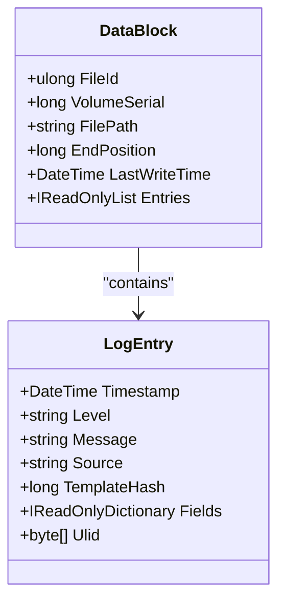
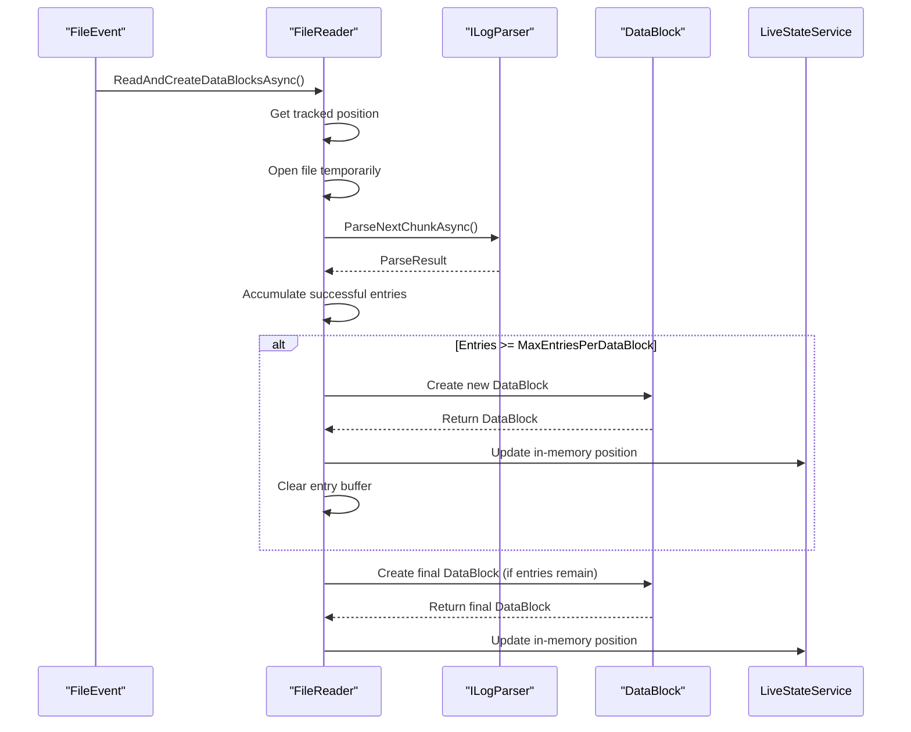
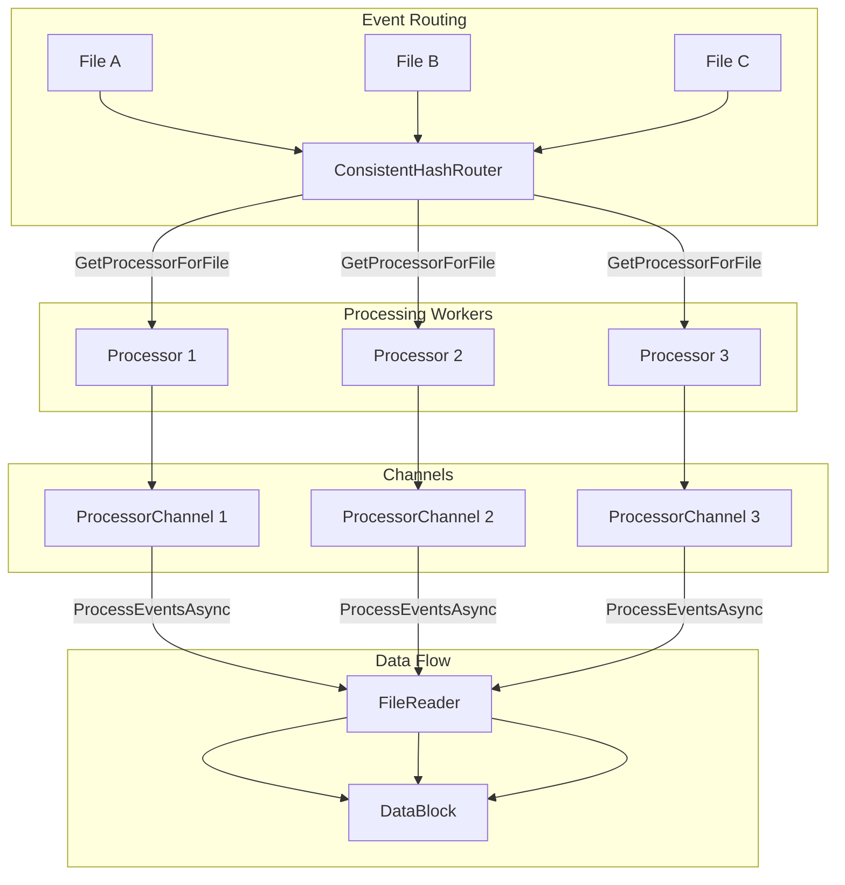
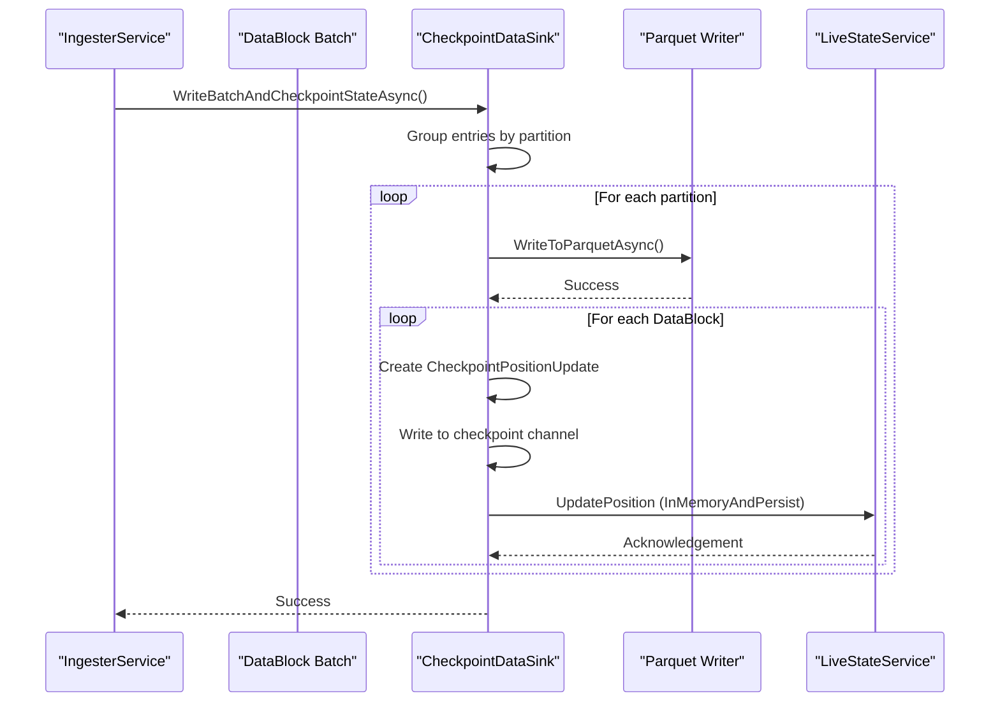
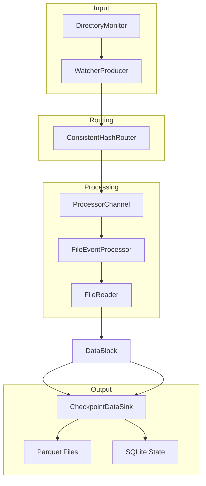
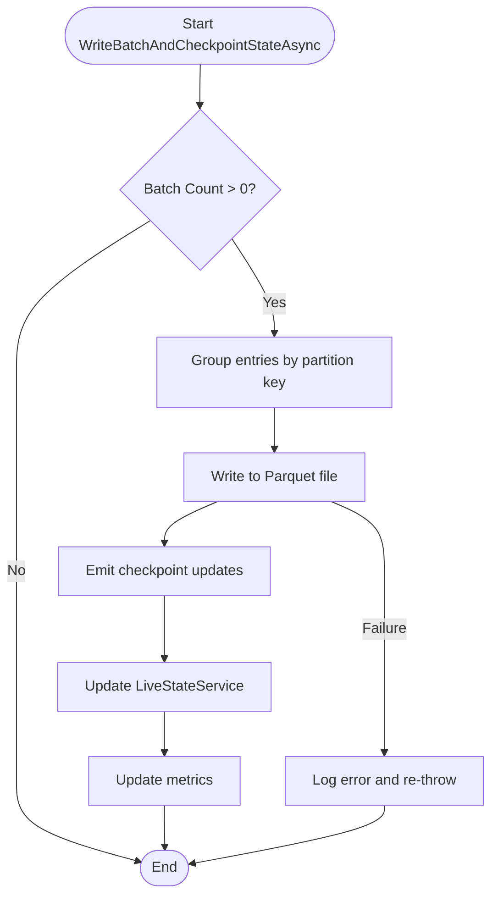
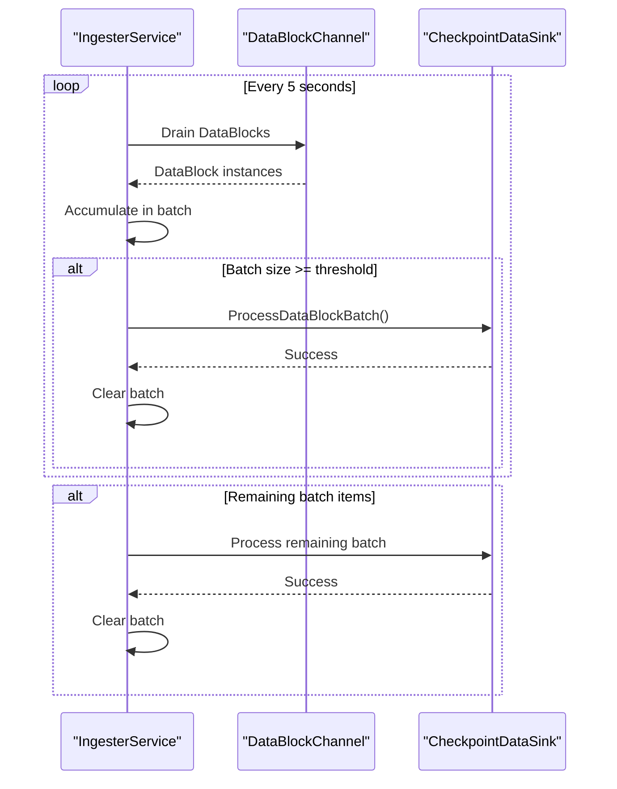

# DataBlock Structure


## Table of Contents
1. [Introduction](#introduction)
2. [DataBlock Properties and Structure](#datablock-properties-and-structure)
3. [Lifecycle and Creation](#lifecycle-and-creation)
4. [Processing Pipeline Integration](#processing-pipeline-integration)
5. [Atomic Persistence and Checkpointing](#atomic-persistence-and-checkpointing)
6. [Thread Safety and Memory Management](#thread-safety-and-memory-management)
7. [Usage Patterns and Extensions](#usage-patterns-and-extensions)
8. [Architecture Overview](#architecture-overview)
9. [Detailed Component Analysis](#detailed-component-analysis)

## Introduction
The DataBlock class serves as the primary batch container for log processing in LogTapestry, coordinating the atomic write of log batches and corresponding state updates. This document details the structure, lifecycle, and integration of DataBlock within the processing pipeline, from creation in FileReader to final persistence in Parquet files. The DataBlock ensures transactional consistency between data ingestion and state updates, replacing separate position update and parsing result objects.

**Section sources**
- [DataBlock.cs](file://src/LogTapestry.Core/DataBlock.cs#L6-L13)

## DataBlock Properties and Structure
The DataBlock is implemented as a C# record, providing an immutable data structure that carries both log data and position context for the checkpointing pipeline. Its properties include file identification, position tracking, and the log entries themselves.

**Properties:**
- **FileId**: Unique identifier for the source file (ulong)
- **VolumeSerial**: Volume serial number to distinguish files across volumes (long)
- **FilePath**: Full path to the source log file (string)
- **EndPosition**: Byte offset in the file after reading this block (long)
- **LastWriteTime**: Timestamp of the file's last modification (DateTime)
- **Entries**: Collection of parsed log entries (IReadOnlyList<LogEntry>)

The DataBlock replaces separate PositionUpdate and ParsingResult objects, ensuring transactional consistency by bundling data and metadata together. This design prevents race conditions and ensures that state updates correspond exactly to the data that was persisted.





**Diagram sources**
- [DataBlock.cs](file://src/LogTapestry.Core/DataBlock.cs#L6-L13)
- [LogEntry.cs](file://src/LogTapestry.Core/LogEntry.cs#L6-L14)

**Section sources**
- [DataBlock.cs](file://src/LogTapestry.Core/DataBlock.cs#L6-L13)
- [LogEntry.cs](file://src/LogTapestry.Core/LogEntry.cs#L6-L14)

## Lifecycle and Creation
The DataBlock lifecycle begins in the FileReader class, which reads and parses log files from a tracked position. The creation process involves several key steps that ensure efficient and reliable log processing.

The FileReader reads files temporarily, processes new content, and closes the file immediately to minimize resource usage. It uses the LiveStateService to retrieve the last processed position for each file, ensuring continuity across processing cycles. When a file is truncated (position exceeds file length), the position is reset to zero.

DataBlocks are created in chunks based on the MaxEntriesPerDataBlock configuration. The FileReader accumulates parsed entries until reaching this threshold, then yields a DataBlock. This chunking mechanism prevents memory overflows with large log files and enables incremental processing.





**Diagram sources**
- [FileReader.cs](file://src/LogTapestry.Ingester/FileReader.cs#L149-L214)

**Section sources**
- [FileReader.cs](file://src/LogTapestry.Ingester/FileReader.cs#L149-L214)

## Processing Pipeline Integration
DataBlock instances flow through a sophisticated processing pipeline that ensures ordered and consistent log processing. The pipeline leverages ProcessorChannel and ConsistentHashRouter to distribute processing while maintaining per-file ordering guarantees.

The ConsistentHashRouter uses file identifiers (FileId and VolumeSerial) to consistently assign files to specific processors. This ensures that all events for the same file are routed to the same processor, preventing race conditions and enabling natural deduplication. The hash is stable across application restarts, maintaining consistent routing.

Each processor has its own ProcessorChannel, an unbounded channel that queues file events for sequential processing. The FileEventProcessor consumes events from its channel and delegates to the FileReader to create DataBlock instances. This architecture enables parallel processing of different files while maintaining order for individual files.





**Diagram sources**
- [ConsistentHashRouter.cs](file://src/LogTapestry.Ingester/ConsistentHashRouter.cs#L8-L85)
- [ProcessorChannel.cs](file://src/LogTapestry.Ingester/ProcessorChannel.cs#L13-L66)
- [FileEventProcessor.cs](file://src/LogTapestry.Ingester/FileEventProcessor.cs#L13-L122)

**Section sources**
- [ConsistentHashRouter.cs](file://src/LogTapestry.Ingester/ConsistentHashRouter.cs#L8-L85)
- [ProcessorChannel.cs](file://src/LogTapestry.Ingester/ProcessorChannel.cs#L13-L66)
- [FileEventProcessor.cs](file://src/LogTapestry.Ingester/FileEventProcessor.cs#L13-L122)

## Atomic Persistence and Checkpointing
The CheckpointDataSink class coordinates the atomic persistence of DataBlock batches and corresponding state updates, ensuring data and state consistency. This is the point of commitment for both data and state in the LogTapestry system.

The WriteBatchAndCheckpointStateAsync method implements the atomic operation that writes log entries to Parquet files and updates checkpoint positions. The process follows a strict sequence: first write data to Parquet, then emit checkpoint updates. This ensures that state updates only occur after successful data persistence, preventing data loss in case of failures.

DataBlocks are grouped by partition key (derived from the log entry timestamp) before writing. This enables efficient partitioning of data by time, optimizing query performance. For each partition, all log entries are written to a Parquet file before any checkpoint updates are emitted.

Checkpoint updates are written to a bounded channel and processed by the LiveStateService, which updates both in-memory state and persistent storage (SQLite). This two-phase update ensures durability while maintaining performance.





**Diagram sources**
- [CheckpointDataSink.cs](file://src/LogTapestry.Ingester/CheckpointDataSink.cs#L19-L351)

**Section sources**
- [CheckpointDataSink.cs](file://src/LogTapestry.Ingester/CheckpointDataSink.cs#L19-L351)

## Thread Safety and Memory Management
The DataBlock class and its processing pipeline are designed with thread safety and memory efficiency in mind. As an immutable record, DataBlock instances can be safely shared across threads without synchronization.

The processing pipeline uses a producer-consumer pattern with channels to coordinate between components. The FileReader produces DataBlock instances, which are consumed by the data sink pipeline. This decouples processing stages and provides natural backpressure.

For large batches, the system implements several memory management strategies:
1. Chunking: DataBlocks are limited by MaxEntriesPerDataBlock to prevent excessive memory usage
2. Streaming: Files are processed in chunks rather than loading entire files into memory
3. Temporary files: Parquet files are written to temporary locations before atomic move
4. Bounded channels: The checkpoint channel is bounded to limit memory usage

The system also handles file rotation and truncation gracefully. When a file is rotated (detected by FileId change), processing starts from the beginning. When a file is truncated (current position exceeds file length), the position is reset to zero.

**Section sources**
- [FileReader.cs](file://src/LogTapestry.Ingester/FileReader.cs#L149-L214)
- [CheckpointDataSink.cs](file://src/LogTapestry.Ingester/CheckpointDataSink.cs#L19-L351)

## Usage Patterns and Extensions
Custom processing extensions can leverage the DataBlock structure by implementing the IDataSink interface or creating custom processors. The architecture supports various extension patterns:

**Custom Data Sinks:**
Implement IDataSink to route processed logs to alternative destinations (e.g., databases, message queues). The interface requires implementing WriteBatchAsync, which receives arrays of LogEntry objects extracted from DataBlock instances.

**Custom Processors:**
Create processors that consume DataBlock instances directly from the processing pipeline. This allows for pre-processing, filtering, or enrichment of log data before persistence.

**Example of Custom DataBlock Usage:**

```csharp
// Example: Custom data sink extension
public class CustomDataSink : IDataSink
{
    private readonly ILogger<CustomDataSink> _logger;
    
    public CustomDataSink(ILogger<CustomDataSink> logger)
    {
        _logger = logger;
    }
    
    public async Task WriteBatchAsync(LogEntry[] batch, Stream targetStream, 
        string? parquetFilePath = null, string? partitionPath = null)
    {
        _logger.LogInformation("Processing batch of {Count} entries", batch.Length);
        
        // Custom processing logic here
        foreach (var entry in batch)
        {
            // Process individual entries
            await ProcessEntryAsync(entry);
        }
        
        // Forward to original sink if needed
        // await originalSink.WriteBatchAsync(batch, targetStream, ...);
    }
    
    private async Task ProcessEntryAsync(LogEntry entry)
    {
        // Custom processing logic
    }
}
```


The DataBlock structure can also be extended through composition rather than inheritance, maintaining the immutability and thread safety of the core design.

**Section sources**
- [CheckpointDataSink.cs](file://src/LogTapestry.Ingester/CheckpointDataSink.cs#L356-L359)
- [DataBlock.cs](file://src/LogTapestry.Core/DataBlock.cs#L6-L13)

## Architecture Overview
The DataBlock is central to LogTapestry's architecture, serving as the primary container for log data and metadata throughout the processing pipeline. The architecture follows a producer-consumer pattern with multiple stages of processing and persistence.





**Diagram sources**
- [FileReader.cs](file://src/LogTapestry.Ingester/FileReader.cs#L149-L214)
- [CheckpointDataSink.cs](file://src/LogTapestry.Ingester/CheckpointDataSink.cs#L19-L351)
- [FileEventProcessor.cs](file://src/LogTapestry.Ingester/FileEventProcessor.cs#L13-L122)

## Detailed Component Analysis

### DataBlock Creation Process
The DataBlock creation process in FileReader is designed for efficiency and reliability. It uses asynchronous enumeration to yield DataBlock instances as they are created, enabling immediate processing without waiting for the entire file to be read.

The process handles several edge cases:
- **File rotation**: Detected by comparing FileId, resets processing position
- **File truncation**: When position exceeds file length, resets to zero
- **Parsing failures**: Logs warnings but continues processing subsequent entries
- **Empty files**: Skips processing and logs trace message

The use of IAsyncEnumerable enables memory-efficient processing of large files, as DataBlock instances are yielded incrementally rather than collecting all entries in memory.

**Section sources**
- [FileReader.cs](file://src/LogTapestry.Ingester/FileReader.cs#L149-L214)

### Checkpointing Mechanism
The checkpointing mechanism in CheckpointDataSink ensures atomicity between data persistence and state updates. The key principle is "write data first, update state second" - state updates only occur after successful data persistence.

The mechanism provides several guarantees:
- **Durability**: State updates are persisted to SQLite after in-memory updates
- **Consistency**: Each DataBlock corresponds to exactly one checkpoint update
- **Atomicity**: Batch processing fails entirely if any component fails
- **Recoverability**: On restart, processing resumes from last checkpointed position

The bounded checkpoint channel (size 10) provides backpressure, preventing excessive memory usage while ensuring checkpoint updates are processed in a timely manner.





**Diagram sources**
- [CheckpointDataSink.cs](file://src/LogTapestry.Ingester/CheckpointDataSink.cs#L19-L351)

**Section sources**
- [CheckpointDataSink.cs](file://src/LogTapestry.Ingester/CheckpointDataSink.cs#L19-L351)

### Processing Pipeline Flow
The complete processing pipeline flows from file event detection through to final persistence. The IngesterService coordinates the pipeline, managing processor workers and the data sink.

The pipeline operates on a periodic timer (5 seconds by default), draining the data block channel and processing batches when they reach the configured size. This balances latency and throughput, ensuring timely processing while maximizing batch efficiency.





**Diagram sources**
- [IngesterService.cs](file://src/LogTapestry.Ingester/IngesterService.cs#L97-L167)

**Section sources**
- [IngesterService.cs](file://src/LogTapestry.Ingester/IngesterService.cs#L97-L167)

**Referenced Files in This Document**   
- [DataBlock.cs](file://src/LogTapestry.Core/DataBlock.cs)
- [FileReader.cs](file://src/LogTapestry.Ingester/FileReader.cs)
- [CheckpointDataSink.cs](file://src/LogTapestry.Ingester/CheckpointDataSink.cs)
- [FileEventProcessor.cs](file://src/LogTapestry.Ingester/FileEventProcessor.cs)
- [ProcessorChannel.cs](file://src/LogTapestry.Ingester/ProcessorChannel.cs)
- [ConsistentHashRouter.cs](file://src/LogTapestry.Ingester/ConsistentHashRouter.cs)
- [LogEntry.cs](file://src/LogTapestry.Core/LogEntry.cs)
- [IngesterService.cs](file://src/LogTapestry.Ingester/IngesterService.cs)