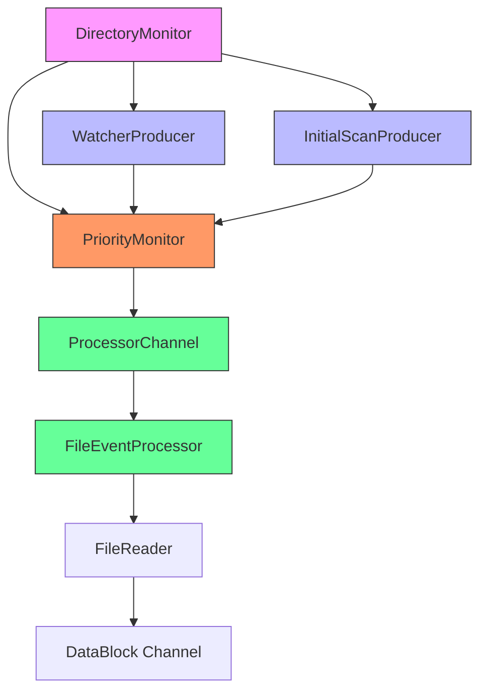
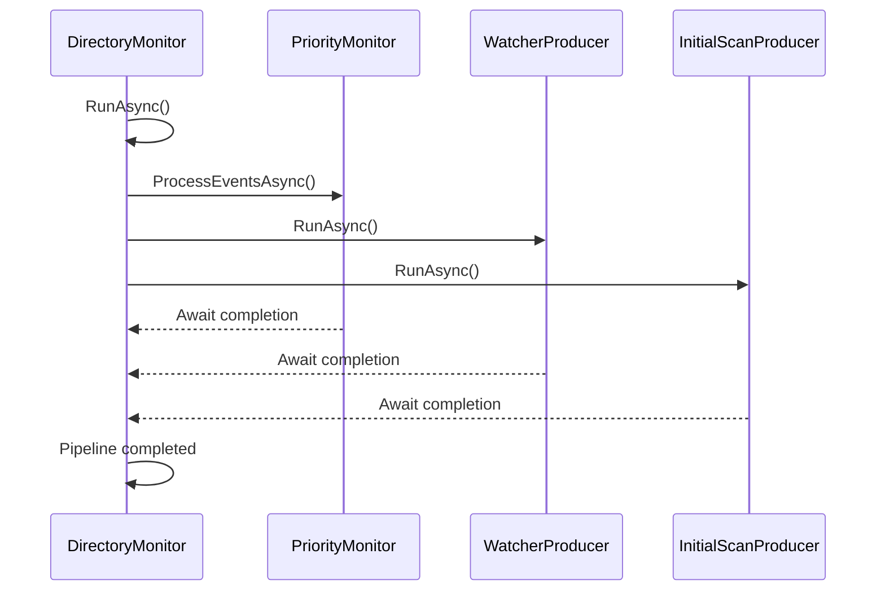
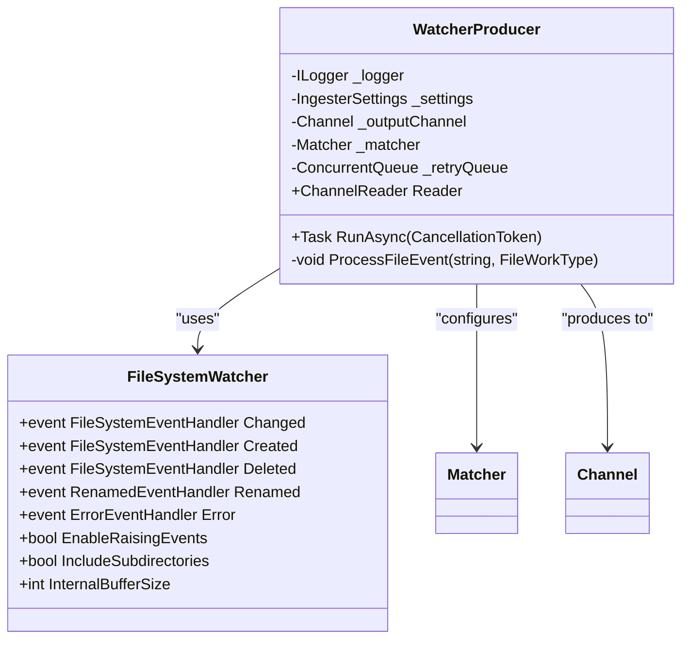
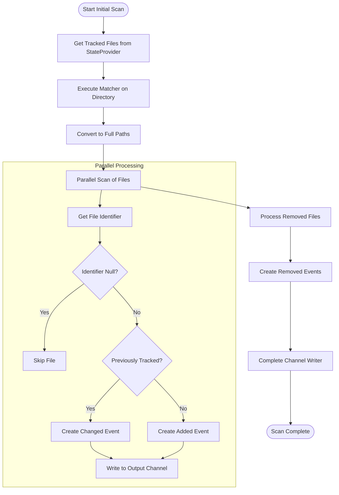
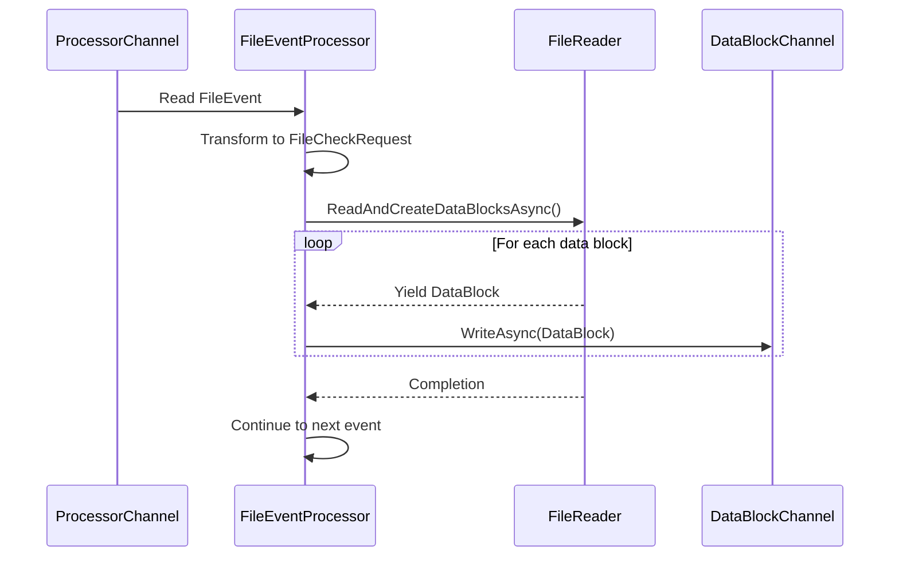
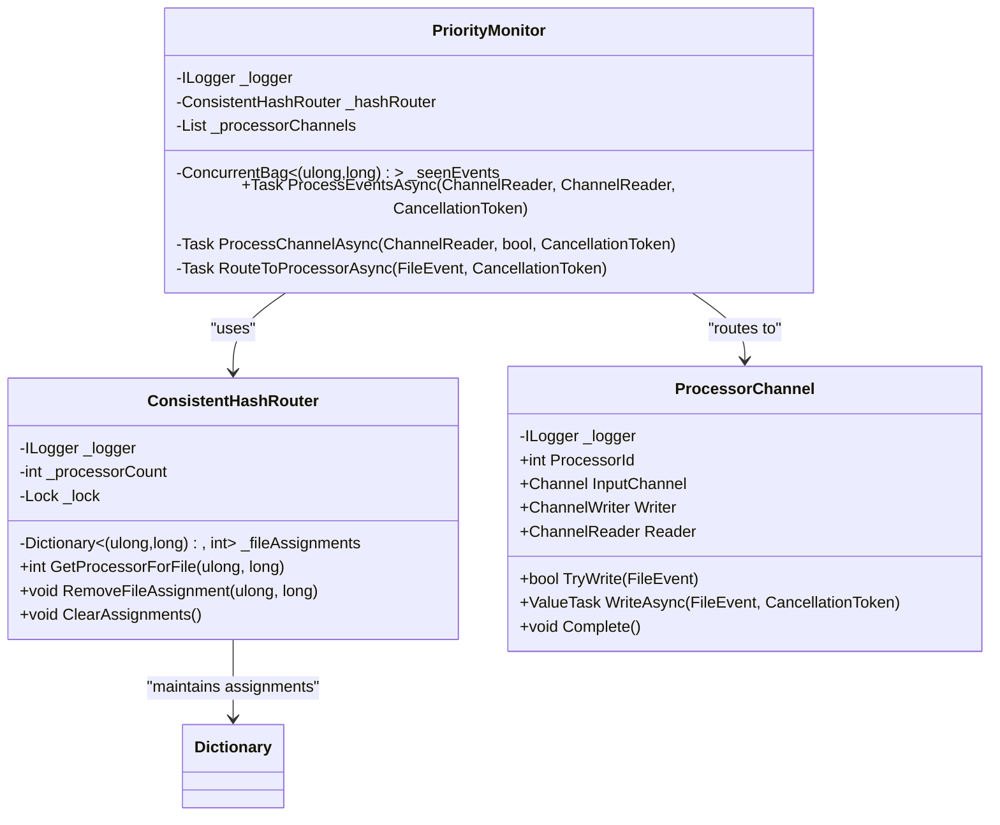

# Directory Monitoring


## Table of Contents
1. [Introduction](#introduction)
2. [Core Components Overview](#core-components-overview)
3. [DirectoryMonitor: Central Orchestration](#directorymonitor-central-orchestration)
4. [WatcherProducer: Real-Time File Event Detection](#watcherproducer-real-time-file-event-detection)
5. [InitialScanProducer: Startup Directory Scanning](#initialscanproducer-startup-directory-scanning)
6. [File Event Processing Pipeline](#file-event-processing-pipeline)
7. [PriorityMonitor and Event Routing](#prioritymonitor-and-event-routing)
8. [Configuration and Filtering](#configuration-and-filtering)
9. [Performance and Reliability Considerations](#performance-and-reliability-considerations)
10. [Troubleshooting Guide](#troubleshooting-guide)

## Introduction

The directory monitoring subsystem in LogTapestry is responsible for detecting changes in log files across specified directories and initiating processing pipelines to extract and forward log data. This system combines real-time file system monitoring with comprehensive startup scanning to ensure no log entries are missed during ingestion. The architecture leverages .NET's `FileSystemWatcher` for real-time event detection and implements a robust, scalable pipeline for handling file creation, modification, and renaming events.

This document provides a comprehensive analysis of the directory monitoring components, detailing how they work together to provide reliable, high-performance log file monitoring.

## Core Components Overview

The directory monitoring subsystem consists of several key components that work in concert:

- **DirectoryMonitor**: Orchestrates the entire monitoring pipeline
- **WatcherProducer**: Manages real-time file system events using `FileSystemWatcher`
- **InitialScanProducer**: Performs parallel scanning of existing files at startup
- **PriorityMonitor**: Routes events from multiple sources with priority handling
- **FileEventProcessor**: Processes individual file events and reads log data
- **ConsistentHashRouter**: Distributes file events across processor channels
- **ProcessorChannel**: Provides communication channels between components

These components form a pipeline that ensures efficient, ordered processing of log files while maintaining system responsiveness and reliability.





**Diagram sources**
- [DirectoryMonitor.cs](file://src/LogTapestry.Ingester/DirectoryMonitor.cs)
- [WatcherProducer.cs](file://src/LogTapestry.Ingester/WatcherProducer.cs)
- [InitialScanProducer.cs](file://src/LogTapestry.Ingester/InitialScanProducer.cs)
- [PriorityMonitor.cs](file://src/LogTapestry.Ingester/PriorityMonitor.cs)
- [ProcessorChannel.cs](file://src/LogTapestry.Ingester/ProcessorChannel.cs)
- [FileEventProcessor.cs](file://src/LogTapestry.Ingester/FileEventProcessor.cs)

**Section sources**
- [DirectoryMonitor.cs](file://src/LogTapestry.Ingester/DirectoryMonitor.cs)
- [WatcherProducer.cs](file://src/LogTapestry.Ingester/WatcherProducer.cs)

## DirectoryMonitor: Central Orchestration

The `DirectoryMonitor` class serves as the central orchestrator for the entire file monitoring pipeline. It coordinates the startup and shutdown of all monitoring components, ensuring they work together seamlessly.


```csharp
public class DirectoryMonitor(
    ILogger<DirectoryMonitor> logger,
    IOptions<IngesterSettings> options,
    IStateProvider stateProvider,
    PriorityMonitor priorityMonitor,
    InitialScanProducer initialScanProducer,
    WatcherProducer watcherProducer)
{
    // Constructor dependencies injected
    private readonly ILogger<DirectoryMonitor> _logger = logger;
    private readonly IngesterSettings _settings = options.Value;
    private readonly IStateProvider _stateProvider = stateProvider;
    private readonly PriorityMonitor _priorityMonitor = priorityMonitor;
    private readonly InitialScanProducer _initialScanProducer = initialScanProducer;
    private readonly WatcherProducer _watcherProducer = watcherProducer;
    
    // Task tracking
    private Task? _priorityTask;
    private Task? _initialScanTask;
    private Task? _watcherTask;
    private CancellationTokenSource? _cts;
}
```


The `RunAsync` method starts all three major components in parallel:
1. `_priorityMonitor.ProcessEventsAsync` - Handles event routing
2. `_watcherProducer.RunAsync` - Monitors for real-time file changes
3. `_initialScanProducer.RunAsync` - Scans existing files at startup

This parallel execution ensures that the system can begin processing existing files while simultaneously monitoring for new changes, minimizing startup time and ensuring no events are missed.





**Diagram sources**
- [DirectoryMonitor.cs](file://src/LogTapestry.Ingester/DirectoryMonitor.cs)

**Section sources**
- [DirectoryMonitor.cs](file://src/LogTapestry.Ingester/DirectoryMonitor.cs#L15-L95)

## WatcherProducer: Real-Time File Event Detection

The `WatcherProducer` class leverages .NET's `FileSystemWatcher` to detect file system events in real time. It monitors the configured directory for file creation, modification, deletion, and renaming events.

### Key Implementation Details


```csharp
var watcher = new FileSystemWatcher(_settings.Directory, "*") {
    IncludeSubdirectories = true,
    EnableRaisingEvents = true,
    InternalBufferSize = _settings.FileSystemWatcherBufferSize
};
```


The watcher is configured to:
- Monitor the directory specified in `IngesterSettings.Directory`
- Include subdirectories recursively
- Use a configurable buffer size (default: 65,536 bytes)
- Watch all files (`*` pattern)

### Event Filtering with Pattern Matching

The `WatcherProducer` uses a `Matcher` instance to filter events based on include and exclude patterns defined in the configuration:


```csharp
_matcher = new Matcher();
_matcher.AddIncludePatterns(_settings.IncludePatterns);
_matcher.AddExcludePatterns(_settings.ExcludePatterns);

bool IsMatch(string path)
{
    var relPath = Path.GetRelativePath(_settings.Directory, path);
    var result = _matcher.Match(relPath);
    return result.HasMatches;
}
```


This filtering occurs before event processing, reducing unnecessary work on irrelevant files.

### Event Handlers

The component registers handlers for four types of file system events:

- **OnCreated**: Triggered when a new file is created
- **OnChanged**: Triggered when a file is modified
- **OnDeleted**: Triggered when a file is deleted
- **OnRenamed**: Triggered when a file is renamed

Each handler first checks if the file path matches the configured patterns before processing the event.

### Retry Mechanism

A `ConcurrentQueue<string>` is used to handle files for which the file identifier cannot be immediately obtained:


```csharp
private void ProcessFileEvent(string filePath, FileWorkType type)
{
    var fileIdObj = NtfsUtils.GetFileIdentifier(filePath);
    if (fileIdObj == null) {
        _retryQueue.Enqueue(filePath);
        return;
    }
    // ... create and write file event
}
```


The retry queue is processed periodically in the main loop, allowing transient issues (like file locks) to resolve before retrying.





**Diagram sources**
- [WatcherProducer.cs](file://src/LogTapestry.Ingester/WatcherProducer.cs)

**Section sources**
- [WatcherProducer.cs](file://src/LogTapestry.Ingester/WatcherProducer.cs#L14-L151)

## InitialScanProducer: Startup Directory Scanning

The `InitialScanProducer` performs a comprehensive scan of existing log files when the system starts up. This ensures that any log files present before the monitor began running are processed.

### Parallel Processing Architecture

The component uses `Parallel.ForEachAsync` to scan files efficiently:


```csharp
await Parallel.ForEachAsync(filePaths, options, async (filePath, ct) => {
    // Process each file
});
```


Key configuration options:
- `MaxDegreeOfParallelism = Environment.ProcessorCount`
- Uses cancellation token for graceful shutdown
- Processes files in parallel to maximize throughput

### File Matching and State Comparison

The scanner uses the same `Matcher` component as `WatcherProducer` to ensure consistent filtering:


```csharp
var matchResult = _matcher.Execute(dirWrapper);
var filePaths = matchResult.Files
    .Select(f => Path.Combine(_settings.Directory, f.Path))
    .ToList();
```


It then compares the current file state with previously tracked files from the state provider:


```csharp
var trackedFiles = await _stateProvider.GetAllTrackedFilesAsync();
var seen = new ConcurrentBag<ulong>();

// For each matching file
var fileEvent = trackedFiles.TryGetValue(id, out TrackedFileInfo? tracked)
    ? CreateChangedEvent(fileIdObj, filePath)
    : CreateAddedEvent(fileIdObj, filePath);
```


Files that exist in the state provider but not in the current scan are marked as removed or rotated.

### Event Generation

The component generates three types of events:
- `FileAdded`: For new files not previously tracked
- `FileChanged`: For existing files that have been modified
- `FileRemovedOrRotated`: For files that were previously tracked but no longer exist





**Diagram sources**
- [InitialScanProducer.cs](file://src/LogTapestry.Ingester/InitialScanProducer.cs)

**Section sources**
- [InitialScanProducer.cs](file://src/LogTapestry.Ingester/InitialScanProducer.cs#L16-L139)

## File Event Processing Pipeline

The file event processing pipeline handles events from both real-time monitoring and initial scanning, ensuring they are processed efficiently and without duplication.

### FileEventProcessor Implementation

The `FileEventProcessor` class processes events from its assigned channel:


```csharp
public async Task ProcessEventsAsync(ChannelReader<FileEvent> eventReader, CancellationToken token)
{
    await foreach (var fileEvent in eventReader.ReadAllAsync(token)) {
        await ProcessFileEventAsync(fileEvent, token);
    }
}
```


Key features:
- Processes events sequentially per processor to maintain order
- Transforms `FileEvent` to `FileCheckRequest` for the `FileReader`
- Handles exceptions gracefully without stopping the entire pipeline
- Logs detailed trace information for debugging

### Integration with FileReader

The processor delegates actual file reading to the `FileReader` component:


```csharp
await foreach (var dataBlock in _fileReader.ReadAndCreateDataBlocksAsync(fileRequest, token)) {
    await _dataBlockChannel.Writer.WriteAsync(dataBlock, token);
}
```


This separation of concerns allows the monitoring system to focus on event detection while the reading system handles the complexities of parsing log files.





**Diagram sources**
- [FileEventProcessor.cs](file://src/LogTapestry.Ingester/FileEventProcessor.cs)

**Section sources**
- [FileEventProcessor.cs](file://src/LogTapestry.Ingester/FileEventProcessor.cs#L13-L120)

## PriorityMonitor and Event Routing

The `PriorityMonitor` component manages the routing of file events from multiple sources to processor channels, implementing a priority-based system.

### Dual-Channel Processing

The monitor handles two types of event sources:
- **Fast channel**: Real-time events from `WatcherProducer`
- **Slow channel**: Batch events from `InitialScanProducer`


```csharp
public async Task ProcessEventsAsync(
    ChannelReader<FileEvent> fastChannel,
    ChannelReader<FileEvent> slowChannel,
    CancellationToken token)
{
    var fastTask = ProcessChannelAsync(fastChannel, isFastChannel: true, token);
    var slowTask = ProcessChannelAsync(slowChannel, isFastChannel: false, token);
    await Task.WhenAll(fastTask, slowTask);
}
```


### Duplicate Event Prevention

The monitor prevents duplicate processing using a `ConcurrentBag` to track seen files:


```csharp
private readonly ConcurrentBag<(ulong FileId, long VolumeSerial)> _seenEvents = [];

// In ProcessChannelAsync:
if (!isFastChannel && _seenEvents.Contains(key)) {
    continue; // Skip duplicate
}
_seenEvents.Add(key);
```


This ensures that if a file is detected by both the initial scan and real-time monitoring, it is only processed once, with preference given to the real-time source.

### Consistent Hashing Distribution

Events are routed to processor channels using consistent hashing based on file identifiers:


```csharp
var processorId = _hashRouter.GetProcessorForFile(fileEvent.FileId, fileEvent.VolumeSerial);
var processorChannel = _processorChannels[processorId];
await processorChannel.WriteAsync(fileEvent, token);
```


This ensures that all events for a given file are processed by the same processor, maintaining processing order and state.





**Diagram sources**
- [PriorityMonitor.cs](file://src/LogTapestry.Ingester/PriorityMonitor.cs)
- [ConsistentHashRouter.cs](file://src/LogTapestry.Ingester/ConsistentHashRouter.cs)
- [ProcessorChannel.cs](file://src/LogTapestry.Ingester/ProcessorChannel.cs)

**Section sources**
- [PriorityMonitor.cs](file://src/LogTapestry.Ingester/PriorityMonitor.cs#L14-L97)
- [ConsistentHashRouter.cs](file://src/LogTapestry.Ingester/ConsistentHashRouter.cs#L8-L85)
- [ProcessorChannel.cs](file://src/LogTapestry.Ingester/ProcessorChannel.cs#L13-L66)

## Configuration and Filtering

The directory monitoring system is highly configurable through the `IngesterSettings` class, which defines all operational parameters.

### Key Configuration Options


```csharp
public class IngesterSettings
{
    public string Directory { get; set; } = "";
    public List<string> IncludePatterns { get; set; } = [];
    public List<string> ExcludePatterns { get; set; } = [];
    public int FileSystemWatcherBufferSize { get; set; } = 65536;
    // ... other settings
}
```


**Directory Monitoring Settings**
- `Directory`: Root directory to monitor
- `IncludePatterns`: Glob patterns for files to include (e.g., "*.log", "app-*.txt")
- `ExcludePatterns`: Glob patterns for files to exclude
- `FileSystemWatcherBufferSize`: Size of the internal buffer for file system events

### Pattern Matching Implementation

Both `WatcherProducer` and `InitialScanProducer` use the same `Matcher` component for consistent filtering:


```csharp
_matcher = new Matcher();
_matcher.AddIncludePatterns(_settings.IncludePatterns);
_matcher.AddExcludePatterns(_settings.ExcludePatterns);
```


The system uses `Microsoft.Extensions.FileSystemGlobbing` for pattern matching, supporting standard glob patterns like:
- `*.log` - All files with .log extension
- `**/*.txt` - All .txt files in any subdirectory
- `app-[0-9]*.log` - Files matching a specific naming pattern

### Configuration Example


```json
{
  "Ingester": {
    "Directory": "C:\\Logs\\Application",
    "IncludePatterns": [
      "*.log",
      "**/error-*.txt"
    ],
    "ExcludePatterns": [
      "*.tmp",
      "**/archive/**"
    ],
    "FileSystemWatcherBufferSize": 65536,
    "MaxParsingParallelism": 8
  }
}
```


This configuration would monitor the C:\Logs\Application directory for all .log files and error-*.txt files in any subdirectory, while excluding temporary files and anything in archive folders.

**Section sources**
- [Configuration.cs](file://src/LogTapestry.Core/Configuration.cs#L8-L34)

## Performance and Reliability Considerations

The directory monitoring subsystem includes several features to ensure high performance and reliability in production environments.

### Performance Optimizations

**Parallel Initial Scanning**
- Uses `Parallel.ForEachAsync` with degree of parallelism equal to processor count
- Processes hundreds or thousands of files simultaneously during startup
- Minimizes time to begin processing log data

**Efficient Event Buffering**
- Uses unbounded channels for event communication
- Prevents blocking between components
- Allows backpressure handling through channel configuration

**File System Watcher Tuning**
- Configurable buffer size (default: 64KB) to handle burst events
- 500ms delay in the main loop to batch processing of retry queue
- Recursive monitoring with subdirectory inclusion

### Reliability Features

**File Identifier-Based Tracking**
- Uses NTFS file identifiers (FileId and VolumeSerial) instead of paths
- Resistant to file renaming and movement within the same volume
- Prevents duplicate processing of the same file

**Retry Mechanism**
- Files that cannot be immediately processed are queued for retry
- Handles transient issues like file locks or permission errors
- Continues processing other files while retrying problematic ones

**Graceful Error Handling**
- Individual file processing errors do not stop the entire pipeline
- Comprehensive logging at multiple levels (Information, Warning, Error)
- Cancellation token support for clean shutdown

### Resource Management

**Memory Efficiency**
- Streams events through channels rather than storing in memory
- Processes files one at a time within each processor
- Uses concurrent collections for thread-safe operations

**CPU Utilization**
- Balances parallelism with system resources
- Configurable processing parallelism
- Avoids busy-waiting with proper async/await patterns

## Troubleshooting Guide

This section addresses common issues encountered with the directory monitoring subsystem and provides solutions.

### Missed File Events

**Symptoms**: New or modified files are not being processed.

**Possible Causes and Solutions**:
- **File system watcher buffer overflow**: Increase `FileSystemWatcherBufferSize` in configuration
- **File patterns don't match**: Verify include/exclude patterns in configuration
- **Permission issues**: Ensure the process has read access to the monitored directory
- **Antivirus interference**: Add the monitored directory to antivirus exclusions

### High CPU Usage

**Symptoms**: Process consumes excessive CPU resources.

**Possible Causes and Solutions**:
- **Rapid file changes**: Implement rate limiting or increase polling interval
- **Large number of files**: Optimize include patterns to monitor only necessary files
- **Frequent retries**: Investigate why files are being retried and resolve underlying issues

### Duplicate Processing

**Symptoms**: The same log entries appear multiple times in the output.

**Possible Causes and Solutions**:
- **File identifier unavailable**: Ensure NTFS file system is used (not FAT32)
- **Different volumes**: Files moved between volumes will have different identifiers
- **Configuration changes**: Restart may cause reprocessing of all files

### File Not Found Errors

**Symptoms**: "Could not get file identifier" warnings in logs.

**Possible Causes and Solutions**:
- **File deleted between detection and processing**: Expected behavior, can be ignored
- **Permission issues**: Verify read permissions on the file and directory
- **Network latency**: For network drives, increase retry attempts or delay

### Best Practices

- **Use specific include patterns** rather than broad ones to reduce monitoring overhead
- **Monitor dedicated log directories** rather than large, general-purpose directories
- **Regularly review logs** for warnings and errors related to file monitoring
- **Test configuration changes** in a staging environment before production deployment
- **Monitor system resources** to ensure the watcher buffer is appropriately sized

**Section sources**
- [WatcherProducer.cs](file://src/LogTapestry.Ingester/WatcherProducer.cs)
- [InitialScanProducer.cs](file://src/LogTapestry.Ingester/InitialScanProducer.cs)
- [DirectoryMonitor.cs](file://src/LogTapestry.Ingester/DirectoryMonitor.cs)

**Referenced Files in This Document**   
- [DirectoryMonitor.cs](file://src/LogTapestry.Ingester/DirectoryMonitor.cs)
- [WatcherProducer.cs](file://src/LogTapestry.Ingester/WatcherProducer.cs)
- [InitialScanProducer.cs](file://src/LogTapestry.Ingester/InitialScanProducer.cs)
- [FileEventProcessor.cs](file://src/LogTapestry.Ingester/FileEventProcessor.cs)
- [PriorityMonitor.cs](file://src/LogTapestry.Ingester/PriorityMonitor.cs)
- [ConsistentHashRouter.cs](file://src/LogTapestry.Ingester/ConsistentHashRouter.cs)
- [ProcessorChannel.cs](file://src/LogTapestry.Ingester/ProcessorChannel.cs)
- [Configuration.cs](file://src/LogTapestry.Core/Configuration.cs)