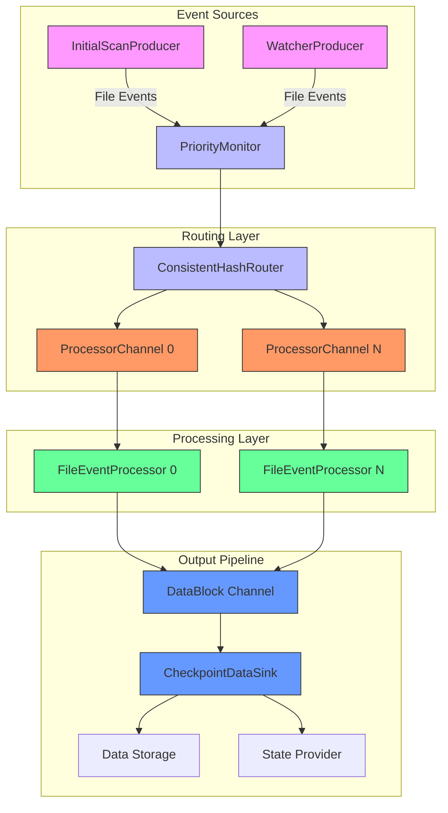
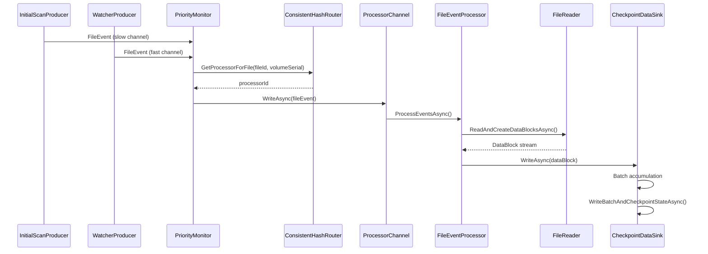

# File Event Processing


## Table of Contents
1. [Architecture Overview](#architecture-overview)
2. [Core Components](#core-components)
3. [File Event Lifecycle](#file-event-lifecycle)
4. [Consistent Hashing Distribution](#consistent-hashing-distribution)
5. [Priority-Based Event Processing](#priority-based-event-processing)
6. [Performance Configuration](#performance-configuration)
7. [Error Handling and Recovery](#error-handling-and-recovery)

## Architecture Overview

The file event processing pipeline in LogTapestry implements a scalable, fault-tolerant architecture for ingesting and processing log files. The system uses a consistent hashing-based worker pool to distribute file processing load while ensuring sequential processing of events from the same file to maintain state consistency.





**Diagram sources**
- [DirectoryMonitor.cs](file://d:/devel/LogTapestry/src/LogTapestry.Ingester/DirectoryMonitor.cs)
- [PriorityMonitor.cs](file://d:/devel/LogTapestry/src/LogTapestry.Ingester/PriorityMonitor.cs)
- [ConsistentHashRouter.cs](file://d:/devel/LogTapestry/src/LogTapestry.Ingester/ConsistentHashRouter.cs)
- [ProcessorChannel.cs](file://d:/devel/LogTapestry/src/LogTapestry.Ingester/ProcessorChannel.cs)
- [FileEventProcessor.cs](file://d:/devel/LogTapestry/src/LogTapestry.Ingester/FileEventProcessor.cs)

## Core Components

The file event processing pipeline consists of several key components that work together to efficiently process file events while maintaining data consistency and system reliability.

### FileEventProcessor

The `FileEventProcessor` class is responsible for processing file events sequentially for a specific processor. Each processor instance handles events from its dedicated channel, ensuring that all events for a given file are processed in order.


```csharp
public class FileEventProcessor(
    ILogger<FileEventProcessor> logger,
    FileReader fileReader,
    Channel<DataBlock> dataBlockChannel,
    int processorId)
{
    private readonly ILogger<FileEventProcessor> _logger = logger;
    private readonly FileReader _fileReader = fileReader;
    private readonly Channel<DataBlock> _dataBlockChannel = dataBlockChannel;
    private readonly int _processorId = processorId;

    public async Task ProcessEventsAsync(ChannelReader<FileEvent> eventReader, CancellationToken token)
    {
        _logger.LogInformation("Processor {ProcessorId}: Starting event processing", _processorId);

        try {
            await foreach (var fileEvent in eventReader.ReadAllAsync(token)) {
                await ProcessFileEventAsync(fileEvent, token);
            }
        } catch (OperationCanceledException) {
            _logger.LogInformation("Processor {ProcessorId}: Event processing cancelled", _processorId);
        }
    }

    private async Task ProcessFileEventAsync(FileEvent fileEvent, CancellationToken token)
    {
        var fileRequest = new FileCheckRequest {
            FileId = fileEvent.FileId,
            VolumeSerial = fileEvent.VolumeSerial,
            FilePath = fileEvent.FilePath,
            LastWriteTimeUtc = fileEvent.LastWriteTimeUtc,
            Type = fileEvent.Type
        };

        await foreach (var dataBlock in _fileReader.ReadAndCreateDataBlocksAsync(fileRequest, token)) {
            if (dataBlock != null) {
                await _dataBlockChannel.Writer.WriteAsync(dataBlock, token);
            }
        }
    }
}
```


**Section sources**
- [FileEventProcessor.cs](file://d:/devel/LogTapestry/src/LogTapestry.Ingester/FileEventProcessor.cs#L5-L122)

### ProcessorChannel

The `ProcessorChannel` class acts as a wrapper for processor-specific channels that handle file events. Each processor has its own unbounded channel to ensure events for the same file are processed sequentially by the same worker.


```csharp
public class ProcessorChannel(ILogger<ProcessorChannel> logger, int processorId)
{
    private readonly ILogger<ProcessorChannel> _logger = logger;

    public int ProcessorId { get; } = processorId;
    public Channel<FileEvent> InputChannel { get; } = Channel.CreateUnbounded<FileEvent>();
    public ChannelWriter<FileEvent> Writer => InputChannel.Writer;
    public ChannelReader<FileEvent> Reader => InputChannel.Reader;

    public bool TryWrite(FileEvent fileEvent)
    {
        if (Writer.TryWrite(fileEvent)) {
            _logger.LogTrace("Processor {ProcessorId}: Successfully queued {EventType} event for {FilePath}",
                ProcessorId, fileEvent.Type, fileEvent.FilePath);
            return true;
        } else {
            _logger.LogWarning("Processor {ProcessorId}: Failed to queue {EventType} event for {FilePath}",
                ProcessorId, fileEvent.Type, fileEvent.FilePath);
            return false;
        }
    }

    public async ValueTask WriteAsync(FileEvent fileEvent, CancellationToken token = default)
    {
        await Writer.WriteAsync(fileEvent, token);
        _logger.LogInformation("Processor {ProcessorId}: Successfully queued {EventType} event for {FilePath}",
            ProcessorId, fileEvent.Type, fileEvent.FilePath);
    }

    public void Complete()
    {
        Writer.Complete();
        _logger.LogDebug("Processor {ProcessorId}: Channel completed", ProcessorId);
    }
}
```


**Section sources**
- [ProcessorChannel.cs](file://d:/devel/LogTapestry/src/LogTapestry.Ingester/ProcessorChannel.cs#L5-L68)

## File Event Lifecycle

The lifecycle of a file event from ingestion to parsing involves multiple stages, each with specific responsibilities and thread safety mechanisms.

### Ingestion and Routing

File events are generated by two sources: `InitialScanProducer` which performs a comprehensive scan of the target directory, and `WatcherProducer` which monitors for real-time file system changes. These events are then processed by the `PriorityMonitor` which routes them based on priority.





**Diagram sources**
- [DirectoryMonitor.cs](file://d:/devel/LogTapestry/src/LogTapestry.Ingester/DirectoryMonitor.cs)
- [PriorityMonitor.cs](file://d:/devel/LogTapestry/src/LogTapestry.Ingester/PriorityMonitor.cs)
- [FileEventProcessor.cs](file://d:/devel/LogTapestry/src/LogTapestry.Ingester/FileEventProcessor.cs)

### Thread Safety and Backpressure

The system employs several mechanisms to ensure thread safety and handle backpressure:

- **Channel-based communication**: Uses `System.Threading.Channels` for thread-safe producer-consumer patterns
- **Unbounded input channels**: Processor channels are unbounded to prevent event loss during processing spikes
- **Bounded data block channel**: The data block channel is bounded with a capacity of 10 to apply backpressure
- **CancellationToken usage**: All async operations accept cancellation tokens for graceful shutdown

The `FileEventProcessor` processes events sequentially from its dedicated channel, eliminating the need for additional synchronization when processing events for the same file. The `ConsistentHashRouter` uses a lock to ensure thread-safe access to the file-to-processor assignment dictionary.

**Section sources**
- [FileEventProcessor.cs](file://d:/devel/LogTapestry/src/LogTapestry.Ingester/FileEventProcessor.cs)
- [ProcessorChannel.cs](file://d:/devel/LogTapestry/src/LogTapestry.Ingester/ProcessorChannel.cs)
- [ConsistentHashRouter.cs](file://d:/devel/LogTapestry/src/LogTapestry.Ingester/ConsistentHashRouter.cs)

## Consistent Hashing Distribution

The `ConsistentHashRouter` plays a critical role in distributing file processing load evenly across processor workers while ensuring that all events for the same file are routed to the same processor.

### Hashing Algorithm

The router uses a consistent hashing algorithm based on the file's unique identifier (file ID and volume serial number) to determine which processor should handle the file:


```csharp
public class ConsistentHashRouter
{
    private readonly Dictionary<(ulong FileId, long VolumeSerial), int> _fileAssignments = [];
    private readonly Lock _lock = new();

    public int GetProcessorForFile(ulong fileId, long volumeSerial)
    {
        lock (_lock) {
            var key = (fileId, volumeSerial);

            if (_fileAssignments.TryGetValue(key, out var processorId)) {
                return processorId;
            }

            var hashCode = HashCode.Combine(fileId, volumeSerial);
            var processor = Math.Abs(hashCode) % _processorCount;

            _fileAssignments[key] = processor;
            return processor;
        }
    }
}
```


This approach ensures:
- **Consistency**: The same file is always routed to the same processor
- **Load balancing**: Files are distributed evenly across available processors
- **State isolation**: Each processor maintains its own state for the files it processes
- **Scalability**: Adding or removing processors only affects a subset of files

The router maintains an in-memory dictionary of file-to-processor assignments, which is thread-safe due to the lock protection. This caching mechanism prevents recalculating the hash for files that have been processed before.

**Section sources**
- [ConsistentHashRouter.cs](file://d:/devel/LogTapestry/src/LogTapestry.Ingester/ConsistentHashRouter.cs#L5-L87)

## Priority-Based Event Processing

The `PriorityMonitor` component manages processing priorities by merging events from multiple channels with different priority levels.

### Priority Handling

The system implements a two-tier priority system:
- **Fast channel**: Real-time file system events from `WatcherProducer`
- **Slow channel**: Initial directory scan events from `InitialScanProducer`


```csharp
public class PriorityMonitor(
    ILogger<PriorityMonitor> logger,
    ConsistentHashRouter hashRouter,
    List<ProcessorChannel> processorChannels)
{
    private readonly ConcurrentBag<(ulong FileId, long VolumeSerial)> _seenEvents = [];

    public async Task ProcessEventsAsync(
        ChannelReader<FileEvent> fastChannel,
        ChannelReader<FileEvent> slowChannel,
        CancellationToken token)
    {
        var fastTask = ProcessChannelAsync(fastChannel, isFastChannel: true, token);
        var slowTask = ProcessChannelAsync(slowChannel, isFastChannel: false, token);

        await Task.WhenAll(fastTask, slowTask);
    }

    private async Task ProcessChannelAsync(
        ChannelReader<FileEvent> channel,
        bool isFastChannel,
        CancellationToken token)
    {
        await foreach (var fileEvent in channel.ReadAllAsync(token)) {
            var key = (fileEvent.FileId, fileEvent.VolumeSerial);

            // Skip if we've already processed this file from a fast channel
            if (!isFastChannel && _seenEvents.Contains(key)) {
                continue;
            }

            _seenEvents.Add(key);
            await RouteToProcessorAsync(fileEvent, token);
        }
    }
}
```


Key features of the priority system:
- **Fast channel precedence**: Real-time events take priority over initial scan events
- **Duplicate elimination**: Files processed via the fast channel are skipped in the slow channel
- **Concurrent processing**: Both channels are processed simultaneously for maximum throughput
- **Memory efficiency**: Uses `ConcurrentBag` to track processed files with minimal contention

This design ensures that newly created or modified files are processed immediately, even if the initial scan is still in progress, providing low-latency processing for recent log entries.

**Section sources**
- [PriorityMonitor.cs](file://d:/devel/LogTapestry/src/LogTapestry.Ingester/PriorityMonitor.cs#L5-L99)

## Performance Configuration

The file event processing pipeline includes several configurable parameters that can be tuned for optimal performance based on the deployment environment and workload characteristics.

### Configuration Parameters

The system's behavior is controlled through settings in `appsettings.json`:


```json
{
  "Ingester": {
    "LogLevel": "Debug",
    "Directory": "d:\\devel\\LogTapestry\\sample-logs",
    "IncludePatterns": [ "**/*.log", "**/*.txt" ],
    "ExcludePatterns": [ ],
    "DataRoot": "data",
    "PollingIntervalMs": 1000,
    "MonitoringUrl": "http://0.0.0.0:8080",
    "FileReaderThreadPoolSize": 8,
    "StateWriterBatchSize": 1000,
    "StateWriterIntervalSeconds": 2,
    "FileSystemWatcherBufferSize": 65536
  }
}
```


**Key performance parameters:**

- **FileReaderThreadPoolSize**: Determines the number of concurrent processor workers (default: 8)
- **FileSystemWatcherBufferSize**: Size of the internal buffer for the file system watcher (default: 65536 bytes)
- **Data block channel capacity**: Bounded channel with capacity of 10 data blocks
- **Batch processing**: Data blocks are batched and checkpointed every 5 seconds or when reaching the batch size limit

### Worker Pool Configuration

The worker pool is configured through dependency injection in the application startup:


```csharp
builder.Services.AddSingleton<List<ProcessorChannel>>(sp => {
    var settings = sp.GetRequiredService<IOptions<IngesterSettings>>().Value;
    var loggerFactory = sp.GetRequiredService<ILoggerFactory>();
    var channels = new List<ProcessorChannel>();

    for (int i = 0; i < settings.FileReaderThreadPoolSize; i++) {
        var logger = loggerFactory.CreateLogger<ProcessorChannel>();
        channels.Add(new ProcessorChannel(logger, i));
    }

    return channels;
});
```


The `FileReaderThreadPoolSize` setting directly controls the number of processor channels and workers, allowing the system to scale horizontally within a single process. For optimal performance, this value should be tuned based on the number of CPU cores and the I/O characteristics of the storage system.

**Section sources**
- [appsettings.json](file://d:/devel/LogTapestry/src/LogTapestry.Ingester/appsettings.json)
- [IngesterService.cs](file://d:/devel/LogTapestry/src/LogTapestry.Ingester/IngesterService.cs)

## Error Handling and Recovery

The file event processing pipeline implements robust error handling and recovery strategies to ensure data integrity and system reliability.

### Error Recovery Strategies

The system employs several approaches to handle and recover from processing failures:

1. **Graceful error handling in FileEventProcessor**:

```csharp
try {
    await ProcessFileEventAsync(fileEvent, token);
} catch (Exception ex) {
    _logger.LogError(ex, "Processor {ProcessorId}: Error processing {EventType} event for {FilePath}",
        _processorId, fileEvent.Type, fileEvent.FilePath);
    // Continue processing other events even if one fails
}
```


2. **Atomic checkpointing for exactly-once semantics**:

```csharp
private async Task ProcessDataBlockBatch(List<DataBlock> batch)
{
    try {
        await _checkpointDataSink.WriteBatchAndCheckpointStateAsync(batch);
        _logger.LogInformation("Checkpointed batch of {Count} data blocks", batch.Count);
    } catch (Exception ex) {
        _logger.LogError(ex, "Failed to checkpoint batch of {Count} data blocks", batch.Count);
        throw; // Fail fast on checkpoint errors to maintain data consistency
    }
}
```


3. **Retry mechanisms in WatcherProducer**:
When file identifiers cannot be retrieved, paths are added to a retry queue for subsequent processing attempts.

### Failure Scenarios and Recovery

The system handles the following failure scenarios:

- **Individual event processing failures**: Errors in processing a single file event do not stop the entire processor, allowing other events to continue
- **Checkpoint failures**: Failures in the checkpointing process are treated as critical, triggering a shutdown to prevent data inconsistency
- **Cancellation**: All operations respond to cancellation tokens for graceful shutdown
- **Resource exhaustion**: Bounded channels provide backpressure to prevent unbounded memory growth

The combination of sequential processing per file, consistent hashing, and atomic checkpointing ensures exactly-once processing semantics, preventing duplicate processing of log entries even in the event of system failures.

**Section sources**
- [FileEventProcessor.cs](file://d:/devel/LogTapestry/src/LogTapestry.Ingester/FileEventProcessor.cs)
- [IngesterService.cs](file://d:/devel/LogTapestry/src/LogTapestry.Ingester/IngesterService.cs)

**Referenced Files in This Document**   
- [FileEventProcessor.cs](file://d:/devel/LogTapestry/src/LogTapestry.Ingester/FileEventProcessor.cs)
- [ProcessorChannel.cs](file://d:/devel/LogTapestry/src/LogTapestry.Ingester/ProcessorChannel.cs)
- [ConsistentHashRouter.cs](file://d:/devel/LogTapestry/src/LogTapestry.Ingester/ConsistentHashRouter.cs)
- [DirectoryMonitor.cs](file://d:/devel/LogTapestry/src/LogTapestry.Ingester/DirectoryMonitor.cs)
- [PriorityMonitor.cs](file://d:/devel/LogTapestry/src/LogTapestry.Ingester/PriorityMonitor.cs)
- [IngesterService.cs](file://d:/devel/LogTapestry/src/LogTapestry.Ingester/IngesterService.cs)
- [appsettings.json](file://d:/devel/LogTapestry/src/LogTapestry.Ingester/appsettings.json)