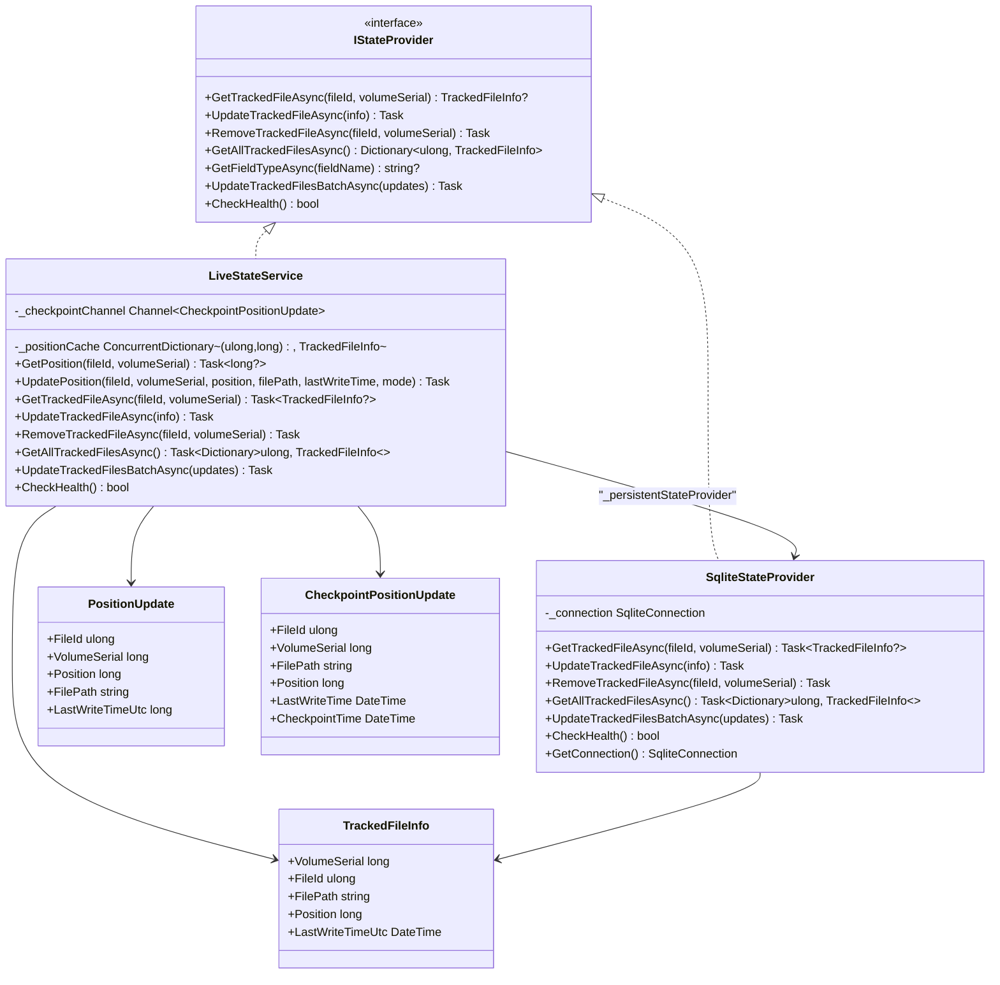
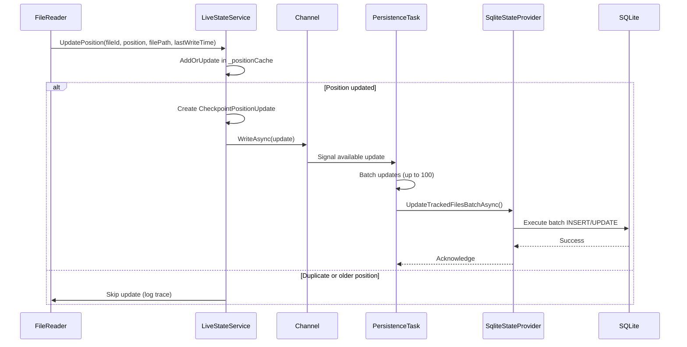
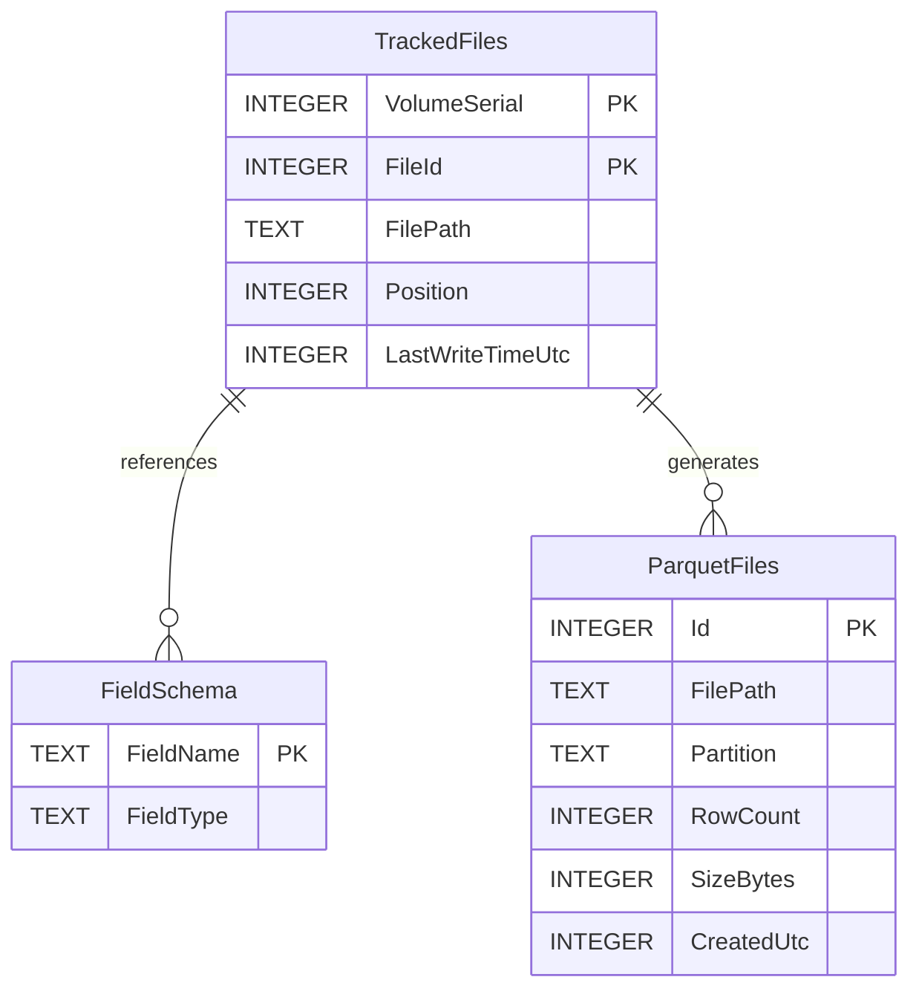
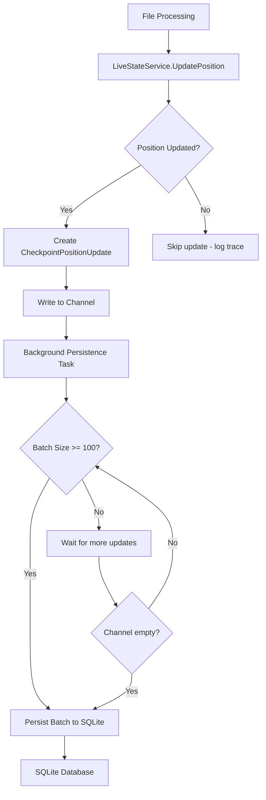

# State Management


## Table of Contents
1. [Introduction](#introduction)
2. [Core Components Overview](#core-components-overview)
3. [In-Memory State Tracking with LiveStateService](#in-memory-state-tracking-with-livestateservice)
4. [Persistent State Management with SqliteStateProvider](#persistent-state-management-with-sqlitestateprovider)
5. [State Persistence Architecture](#state-persistence-architecture)
6. [File Offset Tracking and Resumable Processing](#file-offset-tracking-and-resumable-processing)
7. [SQLite State Database Schema](#sqlite-state-database-schema)
8. [Concurrency Control and Recovery Procedures](#concurrency-control-and-recovery-procedures)
9. [Configuration Options and Performance Implications](#configuration-options-and-performance-implications)

## Introduction
The LogTapestry system implements a robust state management architecture designed to track file processing positions and enable resumable log ingestion after restarts or crashes. This document details the implementation of the state management system, focusing on the interaction between in-memory tracking via `LiveStateService` and persistent storage through `SqliteStateProvider`. The architecture ensures data durability while maintaining high performance through asynchronous writes and batch processing. The system supports pluggable state backends through the `IStateProvider` interface, with SQLite serving as the default persistent storage mechanism.

## Core Components Overview





**Diagram sources**
- [IStateProvider.cs](file://src/LogTapestry.Core/Interfaces/IStateProvider.cs#L3-L24)
- [LiveStateService.cs](file://src/LogTapestry.Ingester/LiveStateService.cs#L20-L269)
- [SqliteStateProvider.cs](file://src/LogTapestry.Core/SqliteStateProvider.cs#L5-L204)
- [NewWorkerTypes.cs](file://src/LogTapestry.Core/NewWorkerTypes.cs#L20-L27)
- [DataBlock.cs](file://src/LogTapestry.Core/DataBlock.cs#L19-L26)

**Section sources**
- [IStateProvider.cs](file://src/LogTapestry.Core/Interfaces/IStateProvider.cs#L3-L24)
- [LiveStateService.cs](file://src/LogTapestry.Ingester/LiveStateService.cs#L20-L269)
- [SqliteStateProvider.cs](file://src/LogTapestry.Core/SqliteStateProvider.cs#L5-L204)

## In-Memory State Tracking with LiveStateService

The `LiveStateService` class serves as the primary in-memory state tracker for file processing positions. It implements both the `IStateProvider` interface and `IHostedService`, allowing it to participate in the application's dependency injection and lifecycle management. The service maintains a `ConcurrentDictionary` as the source of truth for file positions, ensuring thread-safe access across multiple processing threads.

When a file's processing position needs to be updated, the `UpdatePosition` method is called with the file's unique identifiers (FileId and VolumeSerial), the new position, file path, and last write time. The method uses the `AddOrUpdate` operation on the concurrent dictionary to ensure atomic updates, only accepting position updates that represent forward progress (higher position values). This prevents race conditions where multiple workers might attempt to update the same file's position simultaneously.

The service also implements a checkpointing mechanism through a `Channel<CheckpointPositionUpdate>` that queues position updates for persistent storage. When a position is successfully updated in memory, a `CheckpointPositionUpdate` record is created and written to the channel if persistence is requested. This decouples the fast in-memory update from the slower disk I/O operations, maintaining high throughput for the ingestion pipeline.





**Diagram sources**
- [LiveStateService.cs](file://src/LogTapestry.Ingester/LiveStateService.cs#L20-L269)
- [DataBlock.cs](file://src/LogTapestry.Core/DataBlock.cs#L19-L26)

**Section sources**
- [LiveStateService.cs](file://src/LogTapestry.Ingester/LiveStateService.cs#L20-L269)

## Persistent State Management with SqliteStateProvider

The `SqliteStateProvider` class implements the `IStateProvider` interface to provide persistent storage of file tracking information using SQLite. It manages a connection to a SQLite database file and ensures the necessary tables are created upon initialization through the `EnsureSchema` method. The provider stores file metadata including the file's position, path, and last write time, using a composite primary key of VolumeSerial and FileId to uniquely identify files across system restarts.

The implementation uses SQLite's `INSERT ... ON CONFLICT DO UPDATE` syntax (UPSERT) to efficiently handle both insertions of new files and updates to existing file positions. This atomic operation ensures data consistency without requiring separate existence checks. For batch updates, the provider wraps multiple operations in a transaction to improve performance and maintain atomicity across the batch.

The provider also implements health checking functionality through the `CheckHealth` method, which tests database connectivity by executing a simple query. This allows monitoring systems to verify the state store's availability without affecting production operations.





**Diagram sources**
- [SqliteStateProvider.cs](file://src/LogTapestry.Core/SqliteStateProvider.cs#L5-L204)

**Section sources**
- [SqliteStateProvider.cs](file://src/LogTapestry.Core/SqliteStateProvider.cs#L5-L204)

## State Persistence Architecture

The state management system follows a dual-layer architecture with in-memory tracking for performance and persistent storage for durability. The `LiveStateService` acts as an intermediary between processing components and the persistent state provider, implementing a write-through cache pattern where in-memory updates are immediately reflected but persistence occurs asynchronously.

The architecture leverages .NET's `Channel<T>` to create a producer-consumer pattern for state persistence. When file positions are updated, the `LiveStateService` (producer) writes checkpoint updates to an unbounded channel. A background task (consumer) continuously reads from this channel, batching updates and forwarding them to the `SqliteStateProvider` for durable storage. This design provides several benefits:

1. **Decoupling**: Processing threads are not blocked by disk I/O operations
2. **Batching**: Multiple updates are grouped together, reducing database transaction overhead
3. **Backpressure**: The channel can naturally handle bursts of updates by queuing them for later processing
4. **Fault tolerance**: Updates remain in the channel if persistence temporarily fails

During shutdown, the `LiveStateService` ensures all pending updates are processed by draining the channel before termination, preventing data loss. This graceful shutdown procedure is critical for maintaining data consistency across restarts.





**Diagram sources**
- [LiveStateService.cs](file://src/LogTapestry.Ingester/LiveStateService.cs#L20-L269)
- [SqliteStateProvider.cs](file://src/LogTapestry.Core/SqliteStateProvider.cs#L5-L204)

**Section sources**
- [LiveStateService.cs](file://src/LogTapestry.Ingester/LiveStateService.cs#L20-L269)

## File Offset Tracking and Resumable Processing

The system enables resumable processing by tracking file offsets (positions) in both memory and persistent storage. When a file is processed, the current read position is stored, allowing the system to resume from the exact point where it left off after a restart. This is particularly important for log files that are continuously appended to, as it prevents reprocessing of already-ingested data and ensures no data is lost.

The `TrackedFileInfo` class contains the essential metadata for tracking:
- **FileId** and **VolumeSerial**: Unique identifiers that persist across file renames
- **FilePath**: Current path for reference and validation
- **Position**: Byte offset representing how much of the file has been processed
- **LastWriteTimeUtc**: Timestamp to detect file modifications or truncations

When a file is reopened after a restart, the system first checks the in-memory cache in `LiveStateService`. If not found, it queries the `SqliteStateProvider` to retrieve the last known position. The file is then opened and seeked to this position before processing continues. This two-tiered approach ensures fast access to frequently-used file positions while maintaining durability.

Code example of position tracking:

```csharp
// Updating position during file processing
await _liveStateService.UpdatePosition(
    fileId: file.FileId,
    volumeSerial: file.VolumeSerial,
    position: currentPosition,
    filePath: file.FullPath,
    lastWriteTime: file.LastWriteTimeUtc,
    mode: PositionUpdateMode.InMemoryAndPersist
);

// Retrieving position to resume processing
var position = await _liveStateService.GetPosition(
    fileId: file.FileId,
    volumeSerial: file.VolumeSerial
);
if (position.HasValue) {
    fileStream.Seek(position.Value, SeekOrigin.Begin);
}
```


**Section sources**
- [LiveStateService.cs](file://src/LogTapestry.Ingester/LiveStateService.cs#L20-L269)
- [IStateProvider.cs](file://src/LogTapestry.Core/Interfaces/IStateProvider.cs#L16-L23)

## SQLite State Database Schema

The SQLite state database implements a schema designed for efficient querying and updating of file tracking information. The schema is created and maintained by the `EnsureSchema` method in `SqliteStateProvider`, which executes DDL statements to create tables if they don't exist. The primary table, `TrackedFiles`, stores the core file metadata with a composite primary key for optimal indexing.

**TrackedFiles Table**
| Column | Type | Constraints | Description |
|--------|------|-----------|-------------|
| VolumeSerial | INTEGER | NOT NULL, PART OF PK | NTFS volume serial number |
| FileId | INTEGER | NOT NULL, PART OF PK | NTFS file identifier (MFT entry) |
| FilePath | TEXT | NOT NULL | Full path to the file |
| Position | INTEGER | NOT NULL | Byte offset of last processed position |
| LastWriteTimeUtc | INTEGER | NOT NULL | Unix timestamp of file's last write time |

**FieldSchema Table**
| Column | Type | Constraints | Description |
|--------|------|-----------|-------------|
| FieldName | TEXT | PRIMARY KEY | Name of extracted field |
| FieldType | TEXT | NOT NULL | Data type of the field (e.g., "long", "string") |

**ParquetFiles Table**
| Column | Type | Constraints | Description |
|--------|------|-----------|-------------|
| Id | INTEGER | PRIMARY KEY, AUTOINCREMENT | Unique identifier |
| FilePath | TEXT | NOT NULL | Path to generated Parquet file |
| Partition | TEXT | NOT NULL | Partition identifier |
| RowCount | INTEGER | NOT NULL | Number of rows in the file |
| SizeBytes | INTEGER | NOT NULL | File size in bytes |
| CreatedUtc | INTEGER | NOT NULL | Unix timestamp of creation time |

The schema uses Unix timestamps (stored as INTEGER) for temporal fields to simplify date arithmetic and comparisons. The composite primary key on `TrackedFiles` ensures each file is uniquely identified by its NTFS identifiers, which remain consistent even if the file is renamed. This approach is more reliable than using file paths alone, which can change during log rotation or archival processes.

**Section sources**
- [SqliteStateProvider.cs](file://src/LogTapestry.Core/SqliteStateProvider.cs#L5-L204)

## Concurrency Control and Recovery Procedures

The state management system implements several mechanisms to ensure data consistency in concurrent environments and to recover gracefully from failures. The `LiveStateService` uses a `ConcurrentDictionary` for in-memory state storage, which provides thread-safe operations without requiring explicit locking. The `AddOrUpdate` method ensures that position updates are atomic, preventing race conditions where multiple threads might read the same position and then both attempt to update it.

For persistence, the system uses a single background task to process checkpoint updates sequentially, eliminating concurrency issues at the database level. This design choice trades some write parallelism for simplicity and consistency, as SQLite performs well with serialized writes and the batching strategy mitigates performance impacts.

During recovery from crashes or unexpected shutdowns, the system follows a well-defined procedure:
1. On startup, `LiveStateService` initializes with an empty in-memory cache
2. File position queries first check the cache, then fall back to `SqliteStateProvider`
3. As files are accessed, their state is loaded into the cache for faster subsequent access
4. The system resumes processing from the last persisted position

The shutdown sequence is carefully orchestrated to prevent data loss:
1. The `LiveStateService` receives a cancellation token
2. It stops accepting new updates
3. It processes all remaining updates in the channel
4. It waits for the persistence task to complete
5. Only then does it report shutdown completion

This ensures that no checkpoint updates are lost during graceful shutdowns. For abrupt terminations, the system relies on the fact that position updates are only considered durable once they've been persisted to SQLite, following the principle that memory is the source of truth but persistence provides durability.

**Section sources**
- [LiveStateService.cs](file://src/LogTapestry.Ingester/LiveStateService.cs#L20-L269)
- [SqliteStateProvider.cs](file://src/LogTapestry.Core/SqliteStateProvider.cs#L5-L204)

## Configuration Options and Performance Implications

The state management system provides several configuration options that affect performance and durability characteristics. These are defined in the `appsettings.json` file under the `Ingester` section:

**State Persistence Configuration**
- **StateWriterBatchSize**: Controls the number of updates batched together before persistence (default: 1000)
- **StateWriterIntervalSeconds**: Frequency at which the system checks for updates to persist (not directly implemented, but affects batch processing)

The current implementation processes batches of up to 100 updates in the `ProcessCheckpointUpdatesAsync` method, which helps prevent the persistence task from holding database locks for extended periods. Larger batch sizes improve throughput by reducing the number of database transactions but increase the potential data loss window if a crash occurs before the next batch is persisted.

The system employs asynchronous writes to avoid blocking the main processing pipeline. This approach provides significant performance benefits:
- **Pros**: High throughput, responsive processing threads, efficient resource utilization
- **Cons**: Small window of potential data loss if the system crashes before updates are persisted

For applications requiring stronger durability guarantees, the architecture could be extended to support synchronous writes or configurable durability levels. However, the current design strikes a balance between performance and reliability that is appropriate for log processing workloads, where occasional reprocessing of a small amount of data is preferable to the performance cost of synchronous disk I/O on every update.

The `PositionUpdateMode` enum provides a mechanism to control persistence behavior, with options for `InMemoryOnly` (for temporary updates) and `InMemoryAndPersist` (for durable updates). This flexibility allows different parts of the system to choose the appropriate durability level based on their requirements.

**Section sources**
- [appsettings.json](file://src/LogTapestry.Ingester/appsettings.json#L1-L50)
- [LiveStateService.cs](file://src/LogTapestry.Ingester/LiveStateService.cs#L10-L14)
- [LiveStateService.cs](file://src/LogTapestry.Ingester/LiveStateService.cs#L20-L269)

**Referenced Files in This Document**   
- [IStateProvider.cs](file://src/LogTapestry.Core/Interfaces/IStateProvider.cs#L3-L24)
- [SqliteStateProvider.cs](file://src/LogTapestry.Core/SqliteStateProvider.cs#L5-L204)
- [LiveStateService.cs](file://src/LogTapestry.Ingester/LiveStateService.cs#L20-L269)
- [StateWriterService.cs](file://src/LogTapestry.Ingester/StateWriterService.cs#L5-L69)
- [appsettings.json](file://src/LogTapestry.Ingester/appsettings.json#L1-L50)
- [NewWorkerTypes.cs](file://src/LogTapestry.Core/NewWorkerTypes.cs#L20-L27)
- [DataBlock.cs](file://src/LogTapestry.Core/DataBlock.cs#L19-L26)
- [Program.cs](file://src/LogTapestry.Ingester/Program.cs#L75-L190)