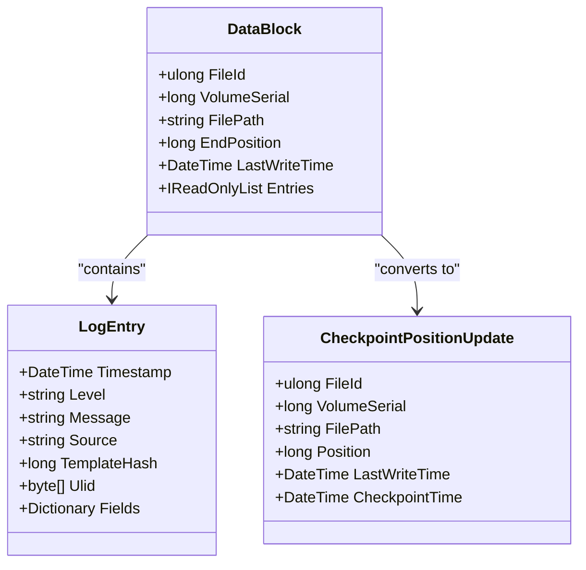
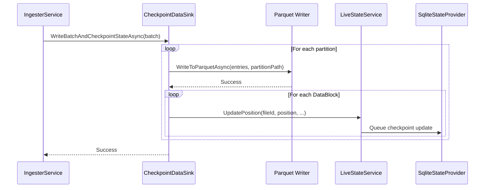
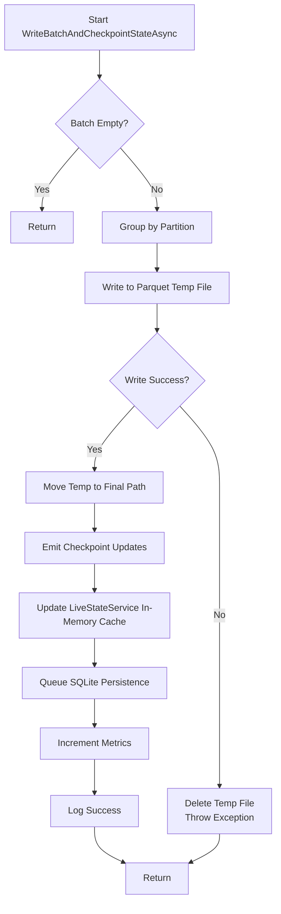
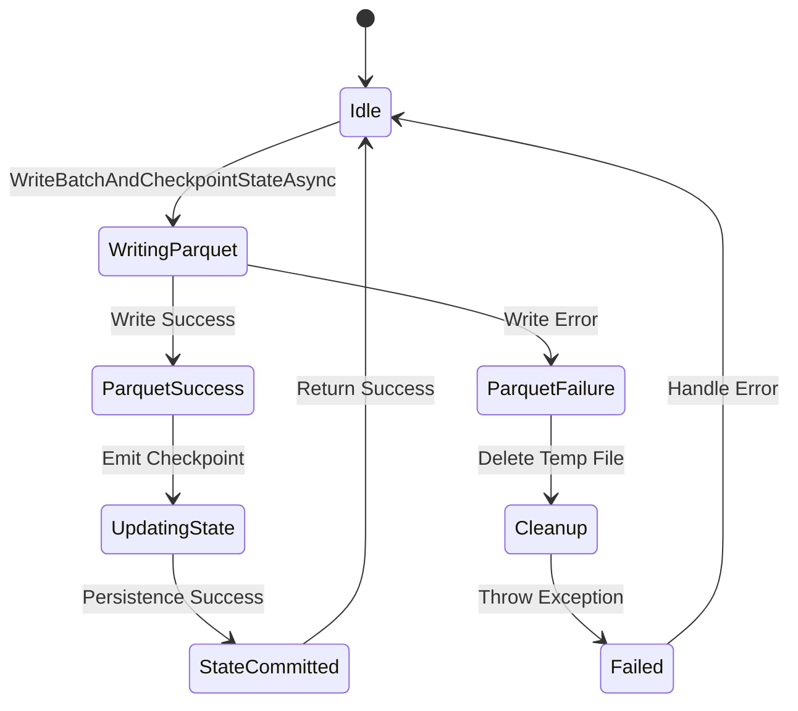

# Checkpointing Mechanism

## Table of Contents
1. [Introduction](#introduction)
2. [Core Components](#core-components)
3. [DataBlock Structure and Batching](#datablock-structure-and-batching)
4. [Atomic Write Coordination](#atomic-write-coordination)
5. [Two-Phase Commit Pattern](#two-phase-commit-pattern)
6. [Parquet Data Sink and Time-Based Partitioning](#parquet-data-sink-and-time-based-partitioning)
7. [Failure Scenarios and Recovery](#failure-scenarios-and-recovery)
8. [Performance Trade-offs](#performance-trade-offs)

## Introduction
The checkpointing mechanism in LogTapestry ensures data consistency by coordinating atomic writes of log data and processing state. It prevents data loss or duplication during system failures through a transactional boundary that couples Parquet file writes with SQLite state updates. This document details how the `CheckpointDataSink` class orchestrates this process using a two-phase commit pattern, leveraging the `DataBlock` structure for efficient batching of log entries with file context metadata.

**Section sources**
- [CheckpointDataSink.cs](file://src/LogTapestry.Ingester/CheckpointDataSink.cs#L19-L351)
- [DataBlock.cs](file://src/LogTapestry.Core/DataBlock.cs#L6-L13)

## Core Components

The checkpointing system is composed of several key components that work together to ensure reliable and consistent data ingestion:

- **CheckpointDataSink**: Coordinates atomic writes of log data (to Parquet) and processing state (to SQLite).
- **DataBlock**: Batches `LogEntry` objects along with file context metadata such as file ID, volume serial, path, end position, and last write time.
- **LiveStateService**: Maintains an in-memory cache of file positions as the source of truth and queues updates for durable persistence to SQLite.
- **SqliteStateProvider**: Implements durable state storage using SQLite with ACID-compliant transactions.
- **TrackedFileInfo**: Represents the processing state of a file, including its current read position and metadata.

These components form a pipeline where data is first written to durable storage (Parquet), and only upon success, the corresponding state update is queued for persistence.

**Section sources**
- [CheckpointDataSink.cs](file://src/LogTapestry.Ingester/CheckpointDataSink.cs#L19-L351)
- [DataBlock.cs](file://src/LogTapestry.Core/DataBlock.cs#L6-L27)
- [LiveStateService.cs](file://src/LogTapestry.Ingester/LiveStateService.cs#L20-L268)
- [SqliteStateProvider.cs](file://src/LogTapestry.Core/SqliteStateProvider.cs#L5-L204)

## DataBlock Structure and Batching

The `DataBlock` record is a critical data structure that encapsulates both log data and file context metadata for transactional consistency. It ensures that each batch of log entries is associated with precise file positioning information, enabling exact recovery after failures.

**Diagram sources**
- [DataBlock.cs](file://src/LogTapestry.Core/DataBlock.cs#L6-L27)

**Section sources**
- [DataBlock.cs](file://src/LogTapestry.Core/DataBlock.cs#L6-L27)

## Atomic Write Coordination

The `CheckpointDataSink.WriteBatchAndCheckpointStateAsync` method implements the core atomic write coordination. It ensures that log data is successfully written to Parquet files before any state updates are committed, following a strict write-order guarantee.

The process works as follows:
1. Group incoming `DataBlock` objects by time-based partition.
2. For each partition, write all log entries to a temporary Parquet file.
3. Atomically move the temporary file to its final location only after successful write.
4. Emit checkpoint updates to the `LiveStateService` only after Parquet persistence.

This sequence ensures that no state update can occur without corresponding data being durably stored.

**Diagram sources**
- [CheckpointDataSink.cs](file://src/LogTapestry.Ingester/CheckpointDataSink.cs#L65-L150)
- [LiveStateService.cs](file://src/LogTapestry.Ingester/LiveStateService.cs#L70-L100)

**Section sources**
- [CheckpointDataSink.cs](file://src/LogTapestry.Ingester/CheckpointDataSink.cs#L65-L150)

## Two-Phase Commit Pattern

LogTapestry implements a two-phase commit pattern to ensure consistency between data and state:

### Phase 1: Data Persistence (Prepare)
- Log entries are grouped by time-based partition (year/month/day).
- Each batch is written to a temporary Parquet file using atomic file operations.
- The temporary file is moved to its final location only after successful write.

### Phase 2: State Commit
- Only after successful Parquet write, `CheckpointPositionUpdate` messages are sent to the `LiveStateService`.
- The `LiveStateService` updates its in-memory cache immediately (source of truth).
- Updates are queued for asynchronous batched persistence to SQLite via `UpdateTrackedFilesBatchAsync`.

This pattern ensures that:
- Data is never orphaned (state advances only after data is safe).
- No duplicate processing occurs (position is only updated if new offset is greater).
- In-memory state is always consistent and serves as the primary source of truth.

**Diagram sources**
- [CheckpointDataSink.cs](file://src/LogTapestry.Ingester/CheckpointDataSink.cs#L65-L150)
- [LiveStateService.cs](file://src/LogTapestry.Ingester/LiveStateService.cs#L70-L100)
- [SqliteStateProvider.cs](file://src/LogTapestry.Core/SqliteStateProvider.cs#L150-L200)

**Section sources**
- [CheckpointDataSink.cs](file://src/LogTapestry.Ingester/CheckpointDataSink.cs#L65-L150)

## Parquet Data Sink and Time-Based Partitioning

The `CheckpointDataSink` writes structured log data to Parquet files with time-based partitioning. The partitioning scheme uses UTC timestamps to organize data into directories by year, month, and day.

### Partitioning Strategy
- **Base Path**: `data/`
- **Partition Format**: `year={YYYY}/month={MM}/day={DD}/landing/`
- **File Naming**: `part-{GUID}.parquet`

This structure enables efficient querying by time ranges and supports scalable data layout.

### Schema Definition
The Parquet schema includes:
- **Timestamp**: Event timestamp (DateTime)
- **Level**: Log level (string)
- **Message**: Log message (string)
- **Source**: Source identifier (string)
- **TemplateHash**: Hash of message template (long)
- **Ulid**: Unique identifier (byte[])
- **Fields**: Nested list of key-value pairs with typed values

The nested `Fields` structure uses Parquet's list and struct types to store heterogeneous log fields efficiently.

**Section sources**
- [CheckpointDataSink.cs](file://src/LogTapestry.Ingester/CheckpointDataSink.cs#L45-L60)

## Failure Scenarios and Recovery

The checkpointing mechanism handles various failure scenarios to ensure data integrity:

### Partial Writes
- If Parquet write fails, the temporary file is deleted and the exception is propagated.
- No state update occurs, so the file will be reprocessed from the last checkpoint.

### Disk Full Errors
- Temporary file creation or write may fail with IOException.
- The system cleans up partial files and throws the exception.
- Recovery follows the same path as partial writes.

### Process Crash
- In-memory state in `LiveStateService` is lost.
- On restart, the service loads the last committed state from SQLite.
- Files are processed from the last checkpointed position.

### Recovery Process
1. On startup, `LiveStateService` loads all tracked files from SQLite.
2. For each file, processing resumes from the `Position` stored in `TrackedFileInfo`.
3. The system compares file size and last write time to detect rotation or truncation.

The `TrackedFileInfo` record contains all necessary metadata for exact recovery:
- **FileId** and **VolumeSerial**: Unique file identifier
- **Position**: Byte offset of last processed data
- **LastWriteTime**: Timestamp to detect file changes

**Diagram sources**
- [CheckpointDataSink.cs](file://src/LogTapestry.Ingester/CheckpointDataSink.cs#L100-L150)
- [LiveStateService.cs](file://src/LogTapestry.Ingester/LiveStateService.cs#L150-L200)
- [SqliteStateProvider.cs](file://src/LogTapestry.Core/SqliteStateProvider.cs#L150-L200)

**Section sources**
- [CheckpointDataSink.cs](file://src/LogTapestry.Ingester/CheckpointDataSink.cs#L100-L150)
- [LiveStateService.cs](file://src/LogTapestry.Ingester/LiveStateService.cs#L150-L200)

## Performance Trade-offs

The checkpointing mechanism involves several performance trade-offs that affect throughput and durability:

### Checkpoint Frequency
- **High Frequency**: More frequent checkpoints improve recovery time but reduce throughput due to increased I/O.
- **Low Frequency**: Better throughput but longer recovery time after failures.

The system batches checkpoint updates in `LiveStateService` (up to 100 per batch) to amortize transaction overhead.

### Throughput Implications
- **Parquet Write Overhead**: Columnar encoding and compression add CPU cost.
- **SQLite Transaction Cost**: Each batch update is wrapped in a transaction for durability.
- **Disk I/O**: Sequential writes to Parquet files are efficient, but random access for SQLite updates can be slower.

### Optimization Opportunities
- **Batch Size Tuning**: Larger `DataBlock` batches improve Parquet compression and reduce per-write overhead.
- **Partitioning Granularity**: Coarser time partitions reduce directory count but may impact query performance.
- **Memory Usage**: The `LiveStateService` cache holds all tracked file positions in memory for fast access.

The metrics in `CheckpointDataSink.Metrics` track key performance indicators:
- **LogEntriesIngested**: Total log entries processed
- **BytesProcessed**: Total bytes written to Parquet
- **CheckpointsCompleted**: Number of successful checkpoints

These metrics can be used to monitor system health and tune performance parameters.

**Section sources**
- [CheckpointDataSink.cs](file://src/LogTapestry.Ingester/CheckpointDataSink.cs#L21-L30)
- [LiveStateService.cs](file://src/LogTapestry.Ingester/LiveStateService.cs#L150-L200)

**Referenced Files in This Document**   
- [CheckpointDataSink.cs](file://src/LogTapestry.Ingester/CheckpointDataSink.cs)
- [DataBlock.cs](file://src/LogTapestry.Core/DataBlock.cs)
- [SqliteStateProvider.cs](file://src/LogTapestry.Core/SqliteStateProvider.cs)
- [LiveStateService.cs](file://src/LogTapestry.Ingester/LiveStateService.cs)
- [IngesterService.cs](file://src/LogTapestry.Ingester/IngesterService.cs)