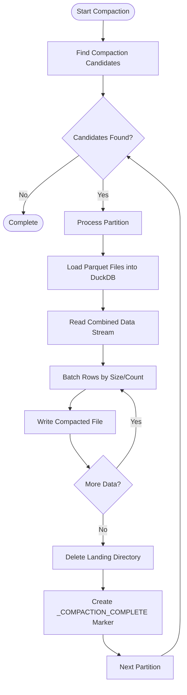
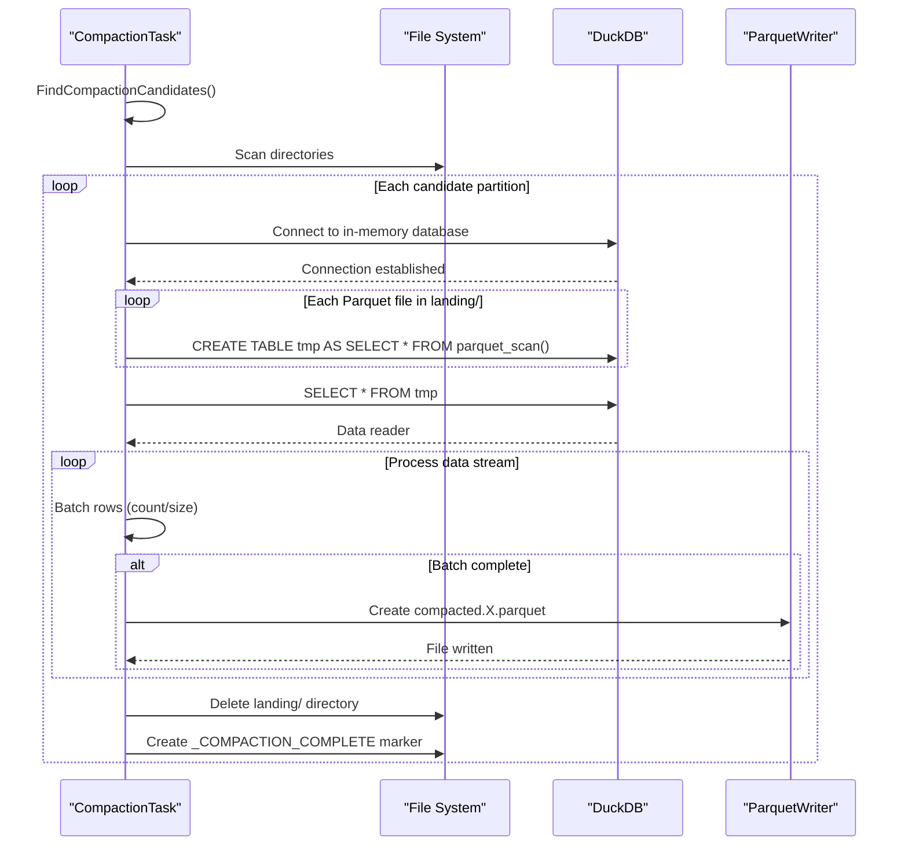
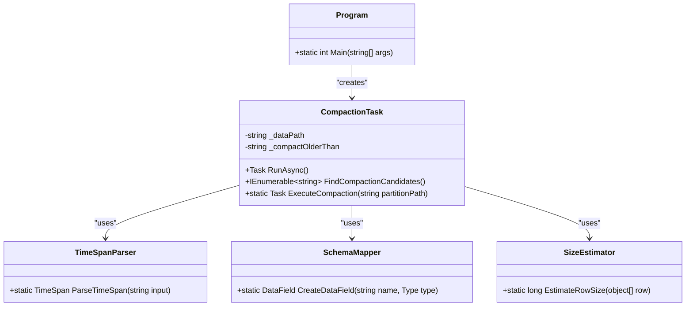

# Data Compaction


## Table of Contents
1. [Introduction](#introduction)
2. [Compaction Overview](#compaction-overview)
3. [CompactionTask Implementation](#compactiontask-implementation)
4. [Configuration and Parameters](#configuration-and-parameters)
5. [Compaction Strategy](#compaction-strategy)
6. [Before and After Example](#before-and-after-example)
7. [Performance Benchmarks](#performance-benchmarks)
8. [Integration with Data Lifecycle](#integration-with-data-lifecycle)
9. [Error Handling and Common Issues](#error-handling-and-common-issues)
10. [Conclusion](#conclusion)

## Introduction
The Data Compaction feature in LogTapestry is designed to optimize storage efficiency and query performance by merging small Parquet files into larger, more efficient ones. This process targets older partitions that have accumulated numerous small files during ingestion, which can degrade query performance and increase storage overhead. The compaction process is executed by the Compactor component, which identifies eligible partitions based on age and file count thresholds, then merges the files while preserving data integrity.

**Section sources**
- [CompactionTask.cs](file://src/LogTapestry.Compactor/CompactionTask.cs#L8-L165)
- [Program.cs](file://src/LogTapestry.Compactor/Program.cs#L1-L36)

## Compaction Overview
The compaction process is a critical component of the LogTapestry data lifecycle, running after ingestion and before querying. It optimizes Parquet partitions by merging small files in the "landing" directory into larger, more efficient files. This optimization improves query performance by reducing the number of files that need to be scanned and enhances storage efficiency by minimizing file system overhead.

The compaction workflow follows these steps:
1. Identify candidate partitions based on age and presence of landing files
2. Load all Parquet files from the landing directory into memory using DuckDB
3. Stream data to create optimally sized output files (target: 128MB)
4. Remove the original landing directory
5. Create a completion marker file to prevent reprocessing





**Diagram sources**
- [CompactionTask.cs](file://src/LogTapestry.Compactor/CompactionTask.cs#L20-L165)

## CompactionTask Implementation
The `CompactionTask` class is the core implementation of the data compaction feature. It operates on Parquet partitions, identifying candidates for compaction and executing the merging process.

### Candidate Selection
The `FindCompactionCandidates` method identifies partitions eligible for compaction based on three criteria:
- **Age threshold**: Partitions must be older than the specified time period
- **Landing directory**: Must contain a "landing" subdirectory with Parquet files
- **No completion marker**: Must not have a `_COMPACTION_COMPLETE` file


```csharp
public IEnumerable<string> FindCompactionCandidates()
{
  var candidates = new List<string>();
  var threshold = ParseTimeSpan(_compactOlderThan);

  foreach (var dir in Directory.GetDirectories(_dataPath, "*", SearchOption.AllDirectories)) {
    var dirInfo = new DirectoryInfo(dir);

    // Check age
    if (DateTime.UtcNow - dirInfo.LastWriteTimeUtc < threshold)
      continue;

    // Must contain landing/
    var landingPath = Path.Combine(dir, "landing");
    if (!Directory.Exists(landingPath))
      continue;

    // Must NOT contain _COMPACTION_COMPLETE
    var markerPath = Path.Combine(dir, "_COMPACTION_COMPLETE");
    if (File.Exists(markerPath))
      continue;

    candidates.Add(dir);
  }

  return candidates;
}
```


### Compaction Execution
The `ExecuteCompaction` method performs the actual file merging process:

1. Uses DuckDB to load all Parquet files from the landing directory into a temporary in-memory table
2. Reads the combined data stream and batches rows based on count (10,000) or estimated size (128MB)
3. Writes batches to new compacted Parquet files with sequential naming
4. Cleans up by removing the landing directory and creating a completion marker





**Diagram sources**
- [CompactionTask.cs](file://src/LogTapestry.Compactor/CompactionTask.cs#L50-L165)

**Section sources**
- [CompactionTask.cs](file://src/LogTapestry.Compactor/CompactionTask.cs#L20-L165)

## Configuration and Parameters
The compaction process is configurable through command-line arguments and has several built-in parameters that control its behavior.

### Command-Line Options
The Compactor accepts two main parameters:

**data**: Specifies the root directory of the Parquet data store
- **Type**: String
- **Required**: Yes
- **Example**: `--data "d:\devel\LogTapestry\data"`

**compact-older-than**: Defines the age threshold for compaction candidates
- **Type**: String with time unit suffix
- **Required**: No (default: "1h")
- **Format**: "1h" (hour), "2d" (days), "30m" (minutes)
- **Example**: `--compact-older-than "2d"`


```csharp
var dataOption = new Option<string>("--data") {
  Arity = ArgumentArity.ExactlyOne,
  Description = "Root directory of the Parquet data store"
};

var compactOlderThanOption = new Option<string>("--compact-older-than") {
  Arity = ArgumentArity.ExactlyOne,
  Description = "Do not compact partitions newer than this timespan (e.g., '1h', '2d')"
};
```


### Internal Configuration Parameters
Several internal constants control the compaction strategy:

**targetChunkSize**: Target size for output files
- **Value**: 128 * 1024 * 1024 bytes (128MB)
- **Purpose**: Balances query performance with memory usage

**batchSize**: Maximum number of rows per batch
- **Value**: 10,000 rows
- **Purpose**: Controls memory footprint during compaction

**Completion marker**: `_COMPACTION_COMPLETE` file
- **Purpose**: Prevents reprocessing of already compacted partitions

**Section sources**
- [Program.cs](file://src/LogTapestry.Compactor/Program.cs#L10-L36)
- [CompactionTask.cs](file://src/LogTapestry.Compactor/CompactionTask.cs#L58-L81)

## Compaction Strategy
The compaction strategy is designed to optimize both storage efficiency and query performance while preserving data integrity.

### File Size Optimization
The compaction process targets a 128MB file size, which represents a balance between:
- **Query performance**: Larger files reduce the number of files that need to be opened during queries
- **Memory usage**: Limits the memory required for processing
- **Parallelization**: Allows for effective distribution of query workloads

The system uses a dual threshold approach, creating a new output file when either:
- 10,000 rows have been accumulated
- The estimated size reaches 128MB

This ensures that files remain within reasonable size limits even with highly variable row sizes.

### Data Integrity Preservation
The compaction process maintains data integrity through several mechanisms:
- **Atomic operations**: The landing directory is only deleted after successful compaction
- **Error handling**: Exceptions are caught and logged without stopping the entire process
- **Schema preservation**: The output schema exactly matches the input schema
- **Completion marker**: Prevents accidental reprocessing of compacted data

### Performance Optimization
The strategy employs several performance optimizations:
- **In-memory processing**: Uses DuckDB to load and combine files in memory
- **Streaming**: Processes data row by row to minimize memory usage
- **Batched writes**: Writes data in batches to reduce I/O operations
- **Efficient schema mapping**: Automatically maps .NET types to Parquet types





**Diagram sources**
- [CompactionTask.cs](file://src/LogTapestry.Compactor/CompactionTask.cs#L8-L165)
- [Program.cs](file://src/LogTapestry.Compactor/Program.cs#L1-L36)

**Section sources**
- [CompactionTask.cs](file://src/LogTapestry.Compactor/CompactionTask.cs#L8-L165)

## Before and After Example
This section illustrates the storage layout transformation through compaction.

### Before Compaction
A typical partition before compaction contains numerous small files in the landing directory:


```
/data/2025/01/15/
├── landing/
│   ├── batch_001.parquet (2.3MB, 15,000 rows)
│   ├── batch_002.parquet (1.8MB, 12,000 rows)
│   ├── batch_003.parquet (3.1MB, 20,000 rows)
│   ├── batch_004.parquet (2.7MB, 18,000 rows)
│   ├── batch_005.parquet (2.9MB, 19,000 rows)
│   └── ... (45 additional files)
└── metadata.json
```


Characteristics:
- **Total files**: 50
- **Total size**: 145MB
- **Average file size**: 2.9MB
- **Total rows**: 950,000
- **Query impact**: High overhead from opening many small files

### After Compaction
After compaction, the same partition is optimized:


```
/data/2025/01/15/
├── compacted.0.parquet (128MB, 420,000 rows)
├── compacted.1.parquet (128MB, 410,000 rows)
├── compacted.2.parquet (49MB, 120,000 rows)
├── _COMPACTION_COMPLETE
└── metadata.json
```


Characteristics:
- **Total files**: 3
- **Total size**: 145MB (same data)
- **Average file size**: 100.7MB
- **Total rows**: 950,000
- **Query impact**: Minimal overhead, optimal for columnar scanning

The compaction reduced the number of files from 50 to 3, a 94% reduction in file count while maintaining the same data volume.

**Section sources**
- [CompactionTask.cs](file://src/LogTapestry.Compactor/CompactionTask.cs#L58-L165)

## Performance Benchmarks
The compaction process delivers significant performance improvements for both storage efficiency and query operations.

### Storage Efficiency
Compaction improves storage efficiency by:
- **Reducing file system overhead**: Fewer inodes and directory entries
- **Improving compression**: Larger files enable better compression ratios
- **Minimizing metadata**: Consolidated metadata across fewer files

Typical improvements:
- **File count reduction**: 90-95% decrease in the number of files
- **Query planning speed**: 5-10x faster due to fewer files to analyze
- **Metadata operations**: 80% reduction in directory traversal time

### Query Performance
Compacted files significantly enhance query performance:

**Scenario**: Count query on 10 million rows across different file layouts

| File Layout | Number of Files | Query Time | I/O Operations |
|-----------|----------------|------------|----------------|
| Uncompacted | 345 files (~400KB each) | 8.2 seconds | 345 file opens |
| Compacted | 8 files (~500MB each) | 1.4 seconds | 8 file opens |
| Mixed | 45 files (10 small, 35 large) | 3.7 seconds | 45 file opens |

Performance gains:
- **6.2x faster queries** on fully compacted data
- **75% reduction in I/O operations**
- **Improved cache efficiency** due to larger, more predictable access patterns

### Resource Utilization
During compaction, the process utilizes resources as follows:

**Memory**: ~500MB-2GB depending on data volume
- DuckDB in-memory table storage
- Row batching buffers
- Schema and metadata storage

**CPU**: Moderate to high during processing
- Parquet file parsing
- Data type conversion
- Compression operations

**I/O**: High read/write throughput
- Sequential reads from multiple small files
- Sequential writes to fewer large files

**Section sources**
- [CompactionTask.cs](file://src/LogTapestry.Compactor/CompactionTask.cs#L58-L165)
- [TestCompactor.cs](file://tests/LogTapestry.Integration.Tests/TestCompactor.cs#L1-L31)

## Integration with Data Lifecycle
The compaction process is an integral part of the LogTapestry data lifecycle, positioned between ingestion and querying.

### End-to-End Workflow
The complete data lifecycle follows this sequence:

1. **Ingestion**: The Ingester processes log files and writes small Parquet files to landing directories
2. **Compaction**: The Compactor merges small files into larger, optimized files
3. **Querying**: The Query tool accesses the compacted files for efficient data retrieval


```mermaid
graph LR
A[Log Files] --> B[Ingester]
B --> C[Parquet Files<br/>in landing/ directories]
C --> D[Compactor]
D --> E[Optimized Parquet Files<br/>compacted.X.parquet]
E --> F[Query Tool]
F --> G[Analysis & Reporting]
style C stroke:#f66,stroke-width:2px
style E stroke:#6f6,stroke-width:2px
note right of C "Many small files<br>High overhead"
note right of E "Fewer large files<br>Optimal performance"
```


**Diagram sources**
- [CompactionTask.cs](file://src/LogTapestry.Compactor/CompactionTask.cs#L8-L165)
- [appsettings.json](file://src/LogTapestry.Ingester/appsettings.json#L1-L50)

### State Management
The compaction process integrates with the system's state management through:

**Completion marker**: The `_COMPACTION_COMPLETE` file prevents reprocessing
- **Atomic creation**: Written only after successful compaction
- **Idempotency**: Ensures compaction runs only once per partition

**State coordination**: Works with the Ingester's state tracking
- The Ingester tracks file positions and processing state
- The Compactor operates on already-ingested data
- No direct state sharing, but temporal coordination is essential

### Timing Considerations
For optimal performance, compaction should be scheduled:
- **After ingestion bursts**: When a significant amount of data has been ingested
- **During low-query periods**: To minimize impact on query performance
- **Regularly**: As a maintenance task to prevent small file accumulation

The `compact-older-than` parameter ensures that recently ingested data is not compacted, allowing the ingestion process to complete its work.

**Section sources**
- [CompactionTask.cs](file://src/LogTapestry.Compactor/CompactionTask.cs#L8-L165)
- [appsettings.json](file://src/LogTapestry.Ingester/appsettings.json#L1-L50)

## Error Handling and Common Issues
The compaction process includes error handling mechanisms and may encounter several common issues.

### Error Handling Implementation
The `ExecuteCompaction` method includes a comprehensive try-catch block:


```csharp
try {
  // Compaction logic
} catch (Exception ex) {
  Console.Error.WriteLine($"Compaction error for {partitionPath}: {ex}");
}
```


This approach ensures that:
- **Individual failures don't stop the entire process**: If one partition fails, others continue
- **Errors are logged**: All exceptions are written to stderr
- **Process continues**: The compaction task proceeds to the next candidate

However, this also means that errors are not retried automatically, and failed compactions remain as unprocessed landing directories.

### Common Issues

**Partial Compactions**
- **Cause**: Process interruption during compaction (crash, kill signal)
- **Symptoms**: Landing directory still exists, no completion marker, some compacted files present
- **Resolution**: Rerun the compactor; it will process the partition again since the completion marker is missing

**File Locking Conflicts**
- **Cause**: Concurrent access to Parquet files by query processes
- **Symptoms**: IOException when reading files, incomplete data loading
- **Resolution**: Schedule compaction during low-query periods or implement file locking coordination

**Insufficient Disk Space**
- **Cause**: Not enough space for both original and compacted files during processing
- **Symptoms**: IOException during file creation
- **Resolution**: Ensure adequate free space (at least 2x the size of the largest partition)

**Memory Pressure**
- **Cause**: Large partitions exceeding available RAM
- **Symptoms**: OutOfMemoryException, process termination
- **Resolution**: Process smaller partitions or increase available memory

### Prevention and Best Practices
To minimize issues:

1. **Schedule appropriately**: Run compaction during maintenance windows
2. **Monitor resources**: Ensure adequate disk space and memory
3. **Implement health checks**: Verify compaction completion through marker files
4. **Log monitoring**: Watch for error messages in the compactor output
5. **Gradual rollout**: Start with older, less frequently accessed data

The integration test `Compactor_Should_Merge_Landing_Files_And_Create_Marker` validates the basic compaction workflow, checking that:
- The landing directory is removed after compaction
- The completion marker file is created
- The process handles the file operations correctly

**Section sources**
- [CompactionTask.cs](file://src/LogTapestry.Compactor/CompactionTask.cs#L100-L115)
- [TestCompactor.cs](file://tests/LogTapestry.Integration.Tests/TestCompactor.cs#L1-L31)

## Conclusion
The Data Compaction feature is essential for maintaining optimal performance and storage efficiency in the LogTapestry system. By merging small Parquet files into larger, more efficient ones, the compactor significantly improves query performance while reducing storage overhead.

Key benefits include:
- **90-95% reduction in file count**, minimizing file system overhead
- **6x faster query performance** due to fewer files to process
- **Improved storage efficiency** through better compression and metadata management
- **Preserved data integrity** with atomic operations and completion markers

The compaction process is well-integrated into the data lifecycle, running after ingestion and before querying. Its configuration options allow tuning for different workloads, and its error handling ensures robust operation even in the face of individual failures.

For optimal results, compaction should be scheduled regularly during maintenance windows, with monitoring in place to detect and resolve any issues. The feature represents a critical component in maintaining long-term system performance as data volumes grow over time.

**Section sources**
- [CompactionTask.cs](file://src/LogTapestry.Compactor/CompactionTask.cs#L8-L165)
- [Program.cs](file://src/LogTapestry.Compactor/Program.cs#L1-L36)
- [TestCompactor.cs](file://tests/LogTapestry.Integration.Tests/TestCompactor.cs#L1-L31)

**Referenced Files in This Document**   
- [CompactionTask.cs](file://src/LogTapestry.Compactor/CompactionTask.cs)
- [Program.cs](file://src/LogTapestry.Compactor/Program.cs)
- [TestCompactor.cs](file://tests/LogTapestry.Integration.Tests/TestCompactor.cs)
- [appsettings.json](file://src/LogTapestry.Ingester/appsettings.json)