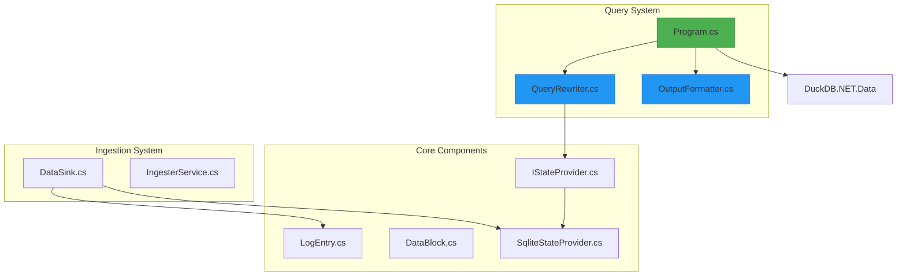
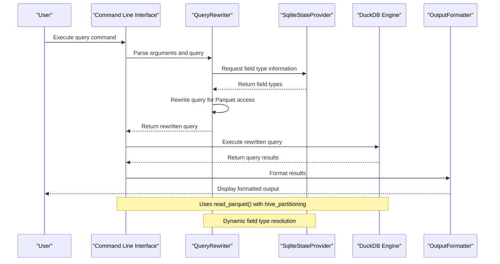
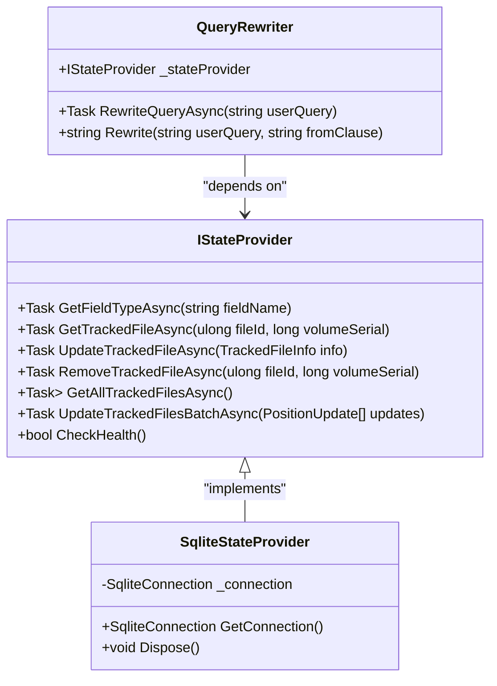
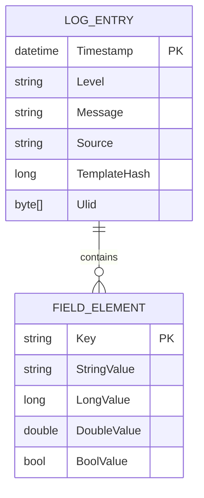
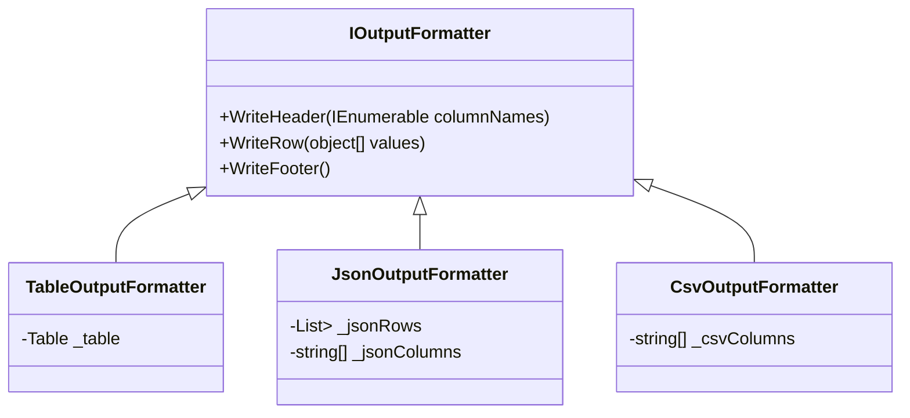
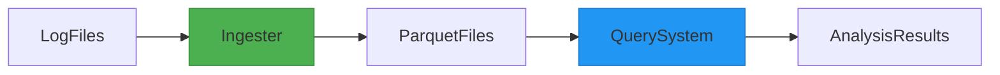

# Query System


## Table of Contents
1. [Introduction](#introduction)
2. [Project Structure](#project-structure)
3. [Core Components](#core-components)
4. [Architecture Overview](#architecture-overview)
5. [Query Rewriting Mechanism](#query-rewriting-mechanism)
6. [Data Model and Schema](#data-model-and-schema)
7. [Output Formatting](#output-formatting)
8. [Query Examples and Use Cases](#query-examples-and-use-cases)
9. [Performance Considerations](#performance-considerations)
10. [Integration with Ingestion Pipeline](#integration-with-ingestion-pipeline)
11. [Limitations and Best Practices](#limitations-and-best-practices)

## Introduction

The Query System in LogTapestry enables SQL-based analysis of structured log data stored in Parquet format. It leverages DuckDB as an in-memory analytical engine to execute SQL queries against large volumes of log data efficiently. The system is designed to work seamlessly with the ingestion and compaction workflows, accessing the same Parquet dataset that is produced by the ingester component. This document provides a comprehensive overview of the query system's architecture, functionality, and usage patterns.

**Section sources**
- [Program.cs](file://src/LogTapestry.Query/Program.cs#L1-L123)

## Project Structure

The LogTapestry repository follows a modular structure with distinct components for ingestion, compaction, core utilities, and querying. The query system resides in the `LogTapestry.Query` project and depends on core data structures and state management components.





**Diagram sources**
- [Program.cs](file://src/LogTapestry.Query/Program.cs#L1-L123)
- [QueryRewriter.cs](file://src/LogTapestry.Query/QueryRewriter.cs#L1-L90)
- [OutputFormatter.cs](file://src/LogTapestry.Query/OutputFormatter.cs#L1-L81)
- [LogEntry.cs](file://src/LogTapestry.Core/LogEntry.cs#L1-L14)
- [SqliteStateProvider.cs](file://src/LogTapestry.Core/SqliteStateProvider.cs#L1-L206)

**Section sources**
- [Program.cs](file://src/LogTapestry.Query/Program.cs#L1-L123)
- [QueryRewriter.cs](file://src/LogTapestry.Query/QueryRewriter.cs#L1-L90)
- [OutputFormatter.cs](file://src/LogTapestry.Query/OutputFormatter.cs#L1-L81)

## Core Components

The query system consists of three primary components: the entry point (`Program.cs`), the query rewriter (`QueryRewriter.cs`), and the output formatter (`OutputFormatter.cs`). These components work together to parse user input, transform queries for efficient execution, and format results for display.

The system uses DuckDB to execute SQL queries against Parquet files, with special handling for the nested structure of log data. The `QueryRewriter` plays a crucial role in transforming user queries to work with the actual data layout, while the `OutputFormatter` supports multiple output formats for different use cases.

**Section sources**
- [Program.cs](file://src/LogTapestry.Query/Program.cs#L1-L123)
- [QueryRewriter.cs](file://src/LogTapestry.Query/QueryRewriter.cs#L1-L90)
- [OutputFormatter.cs](file://src/LogTapestry.Query/OutputFormatter.cs#L1-L81)

## Architecture Overview

The query system architecture follows a command-line interface pattern with structured data processing. When a user submits a query, the system parses the command-line arguments, rewrites the query to match the physical data layout, executes it against DuckDB, and formats the results according to the specified output format.





**Diagram sources**
- [Program.cs](file://src/LogTapestry.Query/Program.cs#L1-L123)
- [QueryRewriter.cs](file://src/LogTapestry.Query/QueryRewriter.cs#L1-L90)
- [SqliteStateProvider.cs](file://src/LogTapestry.Core/SqliteStateProvider.cs#L1-L206)

## Query Rewriting Mechanism

The `QueryRewriter` component is responsible for transforming user queries to efficiently access partitioned Parquet data. It analyzes the original query, identifies dynamic fields, and rewrites the query to work with the actual data structure stored in Parquet files.

### FROM Clause Rewriting

The query rewriter transforms the logical `FROM logs` clause into a physical Parquet access pattern:


```sql
-- User query
SELECT Timestamp, Message FROM logs WHERE Level = 'ERROR'

-- Rewritten query
SELECT Timestamp, Message FROM read_parquet('{data_path}/**/*.parquet', hive_partitioning = true) AS t WHERE Level = 'ERROR'
```


This transformation enables the query to scan all Parquet files in the specified data directory, taking advantage of DuckDB's built-in Parquet reader with Hive-style partitioning support.

### Dynamic Field Handling

The most complex aspect of query rewriting involves handling dynamic log fields. Log entries contain a dictionary of fields (`IReadOnlyDictionary<string, object> Fields`) that are stored in a nested structure in Parquet. The query rewriter transforms conditions on these dynamic fields into `EXISTS` subqueries with `UNNEST`.





**Diagram sources**
- [QueryRewriter.cs](file://src/LogTapestry.Query/QueryRewriter.cs#L1-L90)
- [IStateProvider.cs](file://src/LogTapestry.Core/Interfaces/IStateProvider.cs#L1-L25)
- [SqliteStateProvider.cs](file://src/LogTapestry.Core/SqliteStateProvider.cs#L1-L206)

**Section sources**
- [QueryRewriter.cs](file://src/LogTapestry.Query/QueryRewriter.cs#L1-L90)
- [SqliteStateProvider.cs](file://src/LogTapestry.Core/SqliteStateProvider.cs#L1-L206)

## Data Model and Schema

The log data model is designed to accommodate both structured and semi-structured log information. The schema is optimized for columnar storage and analytical queries.

### LogEntry Structure

The `LogEntry` record defines the core structure of a log event:


```csharp
public record LogEntry(
    DateTime Timestamp,
    string Level, 
    string Message, 
    string Source,
    long TemplateHash,
    IReadOnlyDictionary<string, object> Fields,
    byte[]? Ulid = null)
{
    public byte[] Ulid { get; init; } = Ulid ?? System.Ulid.NewUlid().ToByteArray();
}
```


Key properties:
- **Timestamp**: UTC timestamp of the log event
- **Level**: Log severity level (e.g., "INFO", "ERROR")
- **Message**: The main log message text
- **Source**: Origin of the log (e.g., application name, component)
- **TemplateHash**: Hash of the log message template for grouping similar messages
- **Fields**: Dictionary of additional structured data associated with the log
- **Ulid**: Universally Unique Lexicographically Sortable Identifier

### Parquet Schema

The `DataSink` component writes log data to Parquet files using a schema that supports nested structures for dynamic fields:


```csharp
private static readonly ParquetSchema Schema = new(
    new DataField<DateTime>("Timestamp"),
    new DataField<string>("Level"),
    new DataField<string>("Message"),
    new DataField<string>("Source"),
    new DataField<long>("TemplateHash"),
    new DataField<byte[]>("Ulid"),
    new ListField("Fields",
        new StructField("FieldElement",
            new DataField<string>("Key"),
            new DataField<string>("StringValue", true),
            new DataField<long?>("LongValue", true),
            new DataField<double?>("DoubleValue", true),
            new DataField<bool?>("BoolValue", true)
        )
    )
);
```


This schema uses a list of structs to represent the dynamic fields, where each field is stored as a key-value pair with typed value columns for different data types.





**Diagram sources**
- [LogEntry.cs](file://src/LogTapestry.Core/LogEntry.cs#L1-L14)
- [DataSink.cs](file://src/LogTapestry.Ingester/DataSink.cs#L1-L251)

**Section sources**
- [LogEntry.cs](file://src/LogTapestry.Core/LogEntry.cs#L1-L14)
- [DataSink.cs](file://src/LogTapestry.Ingester/DataSink.cs#L1-L251)

## Output Formatting

The query system supports multiple output formats through the `OutputFormatter` component. The `IOutputFormatter` interface defines a common contract for different formatting strategies.

### Supported Formats

The system supports three output formats:
- **Table**: Formatted text table with headers and alignment
- **JSON**: Structured JSON output with indentation
- **CSV**: Comma-separated values with proper quoting





**Diagram sources**
- [OutputFormatter.cs](file://src/LogTapestry.Query/OutputFormatter.cs#L1-L81)

**Section sources**
- [OutputFormatter.cs](file://src/LogTapestry.Query/OutputFormatter.cs#L1-L81)

## Query Examples and Use Cases

The query system supports a wide range of analytical use cases for log data. Below are common query patterns with examples.

### Error Rate Analysis

Calculate error rates over time:


```sql
-- Hourly error rate
SELECT 
    DATE_TRUNC('hour', Timestamp) as Hour,
    COUNT(*) as TotalLogs,
    SUM(CASE WHEN Level = 'ERROR' THEN 1 ELSE 0 END) as ErrorCount,
    (SUM(CASE WHEN Level = 'ERROR' THEN 1 ELSE 0 END) * 100.0 / COUNT(*)) as ErrorRate
FROM logs 
GROUP BY DATE_TRUNC('hour', Timestamp)
ORDER BY Hour
```


### Time-Series Trends

Analyze request latency trends:


```sql
-- Response time percentiles by service
SELECT 
    Source,
    APPROX_QUANTILE(CAST(Fields['response_time'] AS DOUBLE), 0.5) as MedianLatency,
    APPROX_QUANTILE(CAST(Fields['response_time'] AS DOUBLE), 0.95) as P95Latency,
    APPROX_QUANTILE(CAST(Fields['response_time'] AS DOUBLE), 0.99) as P99Latency
FROM logs 
WHERE Fields['response_time'] IS NOT NULL
GROUP BY Source
ORDER BY MedianLatency DESC
```


### Field-Based Filtering

Query logs based on dynamic fields:


```sql
-- Find logs with specific user ID
SELECT Timestamp, Message, Fields['user_id'], Fields['session_id']
FROM logs 
WHERE EXISTS (
    SELECT 1 FROM UNNEST(t.Fields) AS f 
    WHERE f.Key = 'user_id' AND f.StringValue = '12345'
)
AND Level = 'INFO'
ORDER BY Timestamp DESC
LIMIT 100
```


### Aggregation and Grouping

Group logs by template and analyze frequency:


```sql
-- Top 10 most frequent log templates
SELECT 
    TemplateHash,
    Message,
    COUNT(*) as Frequency,
    MIN(Timestamp) as FirstSeen,
    MAX(Timestamp) as LastSeen
FROM logs 
GROUP BY TemplateHash, Message
ORDER BY Frequency DESC
LIMIT 10
```


**Section sources**
- [Program.cs](file://src/LogTapestry.Query/Program.cs#L1-L123)
- [QueryRewriter.cs](file://src/LogTapestry.Query/QueryRewriter.cs#L1-L90)

## Performance Considerations

The query system is designed with several performance optimizations to handle large log datasets efficiently.

### Predicate Pushdown

DuckDB supports predicate pushdown, which means filters are applied during the Parquet file scanning phase rather than after loading all data into memory. This significantly reduces I/O and memory usage:


```csharp
// The WHERE clause is pushed down to the Parquet reader
SELECT * FROM logs WHERE Timestamp >= '2023-01-01' AND Level = 'ERROR'
```


### Columnar Scanning

The columnar storage format allows the query engine to read only the columns needed for a query, minimizing disk I/O:


```csharp
// Only Timestamp and Level columns are read from Parquet files
SELECT Timestamp, Level FROM logs WHERE Level = 'ERROR'
```


### Partition Pruning

With Hive-style partitioning, DuckDB can skip entire directories of Parquet files that don't match the query predicates. The system stores data in a partitioned structure by date:


```
data/
  year=2023/
    month=01/
      day=01/
        part-00001.parquet
        part-00002.parquet
      day=02/
        part-00001.parquet
```


When querying with date filters, only relevant partitions are scanned.

### Memory Efficiency

The system uses DuckDB's in-memory engine with efficient data structures:

- Queries execute in a single-threaded in-memory database
- Results are streamed from DuckDB to the output formatter
- Large result sets are handled incrementally to avoid memory pressure

**Section sources**
- [Program.cs](file://src/LogTapestry.Query/Program.cs#L1-L123)
- [DataSink.cs](file://src/LogTapestry.Ingester/DataSink.cs#L1-L251)

## Integration with Ingestion Pipeline

The query system integrates seamlessly with the ingestion and compaction workflows by accessing the same Parquet dataset.

### Shared Data Format

Both the ingester and query components use the same Parquet format:





The `DataSink` component writes log data to Parquet files, while the query system reads from these same files using DuckDB's Parquet reader.

### Schema Registry

The `SqliteStateProvider` maintains a schema registry in the `FieldSchema` table, which stores the data type of each dynamic field:


```sql
-- FieldSchema table structure
CREATE TABLE FieldSchema (
    FieldName TEXT PRIMARY KEY,
    FieldType TEXT NOT NULL
);
```


This allows the `QueryRewriter` to determine the appropriate Parquet column to use when rewriting queries with dynamic field conditions.

### State Synchronization

The query system and ingester share the same SQLite database for state information, ensuring consistency between data ingestion and querying:


```csharp
// Both components use SqliteStateProvider
var stateProvider = new SqliteStateProvider("data/state.sqlite");
```


**Diagram sources**
- [DataSink.cs](file://src/LogTapestry.Ingester/DataSink.cs#L1-L251)
- [SqliteStateProvider.cs](file://src/LogTapestry.Core/SqliteStateProvider.cs#L1-L206)

**Section sources**
- [DataSink.cs](file://src/LogTapestry.Ingester/DataSink.cs#L1-L251)
- [SqliteStateProvider.cs](file://src/LogTapestry.Core/SqliteStateProvider.cs#L1-L206)

## Limitations and Best Practices

### Limitations

1. **SQL Syntax Support**: The system relies on DuckDB's SQL dialect, which may not support all SQL features.
2. **Dynamic Field Queries**: Complex queries on dynamic fields require `EXISTS` subqueries, which may be less efficient than direct column access.
3. **Memory Constraints**: Large queries may be limited by available memory since DuckDB operates in-memory.
4. **Schema Evolution**: Adding new field types requires updates to the `DataSink` and `QueryRewriter` components.

### Best Practices

1. **Use Specific Filters**: Always include time range filters to limit the amount of data scanned:
   
```sql
   -- Good: Time-limited query
   SELECT * FROM logs WHERE Timestamp >= '2023-01-01' AND Timestamp < '2023-01-02'
   
   -- Avoid: Full table scan
   SELECT * FROM logs
   ```


2. **Leverage Partitioning**: Structure queries to take advantage of date-based partitioning:
   
```sql
   -- This will prune partitions effectively
   SELECT * FROM logs WHERE Timestamp BETWEEN '2023-01-01' AND '2023-01-07'
   ```


3. **Select Only Needed Columns**: Minimize I/O by selecting only the columns required:
   
```sql
   -- Good: Select specific columns
   SELECT Timestamp, Level, Message FROM logs WHERE Level = 'ERROR'
   
   -- Avoid: Select all columns when not needed
   SELECT * FROM logs WHERE Level = 'ERROR'
   ```


4. **Use Appropriate Output Format**: Choose the output format based on the use case:
   - `table`: Interactive analysis and quick inspection
   - `json`: Programmatic processing and API integration
   - `csv`: Data export and spreadsheet analysis

5. **Monitor Query Performance**: Pay attention to query execution times and adjust queries accordingly for large datasets.

**Section sources**
- [Program.cs](file://src/LogTapestry.Query/Program.cs#L1-L123)
- [QueryRewriter.cs](file://src/LogTapestry.Query/QueryRewriter.cs#L1-L90)
- [DataSink.cs](file://src/LogTapestry.Ingester/DataSink.cs#L1-L251)

**Referenced Files in This Document**   
- [Program.cs](file://src/LogTapestry.Query/Program.cs#L1-L123)
- [QueryRewriter.cs](file://src/LogTapestry.Query/QueryRewriter.cs#L1-L90)
- [OutputFormatter.cs](file://src/LogTapestry.Query/OutputFormatter.cs#L1-L81)
- [DataSink.cs](file://src/LogTapestry.Ingester/DataSink.cs#L1-L251)
- [LogEntry.cs](file://src/LogTapestry.Core/LogEntry.cs#L1-L14)
- [SqliteStateProvider.cs](file://src/LogTapestry.Core/SqliteStateProvider.cs#L1-L206)
- [IStateProvider.cs](file://src/LogTapestry.Core/Interfaces/IStateProvider.cs#L1-L25)